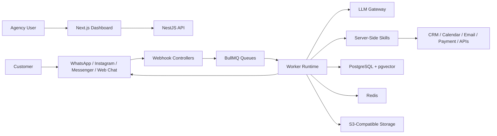
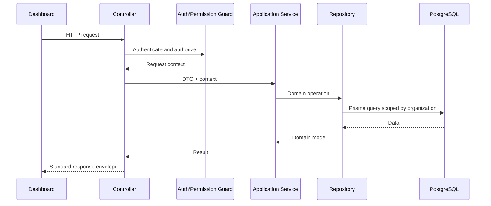
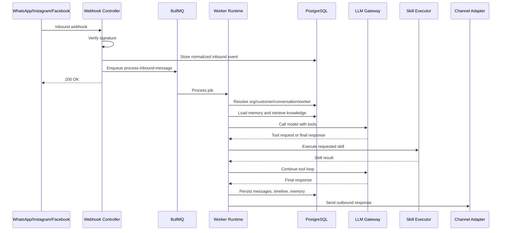
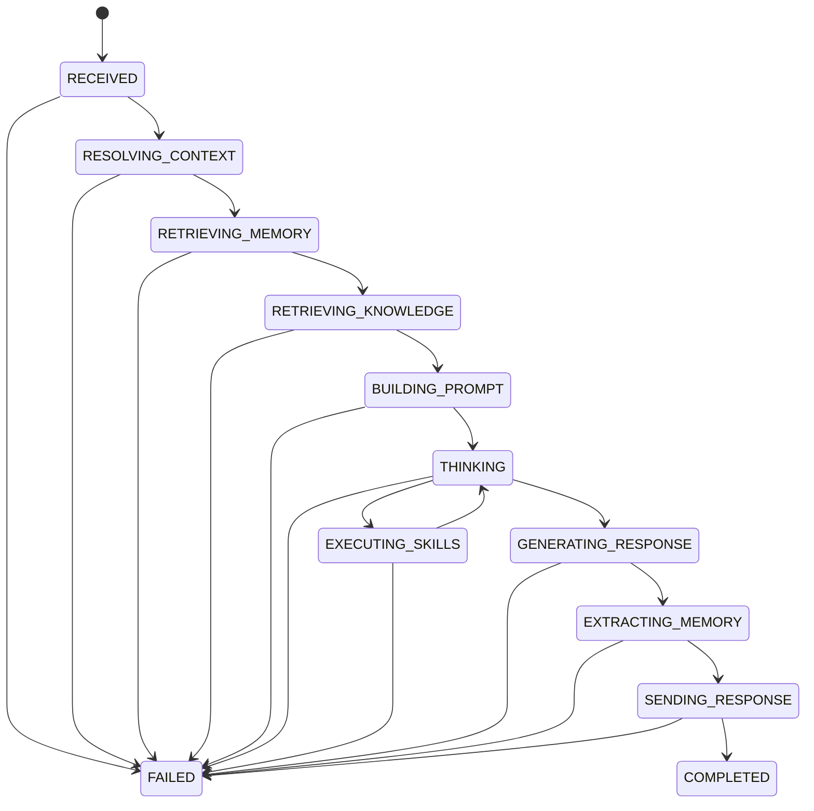

# Master Architecture

This document is the source of truth for AI Workforce OS architecture. Every subsystem specification and implementation must align with it.

## 1. Executive Summary

AI Workforce OS is a multi-tenant SaaS platform for agencies that want to deploy AI workers across messaging channels such as WhatsApp, Instagram, Facebook Messenger, and web chat.

The system is built as a modular monolith:

- Backend: NestJS and TypeScript
- Database: PostgreSQL with pgvector
- ORM: Prisma
- Queue: BullMQ with Redis
- Frontend: Next.js App Router
- Realtime: Socket.IO
- Storage: S3-compatible object storage
- AI: OpenAI-compatible LLM gateway with provider abstraction

The MVP avoids microservices, Kubernetes, Kafka, dynamic third-party skill loading, and complex distributed orchestration. The goal is to build a product that is simple enough for a small team to operate but structured enough to grow into a larger platform.

## 2. Core Product Model

The platform exposes "AI Agents" to customers but uses `Worker` internally.

A Worker is an AI employee with:

- Brain: model, prompt, behavior, tone, response policy
- Skills: server-side executable capabilities
- Knowledge: retrievable content from documents and sources
- Memory: structured customer facts and future worker-level memory
- Channels: connected messaging transports
- Policies: constraints and approvals
- Goals: configured business objectives
- Metrics: success, cost, latency, usage, and quality indicators
- Versions: immutable snapshots of configuration

This model allows the product to grow beyond chatbots into sales, support, booking, marketing, and operations workers.

## 3. Architectural Principles

### 3.1 Modular Monolith

Use one backend application with strong module boundaries.

Acceptable:

- `WorkersModule`
- `ConversationsModule`
- `ChannelsModule`
- `SkillsModule`
- `KnowledgeModule`
- `MemoryModule`
- `RuntimeModule`
- `WorkflowModule`

Not acceptable:

- Separate microservices for MVP
- Cross-module table access
- Shared global business logic
- Runtime behavior hidden inside external frameworks

### 3.2 Feature-First Organization

Organize code by business capability, not technical layer.

Preferred:

```text
src/modules/conversations/
  conversations.controller.ts
  conversations.service.ts
  conversations.repository.ts
  dto/
  entities/
  events/
  tests/
```

Avoid:

```text
src/controllers/
src/services/
src/repositories/
```

### 3.3 Repository Pattern

Prisma access belongs only in repositories.

Controllers call services. Services call repositories or public services from other modules. Repositories call Prisma. Nothing else calls Prisma directly.

### 3.4 Organization Scoped by Default

Every tenant-owned record must include `organization_id` unless there is a documented reason not to. Every tenant-owned query must filter by organization ID.

### 3.5 Async Runtime

Inbound webhooks must enqueue work and return quickly. Worker runtime processing occurs in BullMQ workers. Long-running work must never block webhook response paths.

### 3.6 Server-Side Skills

Skills are TypeScript classes registered on the server. The MVP does not support arbitrary customer-uploaded code or third-party runtime plugins.

### 3.7 Observability Built In

Every Worker execution should produce an execution timeline:

- Inbound event received
- Organization resolved
- Customer resolved
- Conversation resolved
- Worker resolved
- Knowledge retrieved
- Memory retrieved
- Prompt built
- LLM called
- Skills requested
- Skills executed
- Response generated
- Memory extracted
- Message sent

The timeline is critical for debugging, trust, and enterprise readiness.

## 4. High-Level System Context



## 5. Backend Modules

### 5.1 Auth Module

Responsibilities:

- Registration
- Login
- Refresh tokens
- Logout
- Password reset
- Email verification
- Session tracking
- Authentication guards

### 5.2 Organizations Module

Responsibilities:

- Organization creation
- Organization settings
- Tenant context
- Membership
- Invitations

### 5.3 Users Module

Responsibilities:

- User profiles
- Role assignment
- User settings
- Membership lookup

### 5.4 Workers Module

Responsibilities:

- Worker CRUD
- Worker configuration
- Worker versioning
- Worker status
- Skill attachment
- Channel attachment
- Policy configuration

### 5.5 Conversations Module

Responsibilities:

- Conversation creation and retrieval
- Message persistence
- Inbox views
- Human handoff
- Conversation status
- Assignment to human operators

### 5.6 Channels Module

Responsibilities:

- Channel abstraction
- Webhook normalization
- Outbound message dispatch
- Channel credential storage
- WhatsApp adapter
- Instagram adapter
- Facebook adapter
- Future web chat adapter

### 5.7 Runtime Module

Responsibilities:

- Worker execution lifecycle
- Runtime context building
- Prompt orchestration
- Tool calling loop
- Runtime state tracking
- Execution timeline
- Error recovery

### 5.8 Skills Module

Responsibilities:

- Skill registry
- Skill metadata
- Skill permission checks
- Skill input/output validation
- Skill execution
- Skill telemetry
- Built-in skills

### 5.9 Knowledge Module

Responsibilities:

- Knowledge source upload
- Document parsing
- Chunking
- Embedding generation
- Vector search
- Retrieval for runtime

### 5.10 Memory Module

Responsibilities:

- Customer memory extraction
- Customer memory storage
- Memory retrieval
- Memory conflict handling
- Memory expiry and confidence

### 5.11 Workflow Module

Responsibilities:

- Deterministic automations
- Triggers
- Conditions
- Actions
- Workflow runs
- Scheduled jobs

### 5.12 Analytics Module

Responsibilities:

- Message counts
- Worker usage
- Skill usage
- Token usage
- Cost tracking
- Conversation outcomes

### 5.13 Audit Module

Responsibilities:

- Security-relevant event logging
- Configuration change history
- External side effect records
- Compliance-ready audit trail

## 6. Standard Request Lifecycle



## 7. Inbound Message Lifecycle



## 8. Worker Runtime Stages

The runtime must be implemented as explicit stages:

1. Normalize inbound event.
2. Resolve organization.
3. Resolve customer.
4. Resolve conversation.
5. Resolve worker.
6. Load worker configuration.
7. Check conversation state and handoff rules.
8. Retrieve relevant memory.
9. Retrieve relevant knowledge chunks.
10. Build runtime context.
11. Build prompt messages.
12. Call LLM with available skills as tools.
13. Execute requested skills.
14. Repeat tool loop until final response or limit.
15. Validate final response against policies.
16. Persist assistant message.
17. Extract and store memory.
18. Dispatch outbound message.
19. Record metrics and execution timeline.

Each stage should be independently testable.

## 9. Runtime State Machine



## 10. Data Architecture

Core table groups:

- Identity: users, organizations, memberships, roles, permissions, sessions
- Workers: workers, worker_versions, worker_skills, worker_channels, worker_policies
- Channels: channel_connections, channel_credentials, inbound_events, outbound_messages
- Conversations: customers, customer_channels, conversations, messages, attachments, handoff_events
- Skills: skills, skill_executions, skill_permissions
- Knowledge: knowledge_sources, knowledge_documents, knowledge_chunks, embeddings
- Memory: customer_memories, memory_events
- Runtime: runtime_runs, runtime_steps, llm_calls, token_usage
- Workflows: workflows, workflow_versions, workflow_runs, workflow_steps
- Operations: audit_logs, api_keys, notifications

Detailed schemas belong in `docs/03-database/`.

## 11. API Architecture

Use versioned REST APIs:

```text
/api/v1/auth
/api/v1/organizations
/api/v1/workers
/api/v1/conversations
/api/v1/customers
/api/v1/channels
/api/v1/knowledge
/api/v1/skills
/api/v1/workflows
/api/v1/analytics
```

Use standard response envelopes:

```json
{
  "data": {},
  "meta": {
    "requestId": "uuid"
  }
}
```

Use standard error envelopes:

```json
{
  "error": {
    "code": "WORKER_NOT_FOUND",
    "message": "Worker was not found.",
    "details": {},
    "requestId": "uuid"
  }
}
```

## 12. Queue Architecture

Initial queues:

- `inbound-message`
- `outbound-message`
- `knowledge-ingestion`
- `memory-extraction`
- `workflow-execution`
- `runtime-cleanup`
- `analytics-rollup`

Queue rules:

- Jobs must include organization ID when tenant-owned.
- Jobs must include idempotency key.
- Jobs must have bounded retries.
- Jobs must log failure context.
- Jobs must not rely on in-memory state.

## 13. Skill Architecture

Every skill has:

- Stable name
- Description
- Version
- Input schema
- Output schema
- Required permissions
- Timeout
- Retry policy
- Idempotency behavior
- Executor implementation

Skill lifecycle:

```text
Register -> Validate Input -> Authorize -> Execute -> Validate Output -> Record Metrics -> Return Result
```

Workers do not call integrations directly. Workers request tools through the LLM tool loop. Tool requests are mapped to registered server-side skills.

## 14. Channel Architecture

The runtime must not know channel-specific payload formats. Channel adapters normalize inbound events and expose outbound sending through a common interface.

```typescript
interface ChannelAdapter {
  normalizeInboundEvent(raw: unknown): Promise<NormalizedInboundEvent>;
  sendMessage(input: SendMessageInput): Promise<SendMessageResult>;
  markRead?(input: MarkReadInput): Promise<void>;
  sendTyping?(input: TypingInput): Promise<void>;
}
```

Channel-specific details stay inside adapters.

## 15. Knowledge and RAG Architecture

Knowledge ingestion flow:

1. Upload or connect source.
2. Store original file in object storage.
3. Extract text.
4. Normalize text.
5. Chunk text.
6. Generate embeddings.
7. Store chunks and vectors in PostgreSQL with pgvector.
8. Mark source as indexed.

Runtime retrieval flow:

1. Build retrieval query from latest customer message and conversation context.
2. Search organization-scoped knowledge chunks.
3. Filter by worker access rules.
4. Return top chunks with citations.
5. Add chunks to prompt context.

## 16. Memory Architecture

Memory stores structured facts, not raw summaries of every message.

Example memory:

```json
{
  "key": "preferred_location",
  "value": "Dubai",
  "confidence": 0.86,
  "sourceConversationId": "uuid"
}
```

Memory extraction should happen asynchronously after a message exchange. Runtime may load existing memory synchronously before generating a response.

## 17. Workflow Architecture

Workflows are deterministic automations. They are separate from the Worker Runtime.

Examples:

- When a lead is created, notify sales.
- If a conversation is unresolved for 10 minutes, assign a human.
- After appointment booking, send confirmation and reminder.

Workflows use triggers, conditions, and actions. LLM calls inside workflows must be explicit action types, not hidden behavior.

## 18. Security Architecture

Security requirements:

- JWT access tokens and refresh token rotation.
- Organization-scoped authorization.
- RBAC with fine-grained permissions.
- Encrypted channel credentials.
- Verified webhooks.
- Rate limiting.
- Audit logs for sensitive actions.
- No sensitive payloads in logs.
- External calls with timeouts.
- Principle of least privilege for skills.

## 19. Observability Architecture

Every request and job should carry:

- request ID
- correlation ID when applicable
- organization ID when applicable
- user ID when applicable
- conversation ID when applicable
- worker ID when applicable

Track:

- API latency
- job latency
- runtime duration
- LLM latency
- skill latency
- token usage
- cost estimate
- channel send success/failure
- webhook duplicates
- knowledge retrieval quality signals

## 20. Frontend Architecture

Use Next.js App Router with:

- TypeScript
- Tailwind CSS
- shadcn/ui or equivalent component primitives
- TanStack Query for server state
- React Hook Form and Zod for forms

Main product surfaces:

- Dashboard
- Unified inbox
- Worker builder
- Worker runtime timeline
- Knowledge base
- Customer profiles
- Channel settings
- Skill settings
- Workflow builder
- Analytics
- Organization settings

The first screen after login should be a useful operational dashboard or inbox, not a marketing page.

## 21. Deployment Architecture

MVP deployment can use:

- One backend container
- One frontend container
- PostgreSQL with pgvector
- Redis
- S3-compatible storage
- Worker process using same NestJS codebase

Avoid Kubernetes initially. Use Docker Compose locally and a simple production platform such as AWS ECS, Render, Fly.io, Railway, or similar until scale requires more.

## 22. Forbidden Patterns

Do not:

- Add microservices for MVP.
- Add Kafka for MVP.
- Add Kubernetes for MVP.
- Put business logic in controllers.
- Access Prisma outside repositories.
- Let modules query each other's tables directly.
- Add untyped `any` in core logic.
- Process inbound webhooks synchronously.
- Store secrets in plaintext.
- Log full prompts when they contain secrets or private customer data.
- Let the LLM execute arbitrary code.
- Build dynamic third-party skill loading in MVP.
- Hide runtime state inside an opaque external framework.

## 23. Documentation Map

This file defines system-wide rules. Detailed specs should live in:

- `docs/01-domain/` for the domain model, core concepts, and ubiquitous language.
- `docs/02-architecture/` for cross-cutting architecture.
- `docs/03-database/` for schema and migrations.
- `docs/04-backend/` for NestJS modules.
- `docs/05-ai/` for runtime, prompt, RAG, memory, and evaluation.
- `docs/06-frontend/` for UI, pages, components, and state.
- `docs/07-deployment/` for infrastructure and operations.
- `docs/08-testing/` for test strategy, coverage, and quality gates.
- `docs/09-prompts/` for Claude Code implementation prompts.
- `docs/adr/` for numbered Architecture Decision Records.

## 24. Acceptance Criteria for the Architecture

The architecture is successful if:

- A new engineer can understand the system without reading code.
- Claude Code can implement a module from its spec without inventing architecture.
- Runtime behavior can be debugged from persisted traces.
- Tenant isolation is enforced by design.
- New skills can be added without changing runtime internals.
- New channels can be added without changing runtime internals.
- The MVP can be deployed and operated by a small team.

