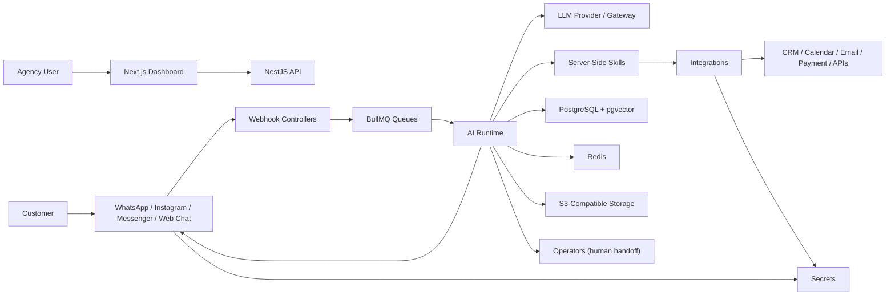
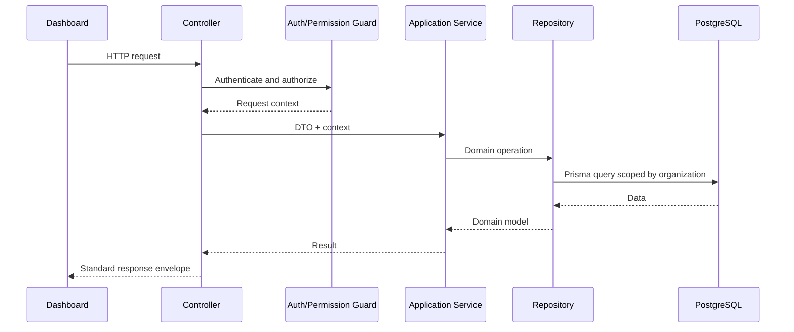
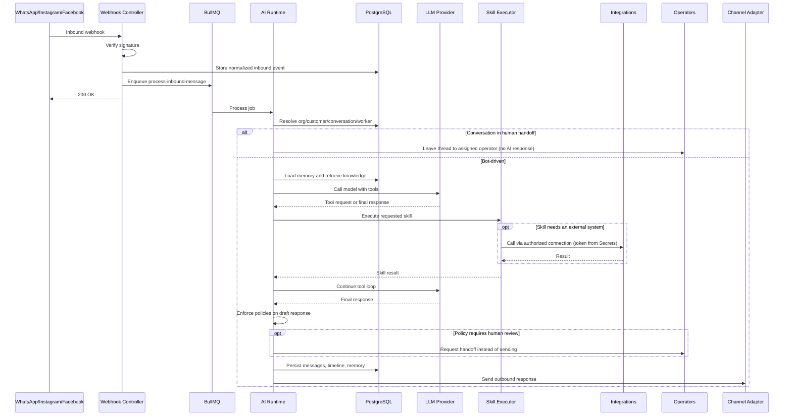
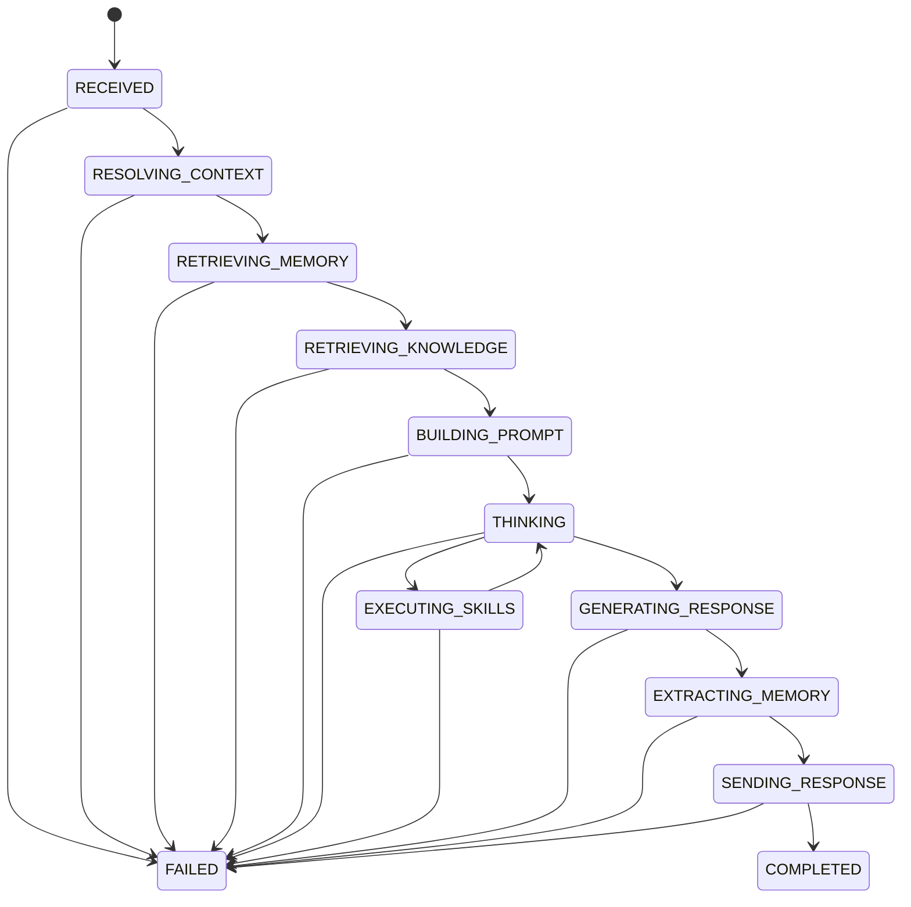

# Master Architecture

This document is the source of truth for AI Workforce OS architecture. Every subsystem specification and implementation must align with it.

## 1. Executive Summary

AI Workforce OS is a multi-tenant SaaS platform for agencies that want to deploy AI workers across messaging channels such as WhatsApp, Instagram, Facebook Messenger, and web chat.

The system is built as a modular monolith:

- Backend: NestJS and TypeScript
- Database: PostgreSQL with pgvector
- ORM: Prisma
- Queue: BullMQ with Redis
- Frontend: Next.js App Router
- Realtime: Socket.IO
- Storage: S3-compatible object storage
- AI: OpenAI-compatible LLM gateway with provider abstraction

The MVP avoids microservices, Kubernetes, Kafka, dynamic third-party skill loading, and complex distributed orchestration. The goal is to build a product that is simple enough for a small team to operate but structured enough to grow into a larger platform.

## 2. Core Product Model

The platform exposes "AI Agents" to customers but uses `Worker` internally.

A Worker is the product's central aggregate — a single consistency boundary whose facets are configured, versioned, and rolled back together. The authoritative model lives in `docs/01-domain/DOMAIN_MAP.md`; this section summarizes it. A Worker is an AI employee composed of:

- Brain: the reasoning core — model and model-level reasoning settings.
- Goals: the business outcomes the Worker is configured to pursue.
- Capabilities: the declared high-level abilities the Worker may exercise (realized concretely by Skill Attachments).
- Prompt Profile: the authored, versioned prompt material — system prompt, tone/format rules, reusable fragments. (Owned inside Worker; see the Prompt evaluation in the Domain Map.)
- Policies: constraints and approvals enforced by the runtime before a response is sent. (Owned inside Worker; see the Policy evaluation in the Domain Map.)
- Skill Attachments: references to Skills the Worker may invoke, pinned to Skill versions.
- Knowledge Attachments: references to Knowledge sources the Worker may retrieve from.
- Channel Bindings: connected messaging transports the Worker operates on.
- Runtime Configuration: declarative execution settings the runtime honors (tool-loop limits, retrieval breadth, latency/cost ceilings).
- Personality: the durable persona (name, voice, character) shaping tone across conversations.
- Metrics: success, cost, latency, usage, and quality indicators (derived by Analytics, targets configured here).
- Version: an immutable snapshot binding all of the above, including pinned Skill/Knowledge versions, for reproducibility.

Ownership note: the Worker owns configuration and identity; it references Skills, Knowledge, and Channels (owned by their domains) via attachments, and does not execute — execution is the AI Runtime's responsibility.

This model allows the product to grow beyond chatbots into sales, support, booking, marketing, and operations workers.

## 3. Architectural Principles

### 3.1 Modular Monolith

Use one backend application with strong module boundaries.

Acceptable (one module per domain; see §5 for the full list):

- `WorkersModule`
- `ConversationsModule`
- `CustomersModule`
- `OperatorsModule`
- `ChannelsModule`
- `IntegrationsModule`
- `SecretsModule`
- `SkillsModule`
- `KnowledgeModule`
- `MemoryModule`
- `RuntimeModule`
- `WorkflowModule`
- `NotificationModule`
- `AnalyticsModule`
- `AuditModule`

Not acceptable:

- Separate microservices for MVP
- Cross-module table access
- Shared global business logic
- Runtime behavior hidden inside external frameworks

### 3.2 Feature-First Organization

Organize code by business capability, not technical layer.

Preferred:

```text
src/modules/conversations/
  conversations.controller.ts
  conversations.service.ts
  conversations.repository.ts
  dto/
  entities/
  events/
  tests/
```

Avoid:

```text
src/controllers/
src/services/
src/repositories/
```

### 3.3 Repository Pattern

Prisma access belongs only in repositories.

Controllers call services. Services call repositories or public services from other modules. Repositories call Prisma. Nothing else calls Prisma directly.

### 3.4 Organization Scoped by Default

Every tenant-owned record must include `organization_id` unless there is a documented reason not to. Every tenant-owned query must filter by organization ID.

### 3.5 Async Runtime

Inbound webhooks must enqueue work and return quickly. AI Runtime processing occurs in BullMQ workers. Long-running work must never block webhook response paths.

### 3.6 Server-Side Skills

Skills are TypeScript classes registered on the server. The MVP does not support arbitrary customer-uploaded code or third-party runtime plugins.

### 3.7 Observability Built In

Every Worker execution should produce an execution timeline:

- Inbound event received
- Organization resolved
- Customer resolved
- Conversation resolved
- Worker resolved
- Knowledge retrieved
- Memory retrieved
- Prompt built
- LLM called
- Skills requested
- Skills executed
- Response generated
- Memory extracted
- Message sent

The timeline is critical for debugging, trust, and enterprise readiness.

## 4. High-Level System Context



## 5. Backend Modules

Each module maps one-to-one to a domain in `docs/01-domain/DOMAIN_MAP.md` and owns that domain's data and rules. Two mappings are not name-identical: the **Identity & Access** domain is implemented as the **Auth** and **Users** modules, and the **Organization** domain is the **Organizations** module. Every other domain is a single module of the same name. No module reads another module's tables; cross-module needs go through public services or domain events.

### 5.1 Auth Module (Identity & Access)

Responsibilities:

- Registration
- Login
- Refresh tokens
- Logout
- Password reset
- Email verification
- Session tracking
- Authentication guards

### 5.2 Users Module (Identity & Access)

Responsibilities:

- User profiles
- Role assignment
- User settings
- Membership lookup

### 5.3 Organizations Module

Responsibilities:

- Organization creation
- Organization settings
- Tenant context
- Membership
- Invitations

### 5.4 Secrets Module

Responsibilities:

- Encrypted storage of credentials, API keys, OAuth tokens, and encryption keys
- Scoped, short-lived release of a secret value to an authorized caller at point of use
- Secret rotation and revocation
- Emission of rotation/revocation signals for dependent modules

No plaintext at rest, no bulk export, no logging of secret values; every access is authorized and audited. Channels, Integrations, Billing, and credentialed Skills hold only *references* to Secrets — never the values.

### 5.5 Workers Module

Responsibilities:

- Worker CRUD and configuration (Brain, Goals, Capabilities, Prompt Profile, Policies, Personality, Runtime Configuration)
- Worker versioning and rollback (immutable snapshots with pinned Skill/Knowledge versions)
- Worker status and activation
- Skill, Knowledge, and Channel attachment
- Policy configuration (Policies remain a Worker facet; see the Policy evaluation in the Domain Map)

### 5.6 Channels Module

Responsibilities:

- Channel abstraction
- Webhook normalization and verification
- Inbound event deduplication
- Outbound message dispatch and delivery status
- Channel configuration (credentials stored in the Secrets module and referenced here)
- WhatsApp adapter
- Instagram adapter
- Facebook adapter
- Future web chat adapter

### 5.7 Customers Module

Responsibilities:

- Customer profiles
- Per-channel contact identifiers
- Cross-channel identity resolution and de-duplication
- Customer attributes and tags

### 5.8 Conversations Module

Responsibilities:

- Conversation creation and retrieval
- Message persistence with authorship and ordering
- Inbox views
- Conversation status
- Handoff status flag and a reference to the assigned Operator (operator management is owned by the Operators module, not here)

### 5.9 Operators Module

Responsibilities:

- Operator profiles and presence/availability
- Queues and routing rules
- Assignment and reassignment of conversations to operators
- Human-handoff lifecycle (request, claim, active, return)

### 5.10 Runtime Module (AI Runtime)

Responsibilities:

- Worker execution lifecycle
- Runtime context building
- Prompt orchestration
- Planning and the tool-calling loop
- Tool registry (runtime projection of the Skill registry, scoped to the Worker Version)
- LLM provider abstraction (token/cost/latency capture)
- Runtime state tracking and execution timeline
- Error recovery

### 5.11 Skills Module

Responsibilities:

- Skill registry
- Skill metadata
- Skill permission checks
- Skill input/output validation
- Skill execution
- Skill telemetry
- Built-in skills

Skills reach external systems only through the Integrations module; they never own OAuth or credentials.

### 5.12 Integrations Module

Responsibilities:

- Catalog of supported external providers (HubSpot, Salesforce, Gmail, Google Calendar, Slack, Jira, Shopify, Stripe, Notion, and future providers)
- OAuth/authorization flows and connection lifecycle (connect, reconnect, revoke)
- Connection status, scopes, and health
- Authorized connection handles that Skills consume

OAuth is orchestrated here; the resulting tokens are stored in the Secrets module, never in Integrations.

### 5.13 Knowledge Module

Responsibilities:

- Knowledge source upload
- Document parsing
- Chunking
- Embedding generation
- Vector search
- Retrieval for runtime

### 5.14 Memory Module

Responsibilities:

- Customer memory extraction
- Customer memory storage
- Memory retrieval
- Memory conflict handling
- Memory expiry and confidence

### 5.15 Workflow Module

Responsibilities:

- Deterministic automations
- Triggers
- Conditions
- Actions
- Workflow runs
- Scheduled jobs

### 5.16 Notification Module

Responsibilities:

- Subscription to noteworthy domain events
- Recipient resolution by role and preference
- In-app and email notification delivery
- Delivery and read-state tracking, respecting user preferences

### 5.17 Analytics Module

Responsibilities:

- Message counts
- Worker usage
- Skill usage
- Token usage
- Cost tracking
- Conversation outcomes

### 5.18 Audit Module

Responsibilities:

- Security-relevant event logging
- Configuration change history
- External side effect records
- Compliance-ready audit trail

### 5.19 Billing Module (deferred to V1)

Not built in the MVP; listed so module boundaries leave room for it. Will own subscription plans, entitlements, and usage metering derived from Analytics. Payment-provider tokens are stored in the Secrets module; Billing never stores raw payment credentials. Usage and cost are tracked from the MVP (via Analytics) even before Billing charges for them.

### Media & Storage

Durable object storage (S3) is a supporting domain in the Domain Map. It is implemented as a shared storage capability that the Conversations (attachments) and Knowledge (source originals) modules reference by object handle rather than a feature module of its own. See §10 and `docs/01-domain/DOMAIN_MAP.md`.

## 6. Standard Request Lifecycle



## 7. Inbound Message Lifecycle



## 8. AI Runtime Stages

The AI Runtime is a single bounded context organized into the conceptual components defined in `docs/01-domain/DOMAIN_MAP.md`: **Context Builder, Prompt Builder, Planner, Tool Loop, Tool Registry, LLM Provider, Response Builder, and Memory Extractor**. The explicit stages below realize those components; each stage names the component that owns it, and each must be independently testable.

1. Normalize inbound event. *(Context Builder)*
2. Resolve organization. *(Context Builder)*
3. Resolve customer. *(Context Builder)*
4. Resolve conversation. *(Context Builder)*
5. Resolve worker and load the Worker Version. *(Context Builder)*
6. Load worker configuration — Brain, Prompt Profile, Policies, Runtime Configuration. *(Context Builder)*
7. Check conversation state and handoff rules; stop here if the thread is in human handoff. *(Context Builder)*
8. Retrieve relevant memory. *(Context Builder)*
9. Retrieve relevant knowledge chunks. *(Context Builder)*
10. Assemble the runtime context. *(Context Builder)*
11. Build prompt messages from context, Prompt Profile, and Personality. *(Prompt Builder)*
12. Decide the next action — answer directly, retrieve more, or call a tool — within the configured budget. *(Planner)*
13. Expose the Worker Version's attached Skills to the model as callable tools. *(Tool Registry — a projection of the Skill registry)*
14. Call the model with the available tools. *(LLM Provider, driven by the Tool Loop)*
15. Execute requested skills; external calls go through Integrations. *(Tool Loop → Skills)*
16. Repeat plan → call → execute until a final response or the iteration limit. *(Tool Loop, always bounded)*
17. Enforce Worker Policies on the draft response; route to human handoff if blocked. *(Response Builder)*
18. Persist the assistant message. *(Response Builder)*
19. Dispatch the outbound message to the Channel. *(Response Builder)*
20. Extract and store memory, asynchronously. *(Memory Extractor)*
21. Record metrics and the execution timeline. *(observability, spanning all components)*

The Planner corresponds to the `THINKING` state in the runtime state machine (§9); the Tool Loop cycles between `THINKING` and `EXECUTING_SKILLS`.

## 9. Runtime State Machine



## 10. Data Architecture

Table groups follow domain ownership: each group is owned by exactly one domain (per `docs/01-domain/DOMAIN_MAP.md`), and no module reads another group's tables directly. Table names below are illustrative.

- Identity & Access: users, roles, permissions, sessions, api_keys (api_key secret values stored in Secrets)
- Organization: organizations, memberships, invitations
- Secrets: secrets, encryption_keys (holds every credential/token value referenced by other groups)
- Workers: workers, worker_versions, worker_skills, worker_knowledge, worker_channels, worker_policies
- Channels: channel_connections, inbound_events, outbound_messages (credentials referenced from Secrets)
- Customers: customers, customer_channels
- Conversations: conversations, messages, attachments (attachments reference Media & Storage objects)
- Operators: operators, operator_presence, queues, assignments, handoff_events
- Skills: skills, skill_executions, skill_permissions
- Integrations: integration_providers, integration_connections (tokens referenced from Secrets)
- Knowledge: knowledge_sources, knowledge_documents, knowledge_chunks, embeddings
- Memory: customer_memories, memory_events
- AI Runtime: runtime_runs, runtime_steps, llm_calls, token_usage
- Workflow: workflows, workflow_versions, workflow_runs, workflow_steps
- Notification: notifications, notification_preferences
- Analytics: usage_rollups, cost_rollups, metric_aggregates
- Audit: audit_logs
- Media & Storage: stored_objects (referenced by Conversations attachments and Knowledge sources)
- Billing (V1, deferred): subscriptions, plans, usage_meters

Detailed schemas belong in `docs/03-database/`.

## 11. API Architecture

Use versioned REST APIs:

```text
/api/v1/auth
/api/v1/organizations
/api/v1/workers
/api/v1/conversations
/api/v1/customers
/api/v1/channels
/api/v1/knowledge
/api/v1/skills
/api/v1/workflows
/api/v1/analytics
```

Use standard response envelopes:

```json
{
  "data": {},
  "meta": {
    "requestId": "uuid"
  }
}
```

Use standard error envelopes:

```json
{
  "error": {
    "code": "WORKER_NOT_FOUND",
    "message": "Worker was not found.",
    "details": {},
    "requestId": "uuid"
  }
}
```

## 12. Queue Architecture

Initial queues:

- `inbound-message`
- `outbound-message`
- `knowledge-ingestion`
- `memory-extraction`
- `workflow-execution`
- `runtime-cleanup`
- `analytics-rollup`

Queue rules:

- Jobs must include organization ID when tenant-owned.
- Jobs must include idempotency key.
- Jobs must have bounded retries.
- Jobs must log failure context.
- Jobs must not rely on in-memory state.

## 13. Skill Architecture

Every skill has:

- Stable name
- Description
- Version
- Input schema
- Output schema
- Required permissions
- Timeout
- Retry policy
- Idempotency behavior
- Executor implementation

Skill lifecycle:

```text
Register -> Validate Input -> Authorize -> Execute -> Validate Output -> Record Metrics -> Return Result
```

Workers do not call integrations directly. Workers request tools through the LLM tool loop. Tool requests are mapped to registered server-side skills.

## 14. Channel Architecture

The runtime must not know channel-specific payload formats. Channel adapters normalize inbound events and expose outbound sending through a common interface.

```typescript
interface ChannelAdapter {
  normalizeInboundEvent(raw: unknown): Promise<NormalizedInboundEvent>;
  sendMessage(input: SendMessageInput): Promise<SendMessageResult>;
  markRead?(input: MarkReadInput): Promise<void>;
  sendTyping?(input: TypingInput): Promise<void>;
}
```

Channel-specific details stay inside adapters.

## 15. Knowledge and RAG Architecture

Knowledge ingestion flow:

1. Upload or connect source.
2. Store original file in object storage.
3. Extract text.
4. Normalize text.
5. Chunk text.
6. Generate embeddings.
7. Store chunks and vectors in PostgreSQL with pgvector.
8. Mark source as indexed.

Runtime retrieval flow:

1. Build retrieval query from latest customer message and conversation context.
2. Search organization-scoped knowledge chunks.
3. Filter by worker access rules.
4. Return top chunks with citations.
5. Add chunks to prompt context.

## 16. Memory Architecture

Memory stores structured facts, not raw summaries of every message.

Example memory:

```json
{
  "key": "preferred_location",
  "value": "Dubai",
  "confidence": 0.86,
  "sourceConversationId": "uuid"
}
```

Memory extraction should happen asynchronously after a message exchange. Runtime may load existing memory synchronously before generating a response.

## 17. Workflow Architecture

Workflows are deterministic automations. They are separate from the AI Runtime.

Examples:

- When a lead is created, notify sales.
- If a conversation is unresolved for 10 minutes, assign a human.
- After appointment booking, send confirmation and reminder.

Workflows use triggers, conditions, and actions. LLM calls inside workflows must be explicit action types, not hidden behavior.

## 18. Security Architecture

Security requirements:

- JWT access tokens and refresh token rotation.
- Organization-scoped authorization.
- RBAC with fine-grained permissions.
- Encrypted channel credentials.
- Verified webhooks.
- Rate limiting.
- Audit logs for sensitive actions.
- No sensitive payloads in logs.
- External calls with timeouts.
- Principle of least privilege for skills.

## 19. Observability Architecture

Every request and job should carry:

- request ID
- correlation ID when applicable
- organization ID when applicable
- user ID when applicable
- conversation ID when applicable
- worker ID when applicable

Track:

- API latency
- job latency
- runtime duration
- LLM latency
- skill latency
- token usage
- cost estimate
- channel send success/failure
- webhook duplicates
- knowledge retrieval quality signals

## 20. Frontend Architecture

Use Next.js App Router with:

- TypeScript
- Tailwind CSS
- shadcn/ui or equivalent component primitives
- TanStack Query for server state
- React Hook Form and Zod for forms

Main product surfaces:

- Dashboard
- Unified inbox
- Worker builder
- AI Runtime execution timeline
- Knowledge base
- Customer profiles
- Channel settings
- Skill settings
- Workflow builder
- Analytics
- Organization settings

The first screen after login should be a useful operational dashboard or inbox, not a marketing page.

## 21. Deployment Architecture

MVP deployment can use:

- One backend container
- One frontend container
- PostgreSQL with pgvector
- Redis
- S3-compatible storage
- Worker process using same NestJS codebase

Avoid Kubernetes initially. Use Docker Compose locally and a simple production platform such as AWS ECS, Render, Fly.io, Railway, or similar until scale requires more.

## 22. Key Architectural Decisions & Rationale

Every significant technology and structural choice is recorded as an Architecture Decision Record in `docs/adr/`. The ADRs are the authoritative, immutable record; this section is a readable summary with links. When a decision changes, a new ADR supersedes the old one and this summary is updated.

- **Modular monolith** — `docs/adr/0001-modular-monolith.md`. One deployable NestJS app with strict per-domain module boundaries. Chosen so a small team can build and operate the platform without the networking, deployment, and transaction overhead of microservices, while clean boundaries keep future service extraction possible.
- **PostgreSQL** — `docs/adr/0002-postgresql.md`. A single relational database for transactional consistency, strong tenant scoping, and a mature ecosystem, avoiding a separate datastore per concern in the MVP.
- **Prisma** — `docs/adr/0003-prisma.md`. Typed data access and migrations with strong developer experience, confined to the repository layer; controllers and services never touch Prisma directly.
- **BullMQ + Redis** — `docs/adr/0004-bullmq.md`. Redis-backed queues decouple fast webhook acknowledgement from slower runtime work and provide safe, bounded retries; every job is idempotent and organization-scoped.
- **REST first** — `docs/adr/0005-rest-api.md`. Versioned REST for the dashboard and integrations; WebSockets only for realtime inbox and runtime updates. GraphQL is deferred until product needs justify its complexity.
- **pgvector** — `docs/adr/0006-pgvector.md`. Vector similarity search lives inside PostgreSQL via the pgvector extension, so retrieval-augmented generation needs no separate vector database during the MVP.

Two further decisions are load-bearing and will be formalized as their own ADRs as they mature:

- **NestJS with TypeScript strict mode** as the backend framework — feature-first modules, dependency injection, and guards that match the modular-monolith and repository patterns.
- **Server-side skills only** — Skills are registered TypeScript executors; no dynamic third-party code execution in the MVP, for security, reliability, and debuggability. Skills reach external systems only through the Integrations module.

## 23. Forbidden Patterns

Do not:

- Add microservices for MVP.
- Add Kafka for MVP.
- Add Kubernetes for MVP.
- Put business logic in controllers.
- Access Prisma outside repositories.
- Let modules query each other's tables directly.
- Add untyped `any` in core logic.
- Process inbound webhooks synchronously.
- Store secrets in plaintext.
- Log full prompts when they contain secrets or private customer data.
- Let the LLM execute arbitrary code.
- Build dynamic third-party skill loading in MVP.
- Hide runtime state inside an opaque external framework.

## 24. Documentation Map

This file defines system-wide rules. Detailed specs should live in:

- `docs/01-domain/` for the domain model, core concepts, and ubiquitous language.
- `docs/02-architecture/` for cross-cutting architecture.
- `docs/03-database/` for schema and migrations.
- `docs/04-backend/` for NestJS modules.
- `docs/05-ai/` for runtime, prompt, RAG, memory, and evaluation.
- `docs/06-frontend/` for UI, pages, components, and state.
- `docs/07-deployment/` for infrastructure and operations.
- `docs/08-testing/` for test strategy, coverage, and quality gates.
- `docs/09-prompts/` for Claude Code implementation prompts.
- `docs/adr/` for numbered Architecture Decision Records.

## 25. Acceptance Criteria for the Architecture

The architecture is successful if:

- A new engineer can understand the system without reading code.
- Claude Code can implement a module from its spec without inventing architecture.
- Runtime behavior can be debugged from persisted traces.
- Tenant isolation is enforced by design.
- New skills can be added without changing runtime internals.
- New channels can be added without changing runtime internals.
- The MVP can be deployed and operated by a small team.

