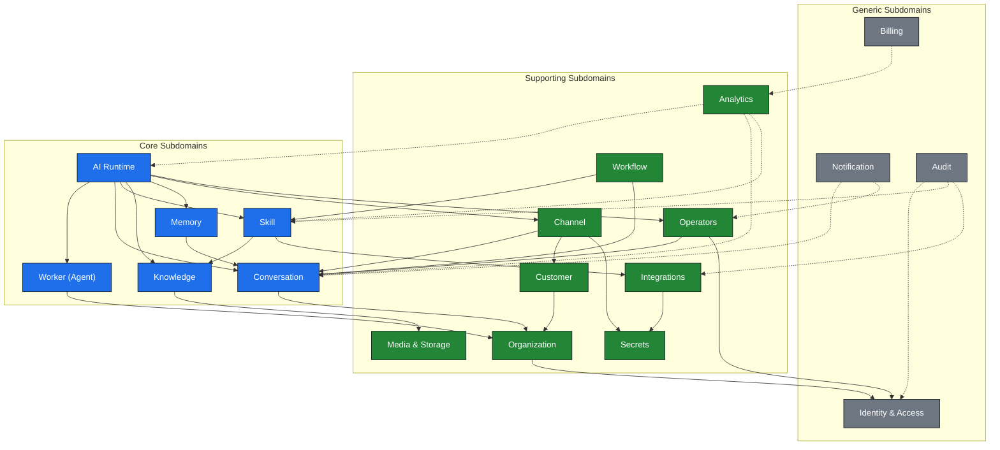
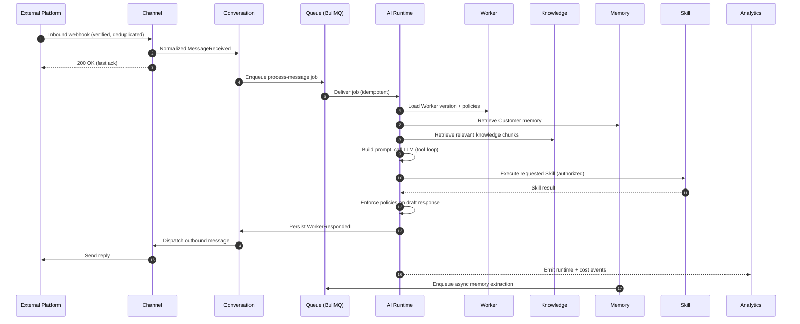

# Domain Map

## Purpose

This document is the authoritative map of the business domains (bounded contexts) that make up AI Workforce OS. It defines what each domain owns, what it is responsible for, the rules it must always uphold, how it depends on and communicates with other domains, and where its boundaries end. It is a business and architecture specification, not an implementation. It exists so that every subsequent specification and every implemented module has a shared, precise model of the problem space before any code is written.

## Scope

This map covers the full logical domain model for the MVP and near-term V1 of the platform. It describes bounded contexts, their owned entities at a conceptual level, the domain events that flow between them, and the interfaces they expose to one another. It deliberately stays at the domain level: it names entities and their invariants but does not define database columns, class structures, or API payloads — those belong in `docs/03-database/`, `docs/04-backend/`, and the per-subsystem specs.

Terminology in this document follows `docs/00-foundation/GLOSSARY.md`. Where product-facing and internal terms differ, the internal term is authoritative here: the customer-facing **Agent** is modeled internally as a **Worker**.

## Goals

- Enumerate every business domain in the platform and classify each as core, supporting, or generic.
- Give each domain a single, clear purpose and an explicit boundary.
- Make ownership unambiguous: every entity is owned by exactly one domain.
- Capture the invariants each domain must always enforce.
- Document the events each domain publishes and consumes, so integration is contract-driven.
- Provide high-level diagrams of context boundaries and of the primary runtime interaction.
- Serve as the reference that `MASTER_ARCHITECTURE.md` and all module specs align to.

## Non Goals

- No database schema, table, or column definitions (see `docs/03-database/`).
- No API request/response shapes, routes, or DTOs (see `docs/04-backend/`).
- No class diagrams, file layouts, or code (this is the Architecture Phase).
- No final event payload schemas — event names and intent only; payloads are defined per-subsystem.
- No delivery sequencing or sprint planning (see root `TASKS.md`).
- No decisions about technology already fixed in `docs/00-foundation/DECISIONS.md`; this document assumes them.

---

## Subdomain Classification

Bounded contexts are grouped using a strategic Domain-Driven Design lens. **Core** domains are the product's differentiators — the reasons a customer chooses AI Workforce OS. **Supporting** domains are necessary and specific to this product but not themselves the differentiator. **Generic** domains are solved problems the platform needs but does not innovate on.

| Classification | Domains |
|----------------|---------|
| Core | Worker (Agent), AI Runtime, Skill, Knowledge, Memory, Conversation |
| Supporting | Organization, Channel, Customer, Operators, Workflow, Integrations, Analytics, Media & Storage, Secrets |
| Generic | Identity & Access, Notification, Billing, Audit |

The core domains are protected most carefully: their boundaries, invariants, and events change only through deliberate decisions recorded as ADRs.

**Prompt** is deliberately *not* listed as a standalone domain. It is evaluated in the Worker section and, for the reasons given there, remains a concept owned inside the Worker domain (as the Prompt Profile), with a possible future extraction to a Prompt Library (see Future Domains).

---

## Domain Catalog (Overview)

| # | Domain | Class | One-line purpose |
|---|--------|-------|------------------|
| 1 | Organization | Supporting | The tenant boundary that owns and isolates all other data. |
| 2 | Identity & Access | Generic | Who a platform user is and what they are allowed to do. |
| 3 | Worker (Agent) | Core | The configurable AI employee: brain, skills, knowledge, policies, versions. |
| 4 | AI Runtime | Core | Turns an inbound event into a reasoned, policy-checked response. |
| 5 | Conversation | Core | The threaded record of messages and the human-handoff state. |
| 6 | Customer | Supporting | The external person a Worker talks to, and their profile. |
| 7 | Channel | Supporting | Normalizes inbound events and sends outbound messages per transport. |
| 8 | Skill | Core | Server-side capabilities a Worker can invoke via tool calling. |
| 9 | Knowledge | Core | Ingested content, chunked and embedded for retrieval (RAG). |
| 10 | Memory | Core | Structured, durable facts learned about a Customer. |
| 11 | Workflow | Supporting | Deterministic, non-AI automation of triggers, conditions, actions. |
| 12 | Analytics | Supporting | Usage, cost, and performance metrics derived from platform events. |
| 13 | Notification | Generic | Delivers alerts to platform Users about things needing attention. |
| 14 | Billing | Generic | Subscription plans and usage metering for agencies. |
| 15 | Audit | Generic | Immutable record of sensitive and security-relevant actions. |
| 16 | Media & Storage | Supporting | Durable storage and retrieval of files and attachments (S3). |
| 17 | Operators | Supporting | Human operators — their presence, availability, queues, assignments, and the handoff process. |
| 18 | Integrations | Supporting | Managed connections to external systems (CRMs, email, calendars, commerce) that Skills consume. |
| 19 | Secrets | Supporting | Secure storage of credentials, API keys, OAuth tokens, and encryption keys. |

---

## Bounded-Context Diagram

The diagram groups every context by strategic classification and shows the primary dependency direction. A solid arrow from A to B means A depends on B (calls it directly). A dashed arrow means A reacts to events B publishes.

---

## Domain Interaction Diagram

The most important cross-context flow is processing an inbound customer message end to end. This sequence shows how the contexts collaborate. Solid arrows are synchronous calls; the runtime work happens asynchronously off a queue so the webhook returns immediately.

If the Conversation is in human-handoff state, the Runtime does not generate or send a response; it stops after loading context and leaves the thread to a human operator.

---

## Bounded Contexts in Detail

Each context below follows the same structure: purpose, owned entities, responsibilities, invariants, dependencies, events published and consumed, APIs exposed, boundaries, and what is explicitly out of scope. Event names are stated as intent (past-tense facts); their payloads are defined in the owning subsystem spec.

### 1. Organization (Supporting)

**Purpose.** Organization is the tenant of the platform. It is the top-level boundary that owns and isolates every other piece of data. An Agency operates as one Organization; every Worker, Customer, Conversation, and configuration belongs to exactly one Organization.

**Owned entities.** Organization; Membership (the link between a User and an Organization, carrying the User's role within it); Organization settings and defaults; optionally Client (a business served by the agency, deferred until an agency-client hierarchy is needed).

**Responsibilities.** Establish the tenant boundary. Own organization-level configuration and defaults. Manage which Users belong to the Organization and with what role. Provide the `organizationId` that scopes all tenant-owned data across every other domain.

**Invariants.** Every tenant-owned record in the platform references exactly one Organization. An Organization always has at least one member with owner-level rights. Membership cannot exist without both a valid User and a valid Organization. Deleting or suspending an Organization cascades a suspension of access to all its data.

**Dependencies.** Identity & Access (to resolve which Users may be members and to authenticate them).

**Events published.** OrganizationCreated, OrganizationSuspended, MemberAdded, MemberRemoved, MemberRoleChanged.

**Events consumed.** UserRegistered (to create the first membership when an owner signs up).

**APIs exposed.** Organization profile and settings management; membership management (invite, remove, change role); resolution of the current Organization context for a request.

**Boundaries.** Organization defines *who owns data*, not *what a person may do* — permission logic lives in Identity & Access. It does not model external Customers (that is the Customer domain); its "members" are always platform Users.

**Out of scope.** Authentication mechanics, permission evaluation, billing plans (Billing owns plans, though it is scoped by Organization), and any customer-facing conversational data.

### 2. Identity & Access (Generic)

**Purpose.** Identity & Access answers two questions: who is this platform User, and what are they allowed to do. It provides authentication and the authorization model (roles and fine-grained permissions) used everywhere else.

**Owned entities.** User (a person with a dashboard login); Credential / authentication method; Session or token; Role; Permission; Role-to-permission assignments.

**Responsibilities.** Authenticate Users. Issue and validate sessions/tokens. Define roles and the permissions they grant. Evaluate whether a given User, acting in a given Organization, holds a required permission for an action. Provide the authenticated request context (user identity, organization membership, permissions) consumed by every protected operation.

**Invariants.** A User is globally unique by their identifying credential (e.g., email). Authorization is always evaluated server-side; client-supplied roles or organization claims are never trusted. Every permission check is evaluated in the context of a specific Organization membership. A User with no membership in an Organization has no access to that Organization's data.

**Dependencies.** Organization (to know a User's memberships and role within each). Audit (as a consumer of its events).

**Events published.** UserRegistered, UserAuthenticated, AuthenticationFailed, PermissionDenied, RoleAssigned.

**Events consumed.** MemberRoleChanged (to keep effective permissions current).

**APIs exposed.** Authentication (sign-in, sign-out, token refresh); current-user and current-context resolution; permission-check interface used as a guard by other domains; role and permission administration.

**Boundaries.** Identity & Access governs **platform Users only**. It has nothing to do with external Customers, who never authenticate into the platform. It owns *whether* an action is allowed; it does not own the business action itself.

**Out of scope.** Customer identity (owned by Customer), tenant ownership of data (owned by Organization), and audit persistence (owned by Audit, which merely consumes I&A events).

### 3. Worker / Agent (Core)

**Purpose.** The Worker is the configurable AI employee — the heart of the product. Presented to customers as an "Agent," a Worker is a composition of everything that defines how it behaves. It is best understood as an *aggregate root*: a single consistency boundary that owns a set of tightly-related configuration concepts and guarantees they are only ever changed together and versioned together.

**Conceptual composition.** A Worker conceptually owns the following parts. These are facets of the Worker aggregate, not independent domains — none has a lifecycle apart from the Worker that contains it.

- **Brain** — the reasoning core: which model is used, and the model-level reasoning settings (e.g., temperature, tool-use behavior). *What the Worker thinks with.*
- **Goals** — the outcomes the Worker is configured to pursue (qualify leads, book appointments, resolve support), used to steer behavior and to evaluate success. *What the Worker is for.*
- **Capabilities** — the declared, high-level abilities the Worker is permitted to exercise (e.g., "can book appointments," "can issue refunds up to a limit"). Capabilities are the intent; Skill Attachments are the concrete grants that realize them. *What the Worker is allowed to do.*
- **Prompt Profile** — the authored, versioned prompt material: system prompt, tone/style guidance, response format rules, and reusable prompt fragments. *How the Worker is instructed.* (See the Prompt evaluation below for why this lives in Worker.)
- **Policies** — rules that constrain behavior and are enforced by the Runtime before a response is sent (e.g., require human review before offering a discount). *What the Worker must never or must always do.* (See the Policy evaluation below for why this stays in Worker for now.)
- **Knowledge Attachments** — references to Knowledge sources the Worker may retrieve from. Ownership of the content stays with Knowledge; the Worker owns only the *attachment* (which sources, with what scope).
- **Skill Attachments** — references to Skills the Worker may invoke, pinned to specific Skill versions. Ownership of the Skill stays with Skill; the Worker owns only the *attachment* and its configuration.
- **Runtime Configuration** — declarative execution settings the Runtime honors (e.g., maximum tool-loop iterations, response length limits, retrieval breadth, latency/cost ceilings). This is configuration *data*, not execution *behavior* — the Runtime domain owns the behavior.
- **Personality** — the durable persona of the Worker (name, voice, character) that shapes tone across every conversation, distinct from per-message Prompt Profile mechanics.
- **Version** — an immutable snapshot binding all of the above (including pinned Skill and Knowledge versions) so every execution is reproducible and auditable.

**Owned entities.** Worker (aggregate root); Brain; Goals; Capabilities; Prompt Profile; Policy (a rule that constrains behavior); Worker-to-Skill attachments; Worker-to-Knowledge attachments; Worker-to-Channel bindings; Runtime Configuration; Personality; Worker Version (immutable snapshot of the full composition, with pinned Skill/Knowledge versions).

**Responsibilities.** Own the definition and lifecycle of Workers and every facet above. Validate that a configuration is coherent (attached skills and knowledge exist and are permitted, model is allowed, capabilities are backed by concrete skill grants, policies are well-formed). Produce immutable Worker Versions so runtime behavior is reproducible and auditable. Expose the single resolved, versioned configuration the AI Runtime loads at execution time.

**Invariants.** Every Worker belongs to exactly one Organization. A Worker can only reference Skills, Knowledge sources, and Channels that belong to the same Organization. Each execution runs against a specific, immutable Worker Version; editing a Worker produces a new Version rather than mutating a prior one. A Worker cannot be marked active for a Channel it is not bound to. Policies attached to a Worker are always evaluated by the Runtime before a response is sent.

**Dependencies.** Organization (ownership and scoping). It references Skill, Knowledge, and Channel entities but does not own them.

**Events published.** WorkerCreated, WorkerUpdated, WorkerVersionPublished, WorkerActivated, WorkerDeactivated, PolicyAttached, PolicyDetached.

**Events consumed.** SkillDeprecated and KnowledgeSourceRemoved (to flag or invalidate configurations that reference something no longer available).

**APIs exposed.** Worker CRUD and configuration; version publishing and rollback; policy attachment; skill/knowledge/channel attachment; retrieval of a resolved Worker Version for the Runtime.

**Boundaries.** Worker owns *configuration and identity of the AI employee*, not its *execution* — running a Worker is the AI Runtime's job. It defines which Skills are attached but does not define or execute them (Skill domain). It defines which Knowledge is available but does not ingest or retrieve it (Knowledge domain).

**Out of scope.** Prompt execution, tool loops, LLM calls, conversation state, and analytics — all owned by other domains.

#### Prompt: Domain Evaluation

**Question.** Should Prompt be its own bounded context, or remain a facet of Worker?

**Recommendation: Prompt remains inside the Worker domain (as the Prompt Profile) for the MVP and V1.**

**Why it stays in Worker.** A prompt has no meaningful lifecycle independent of the Worker it configures. It is created, versioned, activated, and rolled back together with the rest of the Worker's configuration — the entire value of a Worker Version is that the prompt, model, policies, and skill/knowledge pins move as one immutable unit. Extracting Prompt into a separate context would split a single consistency boundary across two domains, forcing distributed coordination (and a shared version clock) for something that is always changed atomically. It would also create an entity — "the prompt" — that is co-owned by Worker and Prompt, violating the single-owner rule. At this stage the prompt is *configuration data the Worker owns*, not a shared, reusable asset with its own governance.

**When it should be extracted.** Prompt should graduate to its own domain — a **Prompt Library** (see Future Domains) — when prompts become *shared, first-class assets* rather than per-Worker configuration: when the product needs reusable prompt templates across many Workers, independent prompt versioning and A/B testing, a prompt approval/governance workflow, or a marketplace of prompts. At that point the Worker would *reference* a library prompt version instead of owning the prompt text, and the Prompt Library would own authoring, versioning, and governance.

**If it were extracted (boundary sketch).** For future reference only, without implementation detail: a Prompt domain would own **responsibilities** (authoring, versioning, testing, and governance of reusable prompt templates and fragments), **ownership** (Prompt Template and Prompt Version entities, and their approval state), and **boundaries** (it would own the reusable prompt *asset*; a Worker Version would reference a specific Prompt Version but never mutate it; the Runtime would resolve the referenced Prompt Version at execution time). Until those needs are real, this remains deliberately inside Worker.

#### Policy: Domain Evaluation

**Question.** Should Policy be its own bounded context, or remain a facet of Worker?

**Recommendation: Policy remains inside the Worker domain for the MVP and V1.** The reasoning parallels Prompt exactly.

**Why it stays in Worker.** A Policy today is part of a Worker's versioned configuration: it is authored, activated, and rolled back together with the Worker Version, and it has no meaning outside the Worker it constrains. Enforcement is a separate concern — the Runtime applies policies before sending a response — but *enforcement is a runtime responsibility, not a reason to own the definition elsewhere*. Splitting Policy out now would fragment the Worker's single consistency boundary and risk a policy being co-owned by Worker and a Policy domain, violating the single-owner rule, for no present benefit.

**When it should be extracted.** Policy graduates to its own **Policy domain** when policies become *shared, org-level, reusable governance rules* applied across many Workers rather than per-Worker configuration — for example organization-wide PII handling, country/regulatory rules, brand-voice rules, or escalation rules that must be defined once and enforced everywhere. At that point Workers would *attach* references to centrally-owned Policies (as they already do with Skills and Knowledge), the Policy domain would own definition, versioning, and governance, and the Runtime would continue to enforce.

**If it were extracted (boundary sketch).** For future reference only: a Policy domain would own **responsibilities** (authoring, versioning, and governance of reusable, org-level policies), **ownership** (Policy and Policy Version entities and their scope), and **boundaries** (it would own the reusable policy *asset*; a Worker Version would reference specific Policy Versions but never mutate them; the Runtime would resolve and enforce them at execution time). Until org-level reusable policies are a real requirement, Policy remains a facet of Worker. This mirrors the Prompt decision and keeps the two consistent.

### 4. AI Runtime (Core)

**Purpose.** The AI Runtime is the engine that turns an inbound event into a reasoned, policy-checked response. It orchestrates the core domains at execution time: it loads the Worker Version, gathers context from Memory and Knowledge, builds the prompt, runs the LLM tool-calling loop, invokes Skills, enforces policies, and hands the final response back to the Conversation for dispatch. It is the platform's primary differentiator and is built in-house rather than on a heavy framework.

**Owned entities.** Runtime Run (one execution against one inbound event); Runtime Step (an ordered stage within a run — retrieval, LLM call, tool call, policy check); LLM Call record (prompt, model, tokens, cost, latency); Tool/Skill execution record within a run; Run status and outcome.

**Responsibilities.** Consume process-message jobs idempotently. Load the correct Worker Version and its policies. Retrieve Customer memory and relevant knowledge before prompt construction. Construct the prompt and run a bounded tool-calling loop via LiteLLM/OpenAI tool calling. Request Skill executions and incorporate results. Enforce Worker policies on the draft response. Persist a fully observable trace (runs, steps, LLM calls, tool calls, token and cost usage). Respect human-handoff state by not responding when a human has taken over.

**Invariants.** A Runtime Run is always tied to one Worker Version, one Conversation, and one Organization. The tool loop is always bounded (a maximum number of iterations). The Runtime only executes Skills that are attached to the Worker and permitted for the acting context. No response is generated or sent while the Conversation is in human-handoff state. Every run persists enough detail (inputs, tool calls, outputs, cost) to be replayed and debugged. The LLM is never allowed to execute arbitrary code — only registered Skills.

**Dependencies.** Worker (configuration and policies), Conversation (message history and handoff state), Memory (customer facts), Knowledge (retrieved chunks), Skill (capability execution), Channel (indirectly, for outbound dispatch via Conversation), and the Queue infrastructure.

**Events published.** RunStarted, RunCompleted, RunFailed, LLMCallRecorded, SkillInvokedByRuntime, WorkerResponded, TokenUsageRecorded.

**Events consumed.** MessageReceived (via the process-message job), HumanHandoffStarted and HumanHandoffEnded (to gate responses).

**APIs exposed.** Primarily a queue-driven worker rather than a public API. It exposes an internal interface to start a run for an inbound event and a read interface for run traces used by debugging and analytics tooling.

**Boundaries.** The Runtime *orchestrates* but does not *own* the domains it calls. It does not own Worker configuration, message storage, memory facts, knowledge content, or skill definitions — it reads from and coordinates them. It owns only the execution record.

**Out of scope.** Deterministic non-AI automation (Workflow), long-term storage of messages (Conversation), and the definition of skills or knowledge.

#### Conceptual Runtime Components

The AI Runtime is a single bounded context, but internally it is organized into conceptual components arranged as a pipeline. These are *domain concepts*, not implementation classes or services — they describe responsibilities within the Runtime, and the AI Runtime spec in `docs/05-ai/` will refine them. Each component reads from other domains but the Runtime owns the orchestration.

- **Context Builder** — resolves everything the run needs before any thinking happens: the Worker Version and its policies, the Conversation's recent message history and handoff state, the Customer, and organization context. It produces a single, coherent execution context. *It gathers; it does not reason.*
- **Prompt Builder** — assembles the actual prompt sent to the model from the Worker's Prompt Profile and Personality, the built context, retrieved Knowledge chunks, and retrieved Memory facts. It is the runtime consumer of the Worker's prompt material; it does not author prompts (Worker owns authoring).
- **Planner** — decides, within a bounded budget, what the model should attempt next: whether to answer directly, retrieve more, or call a tool. It represents the reasoning/decision step of the loop and enforces the Runtime Configuration's limits.
- **Tool Loop** — the bounded iteration that lets the model request tool calls, receives results, and continues until a final answer or the iteration limit is reached. It guarantees the loop always terminates and never executes anything outside the Tool Registry.
- **Tool Registry** — the runtime-facing catalog of tools available *to this specific run*: the Skills attached to the Worker Version, exposed to the model as callable tools. It is a projection of the authoritative Skill Registry (owned by the Skill domain) scoped and filtered to the current Worker and permissions — the Runtime does not define skills, it only exposes the permitted ones.
- **LLM Provider** — the conceptual boundary to the language-model provider (via LiteLLM/OpenAI tool calling). It abstracts model access, records each call's tokens/cost/latency, and isolates the rest of the Runtime from provider specifics. *It calls the model; it makes no product decisions.*
- **Response Builder** — turns the model's final output into the outbound response, applies Worker Policies as a final gate, formats the reply, and hands it to Conversation for dispatch. If a policy blocks the draft, it routes to human handoff rather than sending.
- **Memory Extractor** — after the exchange, asynchronously derives structured facts to persist. It is the Runtime's trigger into the Memory domain; Memory owns the facts and the extraction rules, while the Extractor is the runtime step that initiates extraction.

The reference ordering is: Context Builder → Prompt Builder → Planner → Tool Loop (Tool Registry + LLM Provider) → Response Builder → Memory Extractor. This mirrors the Domain Interaction Diagram above.

### 5. Conversation (Core)

**Purpose.** Conversation owns the threaded record of communication between a Customer, a Worker, and optionally human operators, along with the human-handoff state. It is the backbone of the unified inbox that operators use to review, take over, and debug interactions.

**Owned entities.** Conversation (a thread); Message (inbound, outbound, or system, with author type and content); Handoff status *on the thread* (a flag such as bot-driven or human-controlled, plus a reference to the currently assigned Operator); Message attachment references (pointing to Media & Storage). Note: the Operator entities, availability, queues, routing, and the Assignment records themselves are owned by the **Operators** domain — Conversation holds only the resulting status and an operator reference, never operator management.

**Responsibilities.** Create and maintain conversation threads keyed to a Customer and Channel. Persist every inbound and outbound message with authorship and ordering. Record the thread's handoff status and reflect assignment as directed by the Operators domain. Dispatch outbound messages to the Channel for delivery. Provide the message history the Runtime reads as context and the inbox the dashboard renders.

**Invariants.** Every Conversation and Message belongs to exactly one Organization. A Message always has an unambiguous author type (Customer, Worker, or human operator/system) and a stable ordering within its thread. While a Conversation is in human-handoff state, no Worker-authored messages may be produced by the Runtime. Outbound dispatch to a Channel is recorded as an attempt so delivery can be tracked. A Conversation references exactly one Customer and one Channel.

**Dependencies.** Organization (scoping), Customer (the external party), Channel (delivery of outbound messages), Media & Storage (attachments), Operators (owns assignment and handoff routing; Conversation reflects its decisions on the thread).

**Events published.** MessageReceived, MessageSent, WorkerResponded (persisted), ConversationClosed, HandoffRequested (a signal that a thread needs a human; the Operators domain owns the resulting handoff lifecycle).

**Events consumed.** WorkerResponded from the Runtime (to persist and dispatch), MessageDeliveryUpdated from Channel (to reflect delivery status), HumanHandoffStarted / HumanHandoffEnded / ConversationAssigned from Operators (to update the thread's handoff status and operator reference).

**APIs exposed.** Inbox listing and filtering; conversation and message retrieval; sending an operator message on an assigned thread; reading a thread's handoff status. (Requesting/ending handoff and assigning operators are Operators-domain operations.)

**Boundaries.** Conversation owns *the record and state of the dialogue*, not *how messages travel* (Channel), *who the external party is beyond the thread* (Customer), or *the people and process of human handling* (Operators). It does not generate Worker responses — it stores and dispatches what the Runtime produces.

**Out of scope.** Response generation, channel transport specifics, customer profile and memory, analytics aggregation, and operator presence/availability/queue/assignment management (Operators).

### 6. Customer (Supporting)

**Purpose.** Customer represents the external person who messages the agency (or its client) through a Channel. It owns the durable profile of that person — distinct from a platform User, who logs into the dashboard.

**Owned entities.** Customer profile; Customer contact identifiers per channel (e.g., a WhatsApp number, an Instagram handle); Customer attributes and tags; the link that unifies multiple channel identities into one Customer where possible.

**Responsibilities.** Identify and de-duplicate external contacts across channels. Maintain the customer profile and contact identifiers. Provide a stable Customer reference that Conversations, Memory, and analytics attach to.

**Invariants.** Every Customer belongs to exactly one Organization. A channel contact identifier maps to at most one Customer within an Organization. A Customer is never a platform User and never authenticates into the platform. Customer identity is scoped per Organization — the same phone number in two Organizations is two distinct Customers.

**Dependencies.** Organization (scoping). It is referenced by Conversation and Memory but does not depend on them.

**Events published.** CustomerCreated, CustomerUpdated, CustomerMerged, CustomerIdentifierAdded.

**Events consumed.** MessageReceived (to create a Customer on first contact, if one does not exist).

**APIs exposed.** Customer profile lookup and update; search and listing; merge of duplicate customers; management of contact identifiers and tags.

**Boundaries.** Customer owns *who the external contact is*, not *what has been said to them* (Conversation) or *what has been learned about them* (Memory). It holds stable profile attributes, not conversationally-extracted facts.

**Out of scope.** Conversation threads and messages, extracted memory facts, authentication, and any platform-User concerns.

### 7. Channel (Supporting)

**Purpose.** Channel is the boundary between the platform and external communication transports — WhatsApp, Instagram, Facebook Messenger, website chat, and future channels. Each Channel Adapter normalizes inbound events into a common shape and sends outbound messages in the transport's own format.

**Owned entities.** Channel (a configured connection for one transport within an Organization); Channel Adapter behavior (per-transport); Inbound webhook event record (raw + normalized) with deduplication key; Outbound send attempt and its delivery status; Channel configuration and a *reference* to its credentials (the credentials themselves are stored in the **Secrets** domain, never held as plaintext by Channel).

**Responsibilities.** Receive and verify inbound webhooks from external platforms. Deduplicate inbound events idempotently. Normalize transport-specific payloads into a canonical MessageReceived event for Conversation. Send outbound messages, respecting each platform's rate limits and formats. Track delivery status of outbound attempts.

**Invariants.** Every Channel belongs to exactly one Organization. Inbound webhooks are verified before processing. The same external event is processed at most once (idempotent by deduplication key). Transport-specific payloads never leak past the adapter into Runtime or Conversation internals — downstream domains only ever see normalized events. Outbound sends are always recorded as attempts with a resulting status.

**Dependencies.** Conversation (delivers normalized inbound messages to it and receives outbound dispatch from it), Customer (to resolve or create the external contact), Media & Storage (for inbound/outbound media).

**Events published.** WebhookReceived, MessageReceived (normalized), MessageDeliveryUpdated, ChannelConnected, ChannelDisconnected.

**Events consumed.** MessageSent / WorkerResponded (to perform the actual outbound send).

**APIs exposed.** Inbound webhook endpoints per transport; channel connection and configuration management; delivery-status queries.

**Boundaries.** Channel owns *transport and normalization*, not *conversation state* (Conversation) or *contact identity beyond mapping* (Customer). It is the only domain that understands transport-specific formats.

**Out of scope.** Thread and message storage, response generation, and customer profile management beyond identifier mapping.

### 8. Skill (Core)

**Purpose.** A Skill is a server-side executable capability that a Worker can invoke through LLM tool calling — for example, create a lead, check a calendar, send an email, or search a CRM. The Skill domain owns the registry of available skills and the safe, permissioned execution of them.

**Owned entities.** Skill definition (name, description, version, input schema, output schema, required permissions, timeout, retry policy, idempotency behavior, executor reference); Skill Registry; Skill execution record (inputs, outputs, status, timing) as owned by the Skill domain for its own accounting.

**Responsibilities.** Maintain the registry of available skills and their metadata and schemas. Resolve a requested skill by name and version. Validate skill input against its schema. Authorize execution against the required permissions and the acting context. Execute the skill within its timeout and retry policy. Validate output against its schema and record execution metrics. Return a structured result to the caller (typically the Runtime).

**Invariants.** Only registered, server-side skills can be executed — no dynamic or untrusted code execution. A skill executes only if it is attached to the Worker and the acting context holds the skill's required permissions. Every execution validates input before running and output after. Skills declare idempotency behavior, and side-effecting skills are safe under retry. Every skill carries a version; a Worker Version pins the skill versions it may use for reproducibility.

**Dependencies.** Identity & Access (permission evaluation), Knowledge (for knowledge-search skills), and **Integrations** for any access to an external system (CRM, email, calendar, commerce). A Skill *consumes* an Integration to reach an external system; it never owns the connection, the OAuth flow, or the credentials — those belong to Integrations and Secrets. It is invoked by the Runtime and by Workflow.

**Events published.** SkillExecuted, SkillExecutionFailed, SkillRegistered, SkillDeprecated.

**Events consumed.** None required for core operation; may consume WorkerVersionPublished to validate that referenced skill versions exist.

**APIs exposed.** Skill registry listing and metadata; a skill execution interface used by the Runtime and Workflow; skill administration for registering and deprecating skills.

**Boundaries.** Skill owns *capability definition and execution*, not *the decision to call a skill* (that is the Runtime's LLM tool loop, or a Workflow action). It does not own the conversation or the AI reasoning; it is a callable, contract-bound function.

**Out of scope.** Prompt construction, tool-call orchestration, marketplace/third-party skill distribution (deliberately deferred), and running code in the customer's browser.

### 9. Knowledge (Core)

**Purpose.** Knowledge owns the content a Worker can draw on to answer questions — uploaded documents, website pages, FAQs, and similar sources — ingested, chunked, and embedded so the Runtime can retrieve relevant passages (Retrieval-Augmented Generation).

**Owned entities.** Knowledge Source (an uploaded or connected piece of content); Knowledge Chunk (a searchable fragment of a source); Embedding vectors (stored in pgvector); Ingestion job state; Source-to-Worker attachments (as referenced by the Worker domain).

**Responsibilities.** Accept and register knowledge sources. Store originals durably (via Media & Storage). Extract and normalize text. Chunk content deterministically. Generate embeddings asynchronously. Store vectors in pgvector. Serve organization-scoped similarity retrieval to the Runtime, returning chunks with source references for citation.

**Invariants.** Every Knowledge Source and Chunk belongs to exactly one Organization. Retrieval is always organization-scoped — a query can never return another tenant's content. Chunking is deterministic for a given source and configuration. Embeddings are generated asynchronously and never block ingestion acknowledgement. A Chunk always traces back to its Source so responses can cite provenance.

**Dependencies.** Media & Storage (durable storage of originals), Organization (scoping), and the Queue infrastructure (async embedding). Consumed by the Runtime and by knowledge-search Skills.

**Events published.** KnowledgeSourceAdded, KnowledgeIngestionStarted, KnowledgeIngestionCompleted, KnowledgeIngestionFailed, KnowledgeSourceRemoved.

**Events consumed.** None required for core operation; ingestion is triggered by its own API and queued jobs.

**APIs exposed.** Knowledge source upload and management; ingestion status; an organization-scoped retrieval interface returning ranked chunks with source references.

**Boundaries.** Knowledge owns *content and retrieval*, not *the decision of when to retrieve* (Runtime) or *durable blob storage mechanics* (Media & Storage). It is distinct from Memory: Knowledge is authored content the agency provides; Memory is facts learned about a Customer.

**Out of scope.** Prompt assembly, customer-specific facts, and the storage backend itself.

### 10. Memory (Core)

**Purpose.** Memory owns the structured, durable facts learned about a Customer from conversations — location, preferences, budget, prior purchases, and similar — so a Worker can be contextual across interactions without re-reading entire histories.

**Owned entities.** Customer Memory record (a structured fact with source, confidence, and timestamps); Memory extraction job state. (Worker Memory, facts belonging to a Worker rather than a Customer, is anticipated but deferred.)

**Responsibilities.** Extract structured facts from conversations, typically asynchronously. Store facts with their source, confidence, and timing. Resolve conflicts when new facts contradict old ones. Serve a Customer's relevant memory to the Runtime at prompt-construction time. Respect privacy constraints on what may be retained.

**Invariants.** Every Memory record belongs to exactly one Organization and one Customer. Memory stores structured facts, not raw conversation dumps. Each fact carries a source, a confidence, and timestamps. Conflicting facts are resolved deliberately rather than silently duplicated. Sensitive facts are not stored unless product requirements justify it. Memory retrieval is organization- and customer-scoped.

**Dependencies.** Customer (facts attach to a Customer), Conversation (the source material for extraction), Organization (scoping), and the Queue infrastructure. Consumed by the Runtime.

**Events published.** MemoryExtracted, MemoryUpdated, MemoryConflictResolved.

**Events consumed.** WorkerResponded / MessageReceived (to trigger asynchronous extraction after an exchange).

**APIs exposed.** Customer memory retrieval for the Runtime; memory inspection and management for operators; triggering or reviewing extraction.

**Boundaries.** Memory owns *learned, evolving facts about a Customer*, not *stable profile attributes* (Customer) or *authored reference content* (Knowledge). It does not own the conversation it learns from.

**Out of scope.** Full conversation storage, knowledge content, and prompt assembly.

### 11. Workflow (Supporting)

**Purpose.** Workflow provides deterministic, non-AI automation: triggers, conditions, and actions that run predictably. It is intentionally separate from the AI Runtime — where the Runtime reasons, Workflow follows explicit rules.

**Owned entities.** Workflow definition (triggers, conditions, actions); Workflow Run (one execution); Workflow Run step/audit records; Workflow trigger bindings.

**Responsibilities.** Define and store deterministic automations. Evaluate triggers and conditions. Execute ordered actions, which may include invoking Skills or acting on Conversations. Record auditable workflow runs. Treat any LLM usage inside a workflow as an explicit, discrete action rather than open-ended reasoning.

**Invariants.** Every Workflow and Workflow Run belongs to exactly one Organization. Workflow execution is deterministic given the same inputs. Workflows are separate from the Worker Runtime and never share its execution path. Every workflow run is auditable. LLM calls within a workflow are explicit actions, not emergent behavior.

**Dependencies.** Skill (actions that invoke skills), Conversation (actions that read or post to threads), Organization (scoping), Queue infrastructure. Anticipated as a V1 domain.

**Events published.** WorkflowTriggered, WorkflowRunStarted, WorkflowRunCompleted, WorkflowRunFailed.

**Events consumed.** Domain events that serve as triggers (e.g., MessageReceived, CustomerCreated, SkillExecuted), depending on the workflow's configured trigger.

**APIs exposed.** Workflow definition CRUD; enabling/disabling workflows; workflow run history and status.

**Boundaries.** Workflow owns *deterministic automation*, not *AI reasoning* (Runtime). It orchestrates Skills and Conversation actions but does not define skills or store messages.

**Out of scope.** The AI tool-calling loop, prompt construction, and any nondeterministic decision-making.

### 12. Analytics (Supporting)

**Purpose.** Analytics derives usage, cost, and performance metrics from the events other domains publish, powering the dashboard's reporting and feeding usage data to Billing.

**Owned entities.** Aggregated metric records (message volume, active workers, response times, resolution/handoff rates); Token and cost usage rollups; Analytics query/report definitions; Time-series aggregates.

**Responsibilities.** Consume domain events and aggregate them into metrics. Track AI token usage and estimated cost per Organization, Worker, and Conversation. Compute operational metrics (volumes, latencies, handoff rates). Expose reporting queries to the dashboard. Provide usage figures to Billing.

**Invariants.** Every metric is scoped to an Organization. Analytics is read-derived: it never mutates source-of-truth data in other domains. Usage and cost are tracked from early on even if not yet billed. Aggregates are reproducible from the underlying event stream.

**Dependencies.** Consumes events from Runtime, Conversation, Skill, Knowledge, and others. Provides data to Billing and the dashboard.

**Events published.** UsageAggregated, CostThresholdReached (optional alerting trigger).

**Events consumed.** RunCompleted, TokenUsageRecorded, MessageReceived, MessageSent, SkillExecuted, HumanHandoffStarted, and related events.

**APIs exposed.** Metric and report queries for the dashboard; a usage-summary interface for Billing.

**Boundaries.** Analytics owns *derived metrics*, not *source data*. It is downstream of everything and authoritative for nothing except its own aggregates.

**Out of scope.** Being a system of record for messages, runs, or skills; charging money (Billing); real-time alert delivery (Notification).

### 13. Notification (Generic)

**Purpose.** Notification delivers alerts to platform Users about things that need their attention — a conversation escalated to human handoff, an ingestion failure, a cost threshold reached.

**Owned entities.** Notification (a message to a User); Notification preference/subscription per User; Delivery channel configuration (in-app, email, and future channels); Delivery status.

**Responsibilities.** Subscribe to noteworthy domain events. Determine which Users should be notified based on role and preferences. Render and deliver notifications through configured channels. Track delivery and read status. Respect each User's notification preferences.

**Invariants.** Notifications are scoped to an Organization and addressed to Users within it. A User only receives notifications they are permitted to see and have not opted out of. Notification never exposes another tenant's data. Delivery is best-effort and idempotent per triggering event.

**Dependencies.** Identity & Access (who the Users are and their permissions), Organization (scoping). Consumes events from many domains.

**Events published.** NotificationCreated, NotificationDelivered, NotificationRead.

**Events consumed.** HumanHandoffStarted, KnowledgeIngestionFailed, RunFailed, CostThresholdReached, and other attention-worthy events.

**APIs exposed.** Notification listing and read-state management; notification preference management.

**Boundaries.** Notification owns *delivery of alerts to Users*, not *the events that warrant them*. It is a downstream, event-driven consumer.

**Out of scope.** Messaging external Customers (that is Channel + Conversation), and being a system of record for the underlying events.

### 14. Billing (Generic)

**Purpose.** Billing owns subscription plans and usage metering for agencies — the commercial relationship between an Organization and the platform.

**Owned entities.** Subscription/Plan for an Organization; Usage meter records (derived from Analytics); Invoice or billing-period summary; Plan entitlements and limits. External payment-provider references are held, not payment instruments themselves.

**Responsibilities.** Associate each Organization with a plan and its entitlements. Meter billable usage dimensions (active workers, message volume, token usage) sourced from Analytics. Enforce or surface plan limits. Produce billing-period summaries. Integrate with an external payment provider for the actual money movement.

**Invariants.** Every subscription belongs to exactly one Organization. Usage metering is derived from Analytics, not independently recomputed from raw events. The platform never stores raw payment credentials — those live with the external payment provider. Plan entitlements are the single source of truth for what an Organization is allowed to consume.

**Dependencies.** Analytics (usage figures), Organization (the billed party), and an external payment provider. Anticipated as a V1 domain; usage is tracked from MVP even if not charged.

**Events published.** SubscriptionCreated, SubscriptionChanged, PlanLimitReached, InvoiceIssued.

**Events consumed.** UsageAggregated (to meter), OrganizationCreated (to establish an initial plan).

**APIs exposed.** Subscription and plan management; usage and invoice summaries; entitlement checks used to gate premium features.

**Boundaries.** Billing owns *the commercial plan and metering*, not *the raw usage data* (Analytics) or *tenant ownership* (Organization). It never executes financial actions on a user's behalf beyond the sanctioned payment-provider integration.

**Out of scope.** Raw event aggregation, storing payment instruments, and any per-Customer (external contact) billing.

### 15. Audit (Generic)

**Purpose.** Audit maintains an immutable record of sensitive and security-relevant actions — permission changes, external calls, configuration changes, and human handoffs — for accountability and compliance.

**Owned entities.** Audit Log entry (actor, action, target, context, timestamp); Audit query definitions.

**Responsibilities.** Capture security- and compliance-relevant events from across the platform. Persist them immutably with enough context to reconstruct who did what, to what, and when. Provide scoped, read-only querying for administrators.

**Invariants.** Audit entries are append-only and never modified or deleted through normal operation. Every entry is scoped to an Organization and records a clear actor, action, and target. Audit captures sensitive actions specifically (authorization changes, external calls, configuration changes, handoffs). Audit data is read-only to all consumers.

**Dependencies.** Consumes events from Identity & Access, Skill, Worker, Conversation, and others. Scoped by Organization.

**Events published.** None of consequence — Audit is a terminal sink. It may expose read queries rather than emit events.

**Events consumed.** PermissionDenied, RoleAssigned, SkillExecuted (for external-call auditing), WorkerVersionPublished, HumanHandoffStarted, and other sensitive-action events.

**APIs exposed.** Read-only, permission-gated audit log querying and export.

**Boundaries.** Audit owns *the immutable record of sensitive actions*, not *the actions themselves*. It is a passive, append-only consumer and never a decision-maker.

**Out of scope.** Operational metrics (Analytics), user-facing alerts (Notification), and mutating any source data.

### 16. Media & Storage (Supporting)

**Purpose.** Media & Storage provides durable storage and retrieval of files and attachments — message media, knowledge source originals, and exports — backed by object storage (AWS S3). It is a shared supporting capability that other domains reference rather than reimplement.

**Owned entities.** Stored Object reference (key, content type, size, owning Organization); Upload/download grant; Object lifecycle metadata.

**Responsibilities.** Store and retrieve binary content durably. Issue scoped, time-limited access grants for upload and download. Track object metadata and ownership. Enforce organization scoping on access. Provide stable references that Conversation (attachments) and Knowledge (source originals) can point to.

**Invariants.** Every stored object is owned by exactly one Organization and only accessible within that scope. Other domains hold *references* to objects, never the bytes themselves. Access grants are scoped and time-limited. Object references are stable for the lifetime of the object.

**Dependencies.** Organization (scoping) and the external object store (S3). Referenced by Conversation, Knowledge, and export features.

**Events published.** ObjectStored, ObjectDeleted.

**Events consumed.** None required; it acts on direct calls from other domains.

**APIs exposed.** Upload grant issuance; download grant issuance; object metadata lookup; deletion within policy.

**Boundaries.** Media & Storage owns *durable blob storage and access*, not *the meaning of what is stored*. Knowledge interprets a stored document; Conversation interprets a stored attachment — Storage only holds and serves the bytes.

**Out of scope.** Text extraction, chunking, embedding (Knowledge), and any interpretation of content.

### 17. Operators (Supporting)

**Purpose.** Operators owns the human side of the inbox: the people who take over conversations, their availability and presence, the queues they pull from, and the human-handoff process that routes a thread from a Worker to a person and back. Where Conversation owns *the dialogue*, Operators owns *the humans and the process that handle it*.

**Owned entities.** Operator (a platform User acting in a human-support capacity, with an operator profile); Presence and Availability status; Queue (a routable pool of conversations awaiting a human, e.g., by team, skill, or channel); Assignment (the record binding a Conversation to an Operator); Handoff lifecycle record (request, claim, active, return) and its routing rules.

**Responsibilities.** Track which Operators are online, available, or busy. Maintain queues and routing rules that decide which Operator (or team) a handed-off conversation goes to. Assign and reassign conversations to Operators. Drive the human-handoff lifecycle end to end: accept a HandoffRequested signal, place the thread in a queue, assign it, mark it active, and return it to bot control when done. Emit the assignment and handoff events that Conversation reflects on the thread.

**Invariants.** Every Operator, Queue, and Assignment belongs to exactly one Organization. An Operator is always a platform User (Identity & Access); it is never an external Customer. A conversation is assigned to at most one Operator at a time. Handoff routing only assigns to Operators who are permitted and available. The handoff lifecycle is the single source of truth for who is handling a thread; Conversation only mirrors the resulting status.

**Dependencies.** Identity & Access (an Operator is a User with permissions), Organization (scoping), Conversation (the threads being routed and assigned). Consumed by Notification (to alert operators) and Analytics (handoff and workload metrics).

**Events published.** HumanHandoffStarted, HumanHandoffEnded, ConversationAssigned, ConversationReassigned, OperatorPresenceChanged, QueueUpdated.

**Events consumed.** HandoffRequested from Conversation or the Runtime (to begin routing), and permission/role changes from Identity & Access.

**APIs exposed.** Operator presence and availability management; queue configuration and monitoring; claim/assign/reassign a conversation; initiate and end human handoff; operator workload and queue views for the dashboard.

**Boundaries.** Operators owns *people and process*, not *the conversation record* (Conversation) or *who a User is and may do* (Identity & Access — Operators layers routing on top of it). It decides assignment; Conversation merely records the outcome.

**Why Conversation must not own operator management.** Assignment, presence, availability, and queue routing are a different concern with a different lifecycle and a different scaling shape than the message thread. If Conversation owned them, three problems follow: (1) operator state (online/away, current load) would live inside a thread aggregate even though it spans thousands of threads, forcing cross-thread reads and writes through a boundary designed for one dialogue; (2) routing logic — arguably its own small domain — would be buried in the message store, tangling "record what was said" with "decide who should say the next thing"; and (3) the Operator would risk being co-owned by Identity & Access and Conversation. Separating Operators keeps Conversation a clean record of dialogue and gives routing/presence a home that can evolve (skills-based routing, SLAs, shift scheduling) without touching the message model. Conversation therefore holds only a handoff status flag and an operator reference — both projections of decisions the Operators domain makes.

**Out of scope.** Storing messages (Conversation), authenticating or defining User permissions (Identity & Access), and notifying operators (Notification consumes Operators events to do that).

### 18. Integrations (Supporting)

**Purpose.** Integrations owns the managed connections between an Organization and external third-party systems — CRMs, email, calendars, commerce, project tools, and payments — for example HubSpot, Salesforce, Gmail, Google Calendar, Slack, Jira, Shopify, Stripe, and Notion. It is the single place that establishes, authorizes, and maintains a live connection to an external provider, so that Skills can *use* those systems without ever handling connection or credential concerns themselves.

**Owned entities.** Integration Provider (the catalog entry describing a supported external system and its capabilities); Integration Connection (one Organization's authorized link to a provider, including its status and scopes); Connection health/status; a *reference* to the connection's credentials (stored in the **Secrets** domain). Note: OAuth flow orchestration is a responsibility here; the resulting tokens are stored in Secrets, not in Integrations.

**Responsibilities.** Maintain the catalog of supported providers and their capabilities. Run the OAuth/authorization flow to establish a connection. Track connection status, scopes, and health, and surface when a connection needs re-authorization. Provide an authorized, ready-to-use connection handle that Skills consume to make external calls. Refresh tokens and manage connection lifecycle (connect, reconnect, revoke).

**Invariants.** Every Integration Connection belongs to exactly one Organization. Integrations orchestrates OAuth but never stores raw credentials or tokens itself — they always live in Secrets, referenced by handle. A Skill accesses an external system only through an Integration Connection; it never initiates its own OAuth and never reads raw credentials. Connection scopes are explicit, and a connection is only usable for the scopes it was granted. Revoking a connection immediately invalidates the Skills' ability to use it.

**Dependencies.** Secrets (stores the actual tokens/credentials the connection references), Identity & Access (who may connect or manage integrations), Organization (scoping), Audit (external-connection changes are audited). Consumed by Skill (and therefore, transitively, by the Runtime and Workflow).

**Events published.** IntegrationConnected, IntegrationReauthorizationRequired, IntegrationRevoked, IntegrationHealthChanged.

**Events consumed.** OrganizationSuspended (to disable connections), and credential-rotation signals from Secrets.

**APIs exposed.** Provider catalog listing; connect/reconnect/revoke a provider; connection status and health; an internal "get authorized connection" interface that Skills use to obtain a ready connection handle (never raw secrets).

**Boundaries.** Integrations owns *the connection and its authorization*, not *the credential bytes* (Secrets) and not *the business action performed over the connection* (Skill). It is the broker between Skills and the outside world.

**Clarifications (per requirements).** Skills **consume** Integrations. Skills do **not** own OAuth. Skills do **not** own credentials. A Skill says "use the HubSpot connection for this org to create a contact"; Integrations provides the authorized handle and Secrets supplies the token behind the scenes.

**Out of scope.** Storing raw secrets (Secrets), defining what business operation to perform (Skill), and any AI reasoning (Runtime).

### 19. Secrets (Supporting)

**Purpose.** Secrets owns the secure storage and controlled release of sensitive material across the platform: API keys, OAuth tokens, external-system credentials, and encryption keys. It is the single vault so that no other domain ever persists a raw credential.

**Owned entities.** Secret (an encrypted credential with metadata: owning Organization, type, scope, rotation state — never exposing the plaintext at rest to callers); Encryption Key / key reference; Secret access grant. The plaintext value is only ever released to authorized callers at point of use.

**Responsibilities.** Store credentials encrypted at rest. Release a secret's value only to an authorized domain at the moment of use, against an explicit grant. Manage secret lifecycle: creation, rotation, and revocation. Hold the encryption keys (or references to an external key-management service) that protect all other secrets. Emit rotation/revocation signals so dependent domains can react.

**Invariants.** Every Secret belongs to exactly one Organization. No other domain stores raw credentials — Channel, Integrations, Billing, and any credentialed Skill hold only a *reference* to a Secret. Secrets are encrypted at rest and never returned in bulk or logged. Access to a secret is authorized, scoped, and auditable. Rotating or revoking a Secret takes effect immediately for all referencing domains.

**Dependencies.** Identity & Access (authorizing who/what may read a secret), Organization (scoping), Audit (every secret access and change is auditable). An external key-management service may back the encryption keys.

**Events published.** SecretCreated, SecretRotated, SecretRevoked, SecretAccessed (for audit).

**Events consumed.** OrganizationSuspended (to lock secrets), IntegrationRevoked (to revoke the associated tokens).

**APIs exposed.** Store a secret; issue a scoped, short-lived release of a secret's value to an authorized caller; rotate and revoke; secret metadata listing (never plaintext). These interfaces are internal and permission-gated.

**Boundaries.** Secrets owns *the credential material and its protection*, not *what the credential connects to* (Integrations/Channel) or *what is done with it* (Skill). It is a vault, not a broker.

**Out of scope.** Establishing connections or running OAuth flows (Integrations), performing external calls (Skill), and payment processing (Billing references payment-provider tokens stored here but does not move money here).

### Future Domains (informational)

These domains are anticipated but **not** part of the MVP or the current V1 boundary. They are listed here so today's boundaries leave room for them and so they are not accidentally absorbed into an existing domain. Each will get its own detailed section and an ADR when it is actually introduced; the descriptions below are informational only.

- **Marketplace** — a catalog where third parties publish and Organizations discover installable Workers, Skills, or Integrations. Introduces publisher identity, listings, and installation — deliberately deferred (server-side-only skills today).
- **Templates** — reusable, shareable Worker and Workflow blueprints an Organization can instantiate. Distinct from a live Worker: a Template has no runtime, only a definition to copy from.
- **Prompt Library** — the future home of Prompt if and when prompts become shared, governed, independently-versioned assets (see the Prompt evaluation under Worker). Would own Prompt Templates and Prompt Versions.
- **Agent Store** — a customer-facing storefront of prebuilt Agents (Workers) that agencies can adopt, likely building on Marketplace and Templates.
- **AI Evaluations** — systematic quality measurement of Worker behavior: test suites, scoring, regression detection across Worker Versions. Consumes Runtime traces; owns evaluation definitions and results.
- **Experiments** — controlled A/B testing of Worker configurations, prompts, or models, with assignment and outcome measurement. Would coordinate with Analytics and (future) Prompt Library.
- **Feature Flags** — controlled rollout and gating of platform capabilities per Organization or plan. A generic domain that would centralize toggles currently implied by Billing entitlements.

When any of these becomes real, it follows the process in **Domain Evolution** below: an ADR, a detailed section here, and an explicit ownership assignment before implementation.

---

## Cross-Cutting Concerns

Some concerns are not domains but apply across all of them, and every subsystem spec must honor them.

**Multi-tenancy.** `organizationId` scopes every tenant-owned entity and every query. No domain may return or act on another Organization's data. Organization is the tenant boundary; Identity & Access enforces access within it.

**Authorization.** Every protected action is checked server-side against a permission, evaluated in the context of the acting User's membership in a specific Organization. Client-provided role or organization claims are never trusted.

**Eventing.** Domains integrate primarily through published domain events (past-tense facts) and through narrow, documented synchronous interfaces. Event names in this document are intent-level; payloads are fixed in the owning subsystem spec. Cross-domain calls prefer events for anything that need not be synchronous.

**Idempotency.** Anything triggered by an external event or a queued job must be idempotent — inbound webhooks, message processing, embedding, memory extraction, and side-effecting skills.

**Observability.** The AI Runtime is observable by design (runs, steps, LLM calls, tool calls, token and cost usage). Sensitive actions are audited. Operational metrics are aggregated by Analytics.

**Secrets & credentials.** No domain persists a raw credential. Every credential, token, API key, and encryption key lives in the Secrets domain; other domains (Channel, Integrations, Billing, credentialed Skills) hold only references and receive plaintext only at point of use under an authorized, audited grant.

**Ubiquitous language.** All domains use the terms defined in `docs/00-foundation/GLOSSARY.md`. The internal term `Worker` and the customer-facing term `Agent` refer to the same concept; `User` (platform login) and `Customer` (external contact) are always distinct. New terms introduced by this document (Operators, Integration Connection, Secret, Prompt Profile, Runtime components, etc.) must be added to the glossary before dependent specs rely on them.

---

## Cross-Domain Relationships

This section makes the rules of interaction explicit: who may call whom synchronously, who owns which data, and who publishes and consumes which events. It expands the Domain Interaction Diagram from a single flow into the general contract.

### Interaction Rules

- **Synchronous calls follow the dependency direction only.** A domain may call another synchronously only where a dependency is declared (the arrows in the Bounded-Context Diagram and the matrix below). Calls never go "up" from a depended-upon domain back into its caller; that coupling is expressed with events instead.
- **Every domain owns its own data and is the sole writer of it.** Other domains reference it by identifier and read it through the owner's published interface — never by reaching into the owner's store. The Ownership Summary is authoritative for "who owns this."
- **Cross-domain change is event-first.** When something needs to happen in another domain as a *consequence* (not a prerequisite) of an action, the acting domain publishes a domain event and the interested domain consumes it. Synchronous calls are reserved for data a domain needs *right now* to complete its own operation (e.g., the Runtime loading a Worker Version).
- **Generic domains are consumers, not sources.** Analytics, Notification, Billing, and Audit consume events and never own core business data; nothing depends on them synchronously in the critical path.
- **The tenant boundary is universal.** Every call and every event carries the Organization scope; no interaction crosses tenants.

### Dependency Matrix

"May call" lists the domains a given domain is permitted to invoke synchronously to do its own job. "Publishes" and "Consumes" list representative domain events (not exhaustive; payloads are defined per-subsystem). A domain with no synchronous callers in the critical path is marked accordingly.

| Domain | May call (synchronous) | Publishes (key events) | Consumes (key events) |
|--------|------------------------|------------------------|-----------------------|
| Organization | Identity & Access | OrganizationCreated, MemberRoleChanged | UserRegistered |
| Identity & Access | Organization | UserRegistered, PermissionDenied, RoleAssigned | MemberRoleChanged |
| Worker (Agent) | Organization, Skill (validate), Knowledge (validate) | WorkerVersionPublished, WorkerActivated | SkillDeprecated, KnowledgeSourceRemoved |
| AI Runtime | Worker, Conversation, Memory, Knowledge, Skill, Operators | RunStarted, RunCompleted, WorkerResponded, TokenUsageRecorded | MessageReceived, HumanHandoffStarted/Ended |
| Conversation | Organization, Customer, Channel, Media & Storage | MessageReceived, MessageSent, HandoffRequested, ConversationClosed | WorkerResponded, MessageDeliveryUpdated, ConversationAssigned |
| Customer | Organization | CustomerCreated, CustomerMerged | MessageReceived |
| Channel | Conversation, Customer, Media & Storage, Secrets | WebhookReceived, MessageReceived, MessageDeliveryUpdated | MessageSent / WorkerResponded |
| Skill | Identity & Access, Knowledge, Integrations | SkillExecuted, SkillExecutionFailed | WorkerVersionPublished |
| Knowledge | Media & Storage, Organization | KnowledgeIngestionCompleted, KnowledgeSourceRemoved | — |
| Memory | Customer, Conversation, Organization | MemoryExtracted, MemoryUpdated | WorkerResponded / MessageReceived |
| Operators | Identity & Access, Organization, Conversation | HumanHandoffStarted/Ended, ConversationAssigned, OperatorPresenceChanged | HandoffRequested |
| Workflow | Skill, Conversation, Organization | WorkflowRunStarted/Completed/Failed | MessageReceived, CustomerCreated, SkillExecuted (as triggers) |
| Integrations | Secrets, Identity & Access, Organization | IntegrationConnected, IntegrationRevoked, IntegrationReauthorizationRequired | OrganizationSuspended, SecretRotated |
| Secrets | Identity & Access, Organization | SecretCreated, SecretRotated, SecretRevoked, SecretAccessed | OrganizationSuspended, IntegrationRevoked |
| Analytics | *(none — event consumer)* | UsageAggregated, CostThresholdReached | RunCompleted, TokenUsageRecorded, MessageReceived/Sent, SkillExecuted, HumanHandoffStarted |
| Notification | Identity & Access, Organization | NotificationCreated, NotificationDelivered | HumanHandoffStarted, RunFailed, KnowledgeIngestionFailed, CostThresholdReached |
| Billing | Analytics, Organization | SubscriptionCreated, PlanLimitReached, InvoiceIssued | UsageAggregated, OrganizationCreated |
| Audit | *(none — event sink)* | *(none)* | PermissionDenied, RoleAssigned, SkillExecuted, SecretAccessed, IntegrationRevoked, HumanHandoffStarted, WorkerVersionPublished |
| Media & Storage | Organization | ObjectStored, ObjectDeleted | — |

### Reading the Matrix

The core write-path (inbound message → response) is the row for **AI Runtime**: it may synchronously call Worker, Conversation, Memory, Knowledge, Skill, and Operators, because it needs each of them to complete a run. Everything downstream of the response — Analytics, Notification, Billing, Audit — appears only in "Consumes," confirming they never sit in the critical path. **Secrets** is called by exactly the domains that reference credentials (Integrations, Channel) and depends only on Identity & Access and Organization, keeping the vault at the bottom of the dependency graph. No domain both depends on and is depended upon by the same peer synchronously, so there are no dependency cycles.

---

## Ownership Summary

Each entity is owned by exactly one domain. This table is the quick reference for "who owns this concept."

| Concept | Owning Domain |
|---------|---------------|
| Organization, Membership, Client | Organization |
| User, Role, Permission, Session | Identity & Access |
| Worker, Brain, Goals, Capabilities, Prompt Profile, Personality, Runtime Configuration, Policy, Skill/Knowledge/Channel attachments, Worker Version | Worker (Agent) |
| Runtime Run, Runtime Step, LLM Call record (Context Builder, Prompt Builder, Planner, Tool Loop, Tool Registry, LLM Provider, Response Builder, Memory Extractor are internal components, not separately-owned entities) | AI Runtime |
| Conversation, Message, thread Handoff status (flag + operator reference) | Conversation |
| Customer, Customer identifiers | Customer |
| Channel, Adapter, Webhook event, Send attempt | Channel |
| Skill definition, Skill Registry | Skill |
| Knowledge Source, Chunk, Embedding | Knowledge |
| Customer Memory fact | Memory |
| Operator, Presence/Availability, Queue, Assignment, Handoff lifecycle | Operators |
| Workflow, Workflow Run | Workflow |
| Integration Provider, Integration Connection | Integrations |
| Secret, Encryption Key, Secret access grant | Secrets |
| Metric, Cost/token rollup | Analytics |
| Notification, Notification preference | Notification |
| Subscription, Plan, Usage meter | Billing |
| Audit Log entry | Audit |
| Stored Object reference | Media & Storage |

Note on shared concepts: the **Prompt Profile** is owned solely by Worker (not a Prompt domain); **credentials/tokens** are owned solely by Secrets (Channel, Integrations, and Billing hold only references); the **Assignment** and **Handoff lifecycle** are owned solely by Operators (Conversation holds only a status flag and operator reference). No concept appears under two domains.

---

## Design Decisions

- The customer-facing **Agent** is modeled internally as **Worker**, consistent with `DECISIONS.md`. This document uses Worker as the domain name.
- **AI Runtime is treated as its own bounded context**, separate from Worker. Worker owns configuration; Runtime owns execution. This keeps reproducibility (versioned config) cleanly separated from observable execution traces.
- **Knowledge and Memory are distinct core domains.** Knowledge is agency-authored reference content; Memory is facts learned about a Customer. Conflating them would blur retrieval (RAG) with personalization.
- **Customer is separate from Identity & Access.** External contacts never authenticate; platform Users always do. Keeping them apart prevents authorization logic from leaking into contact management.
- **Analytics, Billing, Notification, and Audit are event-driven, downstream consumers.** They never own source-of-truth business data, which keeps the core domains free of reporting and commercial concerns.
- **Workflow is deliberately separated from the AI Runtime**, per `DECISIONS.md`, so deterministic automation never entangles with nondeterministic reasoning.
- **Media & Storage is a supporting shared capability**, so Conversation and Knowledge reference stored objects rather than each implementing storage.
- **Prompt stays inside Worker** as the Prompt Profile rather than becoming its own domain, because a prompt has no lifecycle independent of the Worker Version that binds it. It graduates to a Prompt Library only when prompts become shared, governed, independently-versioned assets (see the Prompt evaluation under Worker and Future Domains).
- **Policy stays inside Worker** for the MVP/V1, for the same reason as Prompt: a policy is part of the Worker's versioned configuration and has no lifecycle apart from it. Enforcement is a Runtime responsibility, not a reason to relocate ownership. Policy graduates to its own domain only when policies become shared, org-level governance rules applied across many Workers (see the Policy evaluation under Worker).
- **Operators is split out of Conversation.** Operator presence, availability, queues, assignment, and the handoff process are a distinct concern with a cross-thread lifecycle. Conversation keeps only a handoff status flag and an operator reference, so the message record stays clean and routing can evolve independently.
- **Secrets is the sole owner of credential material; Integrations owns connections, not credentials.** Integrations orchestrates OAuth and exposes authorized connection handles, while the tokens themselves live in Secrets. Skills consume Integrations and never touch OAuth or raw credentials. This keeps a single vault and a single connection broker, with a clean separation between "what we connect to" and "the secret that authorizes it."
- **The AI Runtime's internal pipeline (Context Builder, Prompt Builder, Planner, Tool Loop, Tool Registry, LLM Provider, Response Builder, Memory Extractor) is modeled as conceptual components within one bounded context**, not as separate domains, because they share a single execution lifecycle and observability record. The Tool Registry is explicitly a runtime projection of the Skill domain's authoritative registry, not a second source of truth.
- Domains **Workflow, Billing, and (optionally) Client** are anticipated for V1, and **Operators, Integrations, and Secrets** are introduced now because credentialed external access and human handoff are needed early; all are mapped now so MVP boundaries do not have to be re-cut later.

## Implementation Notes

- This map drives the module boundaries in `docs/02-architecture/` and the schema ownership in `docs/03-database/`. Each core and supporting domain should become a clearly bounded module in the NestJS modular monolith.
- Event names here are the starting catalog for a platform event registry; the architecture spec should formalize the registry and each event's payload.
- The Runtime interaction diagram is the reference flow for the AI Runtime spec in `docs/05-ai/`; the Skill execution contract is elaborated there and in the Skill spec.
- Anticipated (V1) domains should be stubbed in the documentation structure but not implemented during the MVP.
- When a new entity or concept appears in any later spec, it must be assigned to exactly one domain here (update the Ownership Summary) before it is implemented.

## Acceptance Criteria

- [ ] Every domain listed in the catalog has a detailed section covering purpose, owned entities, responsibilities, invariants, dependencies, events published, events consumed, APIs exposed, boundaries, and out-of-scope.
- [ ] Every entity named anywhere in the document appears in the Ownership Summary under exactly one domain.
- [ ] The bounded-context and interaction Mermaid diagrams render without error.
- [ ] All terms used match `docs/00-foundation/GLOSSARY.md`; no term is introduced here without a glossary entry.
- [ ] No implementation detail (schema, code, API payloads) is present — the document stays at the domain level.
- [ ] The map is consistent with `docs/00-foundation/DECISIONS.md` and `MASTER_ARCHITECTURE.md`; any divergence is resolved or recorded as an ADR.
- [ ] No credential, token, or key is owned by any domain other than Secrets; all others hold only references.
- [ ] Operator presence, queues, assignment, and handoff process are owned by Operators; Conversation holds only a status flag and operator reference.
- [ ] Skills reach external systems only through Integrations; no Skill owns OAuth or credentials.
- [ ] The Prompt-vs-Worker decision is recorded and the Prompt Profile is single-owned by Worker.
- [ ] The dependency matrix contains no cycles: no two domains depend on each other synchronously.
- [ ] Database design (`docs/03-database/`) can begin directly from this map, with every table's owning domain unambiguous.
- [ ] Reviewers from product and engineering agree the boundaries and ownership are correct before dependent specs are written.

---

## Domain Evolution

This document is living, but it changes under discipline. The domain model is the foundation every other spec rests on, so uncontrolled edits here ripple everywhere. The following process governs how the map evolves.

### Introducing a New Domain

A new domain is warranted only when a genuinely new area of responsibility appears that cannot fit an existing domain without violating single-ownership or blurring a boundary. Signs a new domain is justified: an entity would otherwise be co-owned by two domains; a distinct lifecycle or scaling shape is being forced into an aggregate built for something else; or a new external concern (a class of integrations, a compliance surface) has no natural home. Convenience or a new folder is *not* a reason.

To introduce one: (1) write an ADR in `docs/adr/` stating the need, the boundary, and the alternatives considered (including "extend an existing domain"); (2) add a detailed section to this map using the standard structure (purpose, owned entities, responsibilities, invariants, dependencies, events, APIs, boundaries, out-of-scope); (3) classify it as core, supporting, or generic; (4) update the Domain Catalog, the Bounded-Context Diagram, the Dependency Matrix, and the Ownership Summary; and (5) only then allow dependent specs or implementation to reference it. Future Domains listed above are pre-approved *candidates* but still require this process when actually built.

### Changing Ownership of a Concept

Moving an entity or responsibility from one domain to another is the highest-risk change here, because it invalidates assumptions in database, backend, and runtime specs. It requires an ADR that records what moved, why, and the migration implication, followed by a single atomic update to this map: the Ownership Summary, both affected domain sections, and the Dependency Matrix must change together so the document is never internally inconsistent. The single-owner rule is absolute — at no point may a concept appear under two domains, even transiently in the document. Downstream specs that referenced the old owner must be updated in the same change set or explicitly flagged.

### Splitting or Merging Domains

Splitting a domain (as Operators was split from Conversation) follows the "introduce a new domain" process plus an explicit re-assignment of every moved entity. Merging two domains requires an ADR justifying that the boundary was wrong, and a reconciliation of their events and dependencies. Either way, the Design Decisions section records the rationale so future readers understand why the boundary sits where it does.

### The Role of ADRs

Every structural change to the domain model — new domain, ownership move, split, merge, or a reclassification between core/supporting/generic — is recorded as an Architecture Decision Record. ADRs are immutable once accepted; a later decision supersedes an earlier one rather than editing it. The narrative rationale may also be summarized in this document's Design Decisions section and in `docs/00-foundation/DECISIONS.md`, but the ADR is the authoritative, referenceable record. This keeps the domain map's *current state* clean while preserving the full history of *why* it looks the way it does.

### Versioning and Review

Treat this map as versioned alongside the code it governs. Material changes are reviewed by both product and engineering, because domain boundaries encode product intent as much as technical structure. When this document and an implemented module disagree, the map is corrected deliberately (with an ADR if the boundary itself changed) — the two must never silently diverge.
