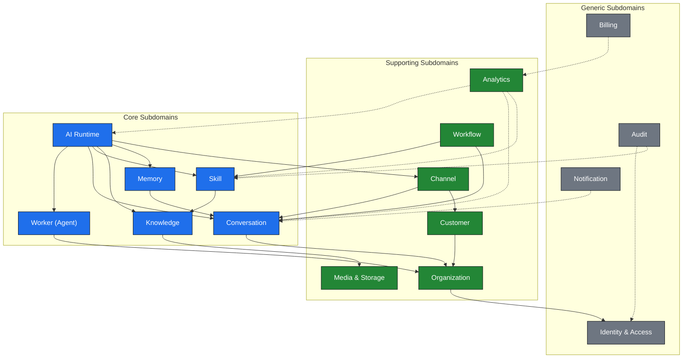
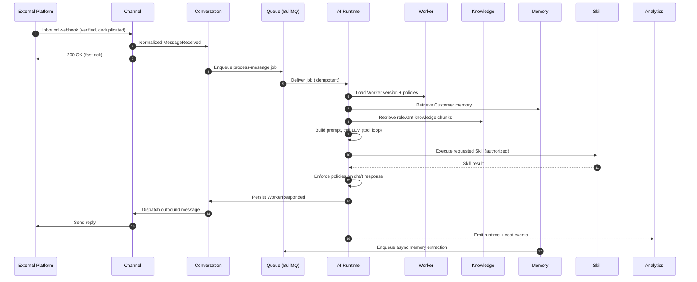

# Domain Map

## Purpose

This document is the authoritative map of the business domains (bounded contexts) that make up AI Workforce OS. It defines what each domain owns, what it is responsible for, the rules it must always uphold, how it depends on and communicates with other domains, and where its boundaries end. It is a business and architecture specification, not an implementation. It exists so that every subsequent specification and every implemented module has a shared, precise model of the problem space before any code is written.

## Scope

This map covers the full logical domain model for the MVP and near-term V1 of the platform. It describes bounded contexts, their owned entities at a conceptual level, the domain events that flow between them, and the interfaces they expose to one another. It deliberately stays at the domain level: it names entities and their invariants but does not define database columns, class structures, or API payloads — those belong in `docs/03-database/`, `docs/04-backend/`, and the per-subsystem specs.

Terminology in this document follows `docs/00-foundation/GLOSSARY.md`. Where product-facing and internal terms differ, the internal term is authoritative here: the customer-facing **Agent** is modeled internally as a **Worker**.

## Goals

- Enumerate every business domain in the platform and classify each as core, supporting, or generic.
- Give each domain a single, clear purpose and an explicit boundary.
- Make ownership unambiguous: every entity is owned by exactly one domain.
- Capture the invariants each domain must always enforce.
- Document the events each domain publishes and consumes, so integration is contract-driven.
- Provide high-level diagrams of context boundaries and of the primary runtime interaction.
- Serve as the reference that `MASTER_ARCHITECTURE.md` and all module specs align to.

## Non Goals

- No database schema, table, or column definitions (see `docs/03-database/`).
- No API request/response shapes, routes, or DTOs (see `docs/04-backend/`).
- No class diagrams, file layouts, or code (this is the Architecture Phase).
- No final event payload schemas — event names and intent only; payloads are defined per-subsystem.
- No delivery sequencing or sprint planning (see root `TASKS.md`).
- No decisions about technology already fixed in `docs/00-foundation/DECISIONS.md`; this document assumes them.

---

## Subdomain Classification

Bounded contexts are grouped using a strategic Domain-Driven Design lens. **Core** domains are the product's differentiators — the reasons a customer chooses AI Workforce OS. **Supporting** domains are necessary and specific to this product but not themselves the differentiator. **Generic** domains are solved problems the platform needs but does not innovate on.

| Classification | Domains |
|----------------|---------|
| Core | Worker (Agent), AI Runtime, Skill, Knowledge, Memory, Conversation |
| Supporting | Organization, Channel, Customer, Workflow, Analytics, Media & Storage |
| Generic | Identity & Access, Notification, Billing, Audit |

The core domains are protected most carefully: their boundaries, invariants, and events change only through deliberate decisions recorded as ADRs.

---

## Domain Catalog (Overview)

| # | Domain | Class | One-line purpose |
|---|--------|-------|------------------|
| 1 | Organization | Supporting | The tenant boundary that owns and isolates all other data. |
| 2 | Identity & Access | Generic | Who a platform user is and what they are allowed to do. |
| 3 | Worker (Agent) | Core | The configurable AI employee: brain, skills, knowledge, policies, versions. |
| 4 | AI Runtime | Core | Turns an inbound event into a reasoned, policy-checked response. |
| 5 | Conversation | Core | The threaded record of messages and the human-handoff state. |
| 6 | Customer | Supporting | The external person a Worker talks to, and their profile. |
| 7 | Channel | Supporting | Normalizes inbound events and sends outbound messages per transport. |
| 8 | Skill | Core | Server-side capabilities a Worker can invoke via tool calling. |
| 9 | Knowledge | Core | Ingested content, chunked and embedded for retrieval (RAG). |
| 10 | Memory | Core | Structured, durable facts learned about a Customer. |
| 11 | Workflow | Supporting | Deterministic, non-AI automation of triggers, conditions, actions. |
| 12 | Analytics | Supporting | Usage, cost, and performance metrics derived from platform events. |
| 13 | Notification | Generic | Delivers alerts to platform Users about things needing attention. |
| 14 | Billing | Generic | Subscription plans and usage metering for agencies. |
| 15 | Audit | Generic | Immutable record of sensitive and security-relevant actions. |
| 16 | Media & Storage | Supporting | Durable storage and retrieval of files and attachments (S3). |

---

## Bounded-Context Diagram

The diagram groups every context by strategic classification and shows the primary dependency direction. A solid arrow from A to B means A depends on B (calls it directly). A dashed arrow means A reacts to events B publishes.

---

## Domain Interaction Diagram

The most important cross-context flow is processing an inbound customer message end to end. This sequence shows how the contexts collaborate. Solid arrows are synchronous calls; the runtime work happens asynchronously off a queue so the webhook returns immediately.

If the Conversation is in human-handoff state, the Runtime does not generate or send a response; it stops after loading context and leaves the thread to a human operator.

---

## Bounded Contexts in Detail

Each context below follows the same structure: purpose, owned entities, responsibilities, invariants, dependencies, events published and consumed, APIs exposed, boundaries, and what is explicitly out of scope. Event names are stated as intent (past-tense facts); their payloads are defined in the owning subsystem spec.

### 1. Organization (Supporting)

**Purpose.** Organization is the tenant of the platform. It is the top-level boundary that owns and isolates every other piece of data. An Agency operates as one Organization; every Worker, Customer, Conversation, and configuration belongs to exactly one Organization.

**Owned entities.** Organization; Membership (the link between a User and an Organization, carrying the User's role within it); Organization settings and defaults; optionally Client (a business served by the agency, deferred until an agency-client hierarchy is needed).

**Responsibilities.** Establish the tenant boundary. Own organization-level configuration and defaults. Manage which Users belong to the Organization and with what role. Provide the `organizationId` that scopes all tenant-owned data across every other domain.

**Invariants.** Every tenant-owned record in the platform references exactly one Organization. An Organization always has at least one member with owner-level rights. Membership cannot exist without both a valid User and a valid Organization. Deleting or suspending an Organization cascades a suspension of access to all its data.

**Dependencies.** Identity & Access (to resolve which Users may be members and to authenticate them).

**Events published.** OrganizationCreated, OrganizationSuspended, MemberAdded, MemberRemoved, MemberRoleChanged.

**Events consumed.** UserRegistered (to create the first membership when an owner signs up).

**APIs exposed.** Organization profile and settings management; membership management (invite, remove, change role); resolution of the current Organization context for a request.

**Boundaries.** Organization defines *who owns data*, not *what a person may do* — permission logic lives in Identity & Access. It does not model external Customers (that is the Customer domain); its "members" are always platform Users.

**Out of scope.** Authentication mechanics, permission evaluation, billing plans (Billing owns plans, though it is scoped by Organization), and any customer-facing conversational data.

### 2. Identity & Access (Generic)

**Purpose.** Identity & Access answers two questions: who is this platform User, and what are they allowed to do. It provides authentication and the authorization model (roles and fine-grained permissions) used everywhere else.

**Owned entities.** User (a person with a dashboard login); Credential / authentication method; Session or token; Role; Permission; Role-to-permission assignments.

**Responsibilities.** Authenticate Users. Issue and validate sessions/tokens. Define roles and the permissions they grant. Evaluate whether a given User, acting in a given Organization, holds a required permission for an action. Provide the authenticated request context (user identity, organization membership, permissions) consumed by every protected operation.

**Invariants.** A User is globally unique by their identifying credential (e.g., email). Authorization is always evaluated server-side; client-supplied roles or organization claims are never trusted. Every permission check is evaluated in the context of a specific Organization membership. A User with no membership in an Organization has no access to that Organization's data.

**Dependencies.** Organization (to know a User's memberships and role within each). Audit (as a consumer of its events).

**Events published.** UserRegistered, UserAuthenticated, AuthenticationFailed, PermissionDenied, RoleAssigned.

**Events consumed.** MemberRoleChanged (to keep effective permissions current).

**APIs exposed.** Authentication (sign-in, sign-out, token refresh); current-user and current-context resolution; permission-check interface used as a guard by other domains; role and permission administration.

**Boundaries.** Identity & Access governs **platform Users only**. It has nothing to do with external Customers, who never authenticate into the platform. It owns *whether* an action is allowed; it does not own the business action itself.

**Out of scope.** Customer identity (owned by Customer), tenant ownership of data (owned by Organization), and audit persistence (owned by Audit, which merely consumes I&A events).

### 3. Worker / Agent (Core)

**Purpose.** The Worker is the configurable AI employee — the heart of the product. Presented to customers as an "Agent," a Worker bundles everything that defines how it behaves: its brain (model, prompt, tone, reasoning settings), the skills it may use, the knowledge it can draw on, the channels it operates on, the policies that constrain it, its goals, and its version history.

**Owned entities.** Worker; Brain (model, system prompt, response style, reasoning configuration); Worker Version (immutable snapshot of a full configuration); Policy (a rule that constrains behavior, e.g., require human review before offering a discount); Worker-to-Skill attachments; Worker-to-Knowledge attachments; Worker-to-Channel bindings; Worker goals and configured metrics targets.

**Responsibilities.** Own the definition and lifecycle of Workers. Validate that a configuration is coherent (attached skills exist, model is permitted, policies are well-formed). Produce immutable Worker Versions so runtime behavior is reproducible and auditable. Expose the resolved, versioned configuration the AI Runtime loads at execution time.

**Invariants.** Every Worker belongs to exactly one Organization. A Worker can only reference Skills, Knowledge sources, and Channels that belong to the same Organization. Each execution runs against a specific, immutable Worker Version; editing a Worker produces a new Version rather than mutating a prior one. A Worker cannot be marked active for a Channel it is not bound to. Policies attached to a Worker are always evaluated by the Runtime before a response is sent.

**Dependencies.** Organization (ownership and scoping). It references Skill, Knowledge, and Channel entities but does not own them.

**Events published.** WorkerCreated, WorkerUpdated, WorkerVersionPublished, WorkerActivated, WorkerDeactivated, PolicyAttached, PolicyDetached.

**Events consumed.** SkillDeprecated and KnowledgeSourceRemoved (to flag or invalidate configurations that reference something no longer available).

**APIs exposed.** Worker CRUD and configuration; version publishing and rollback; policy attachment; skill/knowledge/channel attachment; retrieval of a resolved Worker Version for the Runtime.

**Boundaries.** Worker owns *configuration and identity of the AI employee*, not its *execution* — running a Worker is the AI Runtime's job. It defines which Skills are attached but does not define or execute them (Skill domain). It defines which Knowledge is available but does not ingest or retrieve it (Knowledge domain).

**Out of scope.** Prompt execution, tool loops, LLM calls, conversation state, and analytics — all owned by other domains.

### 4. AI Runtime (Core)

**Purpose.** The AI Runtime is the engine that turns an inbound event into a reasoned, policy-checked response. It orchestrates the core domains at execution time: it loads the Worker Version, gathers context from Memory and Knowledge, builds the prompt, runs the LLM tool-calling loop, invokes Skills, enforces policies, and hands the final response back to the Conversation for dispatch. It is the platform's primary differentiator and is built in-house rather than on a heavy framework.

**Owned entities.** Runtime Run (one execution against one inbound event); Runtime Step (an ordered stage within a run — retrieval, LLM call, tool call, policy check); LLM Call record (prompt, model, tokens, cost, latency); Tool/Skill execution record within a run; Run status and outcome.

**Responsibilities.** Consume process-message jobs idempotently. Load the correct Worker Version and its policies. Retrieve Customer memory and relevant knowledge before prompt construction. Construct the prompt and run a bounded tool-calling loop via LiteLLM/OpenAI tool calling. Request Skill executions and incorporate results. Enforce Worker policies on the draft response. Persist a fully observable trace (runs, steps, LLM calls, tool calls, token and cost usage). Respect human-handoff state by not responding when a human has taken over.

**Invariants.** A Runtime Run is always tied to one Worker Version, one Conversation, and one Organization. The tool loop is always bounded (a maximum number of iterations). The Runtime only executes Skills that are attached to the Worker and permitted for the acting context. No response is generated or sent while the Conversation is in human-handoff state. Every run persists enough detail (inputs, tool calls, outputs, cost) to be replayed and debugged. The LLM is never allowed to execute arbitrary code — only registered Skills.

**Dependencies.** Worker (configuration and policies), Conversation (message history and handoff state), Memory (customer facts), Knowledge (retrieved chunks), Skill (capability execution), Channel (indirectly, for outbound dispatch via Conversation), and the Queue infrastructure.

**Events published.** RunStarted, RunCompleted, RunFailed, LLMCallRecorded, SkillInvokedByRuntime, WorkerResponded, TokenUsageRecorded.

**Events consumed.** MessageReceived (via the process-message job), HumanHandoffStarted and HumanHandoffEnded (to gate responses).

**APIs exposed.** Primarily a queue-driven worker rather than a public API. It exposes an internal interface to start a run for an inbound event and a read interface for run traces used by debugging and analytics tooling.

**Boundaries.** The Runtime *orchestrates* but does not *own* the domains it calls. It does not own Worker configuration, message storage, memory facts, knowledge content, or skill definitions — it reads from and coordinates them. It owns only the execution record.

**Out of scope.** Deterministic non-AI automation (Workflow), long-term storage of messages (Conversation), and the definition of skills or knowledge.

### 5. Conversation (Core)

**Purpose.** Conversation owns the threaded record of communication between a Customer, a Worker, and optionally human operators, along with the human-handoff state. It is the backbone of the unified inbox that operators use to review, take over, and debug interactions.

**Owned entities.** Conversation (a thread); Message (inbound, outbound, or system, with author type and content); Handoff state and Handoff transitions; Message attachment references (pointing to Media & Storage); Conversation assignment (which operator, if any, owns the thread).

**Responsibilities.** Create and maintain conversation threads keyed to a Customer and Channel. Persist every inbound and outbound message with authorship and ordering. Track and transition human-handoff state. Dispatch outbound messages to the Channel for delivery. Provide the message history the Runtime reads as context and the inbox the dashboard renders.

**Invariants.** Every Conversation and Message belongs to exactly one Organization. A Message always has an unambiguous author type (Customer, Worker, or human operator/system) and a stable ordering within its thread. While a Conversation is in human-handoff state, no Worker-authored messages may be produced by the Runtime. Outbound dispatch to a Channel is recorded as an attempt so delivery can be tracked. A Conversation references exactly one Customer and one Channel.

**Dependencies.** Organization (scoping), Customer (the external party), Channel (delivery of outbound messages), Media & Storage (attachments).

**Events published.** MessageReceived, MessageSent, WorkerResponded (persisted), HumanHandoffStarted, HumanHandoffEnded, ConversationAssigned, ConversationClosed.

**Events consumed.** WorkerResponded from the Runtime (to persist and dispatch), MessageDeliveryUpdated from Channel (to reflect delivery status).

**APIs exposed.** Inbox listing and filtering; conversation and message retrieval; sending an operator message; initiating and ending human handoff; assigning a conversation to an operator.

**Boundaries.** Conversation owns *the record and state of the dialogue*, not *how messages travel* (Channel) or *who the external party is beyond the thread* (Customer). It does not generate Worker responses — it stores and dispatches what the Runtime produces.

**Out of scope.** Response generation, channel transport specifics, customer profile and memory, and analytics aggregation.

### 6. Customer (Supporting)

**Purpose.** Customer represents the external person who messages the agency (or its client) through a Channel. It owns the durable profile of that person — distinct from a platform User, who logs into the dashboard.

**Owned entities.** Customer profile; Customer contact identifiers per channel (e.g., a WhatsApp number, an Instagram handle); Customer attributes and tags; the link that unifies multiple channel identities into one Customer where possible.

**Responsibilities.** Identify and de-duplicate external contacts across channels. Maintain the customer profile and contact identifiers. Provide a stable Customer reference that Conversations, Memory, and analytics attach to.

**Invariants.** Every Customer belongs to exactly one Organization. A channel contact identifier maps to at most one Customer within an Organization. A Customer is never a platform User and never authenticates into the platform. Customer identity is scoped per Organization — the same phone number in two Organizations is two distinct Customers.

**Dependencies.** Organization (scoping). It is referenced by Conversation and Memory but does not depend on them.

**Events published.** CustomerCreated, CustomerUpdated, CustomerMerged, CustomerIdentifierAdded.

**Events consumed.** MessageReceived (to create a Customer on first contact, if one does not exist).

**APIs exposed.** Customer profile lookup and update; search and listing; merge of duplicate customers; management of contact identifiers and tags.

**Boundaries.** Customer owns *who the external contact is*, not *what has been said to them* (Conversation) or *what has been learned about them* (Memory). It holds stable profile attributes, not conversationally-extracted facts.

**Out of scope.** Conversation threads and messages, extracted memory facts, authentication, and any platform-User concerns.

### 7. Channel (Supporting)

**Purpose.** Channel is the boundary between the platform and external communication transports — WhatsApp, Instagram, Facebook Messenger, website chat, and future channels. Each Channel Adapter normalizes inbound events into a common shape and sends outbound messages in the transport's own format.

**Owned entities.** Channel (a configured connection for one transport within an Organization); Channel Adapter behavior (per-transport); Inbound webhook event record (raw + normalized) with deduplication key; Outbound send attempt and its delivery status; Channel credentials/configuration references.

**Responsibilities.** Receive and verify inbound webhooks from external platforms. Deduplicate inbound events idempotently. Normalize transport-specific payloads into a canonical MessageReceived event for Conversation. Send outbound messages, respecting each platform's rate limits and formats. Track delivery status of outbound attempts.

**Invariants.** Every Channel belongs to exactly one Organization. Inbound webhooks are verified before processing. The same external event is processed at most once (idempotent by deduplication key). Transport-specific payloads never leak past the adapter into Runtime or Conversation internals — downstream domains only ever see normalized events. Outbound sends are always recorded as attempts with a resulting status.

**Dependencies.** Conversation (delivers normalized inbound messages to it and receives outbound dispatch from it), Customer (to resolve or create the external contact), Media & Storage (for inbound/outbound media).

**Events published.** WebhookReceived, MessageReceived (normalized), MessageDeliveryUpdated, ChannelConnected, ChannelDisconnected.

**Events consumed.** MessageSent / WorkerResponded (to perform the actual outbound send).

**APIs exposed.** Inbound webhook endpoints per transport; channel connection and configuration management; delivery-status queries.

**Boundaries.** Channel owns *transport and normalization*, not *conversation state* (Conversation) or *contact identity beyond mapping* (Customer). It is the only domain that understands transport-specific formats.

**Out of scope.** Thread and message storage, response generation, and customer profile management beyond identifier mapping.

### 8. Skill (Core)

**Purpose.** A Skill is a server-side executable capability that a Worker can invoke through LLM tool calling — for example, create a lead, check a calendar, send an email, or search a CRM. The Skill domain owns the registry of available skills and the safe, permissioned execution of them.

**Owned entities.** Skill definition (name, description, version, input schema, output schema, required permissions, timeout, retry policy, idempotency behavior, executor reference); Skill Registry; Skill execution record (inputs, outputs, status, timing) as owned by the Skill domain for its own accounting.

**Responsibilities.** Maintain the registry of available skills and their metadata and schemas. Resolve a requested skill by name and version. Validate skill input against its schema. Authorize execution against the required permissions and the acting context. Execute the skill within its timeout and retry policy. Validate output against its schema and record execution metrics. Return a structured result to the caller (typically the Runtime).

**Invariants.** Only registered, server-side skills can be executed — no dynamic or untrusted code execution. A skill executes only if it is attached to the Worker and the acting context holds the skill's required permissions. Every execution validates input before running and output after. Skills declare idempotency behavior, and side-effecting skills are safe under retry. Every skill carries a version; a Worker Version pins the skill versions it may use for reproducibility.

**Dependencies.** Identity & Access (permission evaluation), Knowledge (for knowledge-search skills), and any external systems a specific skill integrates with. It is invoked by the Runtime and by Workflow.

**Events published.** SkillExecuted, SkillExecutionFailed, SkillRegistered, SkillDeprecated.

**Events consumed.** None required for core operation; may consume WorkerVersionPublished to validate that referenced skill versions exist.

**APIs exposed.** Skill registry listing and metadata; a skill execution interface used by the Runtime and Workflow; skill administration for registering and deprecating skills.

**Boundaries.** Skill owns *capability definition and execution*, not *the decision to call a skill* (that is the Runtime's LLM tool loop, or a Workflow action). It does not own the conversation or the AI reasoning; it is a callable, contract-bound function.

**Out of scope.** Prompt construction, tool-call orchestration, marketplace/third-party skill distribution (deliberately deferred), and running code in the customer's browser.

### 9. Knowledge (Core)

**Purpose.** Knowledge owns the content a Worker can draw on to answer questions — uploaded documents, website pages, FAQs, and similar sources — ingested, chunked, and embedded so the Runtime can retrieve relevant passages (Retrieval-Augmented Generation).

**Owned entities.** Knowledge Source (an uploaded or connected piece of content); Knowledge Chunk (a searchable fragment of a source); Embedding vectors (stored in pgvector); Ingestion job state; Source-to-Worker attachments (as referenced by the Worker domain).

**Responsibilities.** Accept and register knowledge sources. Store originals durably (via Media & Storage). Extract and normalize text. Chunk content deterministically. Generate embeddings asynchronously. Store vectors in pgvector. Serve organization-scoped similarity retrieval to the Runtime, returning chunks with source references for citation.

**Invariants.** Every Knowledge Source and Chunk belongs to exactly one Organization. Retrieval is always organization-scoped — a query can never return another tenant's content. Chunking is deterministic for a given source and configuration. Embeddings are generated asynchronously and never block ingestion acknowledgement. A Chunk always traces back to its Source so responses can cite provenance.

**Dependencies.** Media & Storage (durable storage of originals), Organization (scoping), and the Queue infrastructure (async embedding). Consumed by the Runtime and by knowledge-search Skills.

**Events published.** KnowledgeSourceAdded, KnowledgeIngestionStarted, KnowledgeIngestionCompleted, KnowledgeIngestionFailed, KnowledgeSourceRemoved.

**Events consumed.** None required for core operation; ingestion is triggered by its own API and queued jobs.

**APIs exposed.** Knowledge source upload and management; ingestion status; an organization-scoped retrieval interface returning ranked chunks with source references.

**Boundaries.** Knowledge owns *content and retrieval*, not *the decision of when to retrieve* (Runtime) or *durable blob storage mechanics* (Media & Storage). It is distinct from Memory: Knowledge is authored content the agency provides; Memory is facts learned about a Customer.

**Out of scope.** Prompt assembly, customer-specific facts, and the storage backend itself.

### 10. Memory (Core)

**Purpose.** Memory owns the structured, durable facts learned about a Customer from conversations — location, preferences, budget, prior purchases, and similar — so a Worker can be contextual across interactions without re-reading entire histories.

**Owned entities.** Customer Memory record (a structured fact with source, confidence, and timestamps); Memory extraction job state. (Worker Memory, facts belonging to a Worker rather than a Customer, is anticipated but deferred.)

**Responsibilities.** Extract structured facts from conversations, typically asynchronously. Store facts with their source, confidence, and timing. Resolve conflicts when new facts contradict old ones. Serve a Customer's relevant memory to the Runtime at prompt-construction time. Respect privacy constraints on what may be retained.

**Invariants.** Every Memory record belongs to exactly one Organization and one Customer. Memory stores structured facts, not raw conversation dumps. Each fact carries a source, a confidence, and timestamps. Conflicting facts are resolved deliberately rather than silently duplicated. Sensitive facts are not stored unless product requirements justify it. Memory retrieval is organization- and customer-scoped.

**Dependencies.** Customer (facts attach to a Customer), Conversation (the source material for extraction), Organization (scoping), and the Queue infrastructure. Consumed by the Runtime.

**Events published.** MemoryExtracted, MemoryUpdated, MemoryConflictResolved.

**Events consumed.** WorkerResponded / MessageReceived (to trigger asynchronous extraction after an exchange).

**APIs exposed.** Customer memory retrieval for the Runtime; memory inspection and management for operators; triggering or reviewing extraction.

**Boundaries.** Memory owns *learned, evolving facts about a Customer*, not *stable profile attributes* (Customer) or *authored reference content* (Knowledge). It does not own the conversation it learns from.

**Out of scope.** Full conversation storage, knowledge content, and prompt assembly.

### 11. Workflow (Supporting)

**Purpose.** Workflow provides deterministic, non-AI automation: triggers, conditions, and actions that run predictably. It is intentionally separate from the AI Runtime — where the Runtime reasons, Workflow follows explicit rules.

**Owned entities.** Workflow definition (triggers, conditions, actions); Workflow Run (one execution); Workflow Run step/audit records; Workflow trigger bindings.

**Responsibilities.** Define and store deterministic automations. Evaluate triggers and conditions. Execute ordered actions, which may include invoking Skills or acting on Conversations. Record auditable workflow runs. Treat any LLM usage inside a workflow as an explicit, discrete action rather than open-ended reasoning.

**Invariants.** Every Workflow and Workflow Run belongs to exactly one Organization. Workflow execution is deterministic given the same inputs. Workflows are separate from the Worker Runtime and never share its execution path. Every workflow run is auditable. LLM calls within a workflow are explicit actions, not emergent behavior.

**Dependencies.** Skill (actions that invoke skills), Conversation (actions that read or post to threads), Organization (scoping), Queue infrastructure. Anticipated as a V1 domain.

**Events published.** WorkflowTriggered, WorkflowRunStarted, WorkflowRunCompleted, WorkflowRunFailed.

**Events consumed.** Domain events that serve as triggers (e.g., MessageReceived, CustomerCreated, SkillExecuted), depending on the workflow's configured trigger.

**APIs exposed.** Workflow definition CRUD; enabling/disabling workflows; workflow run history and status.

**Boundaries.** Workflow owns *deterministic automation*, not *AI reasoning* (Runtime). It orchestrates Skills and Conversation actions but does not define skills or store messages.

**Out of scope.** The AI tool-calling loop, prompt construction, and any nondeterministic decision-making.

### 12. Analytics (Supporting)

**Purpose.** Analytics derives usage, cost, and performance metrics from the events other domains publish, powering the dashboard's reporting and feeding usage data to Billing.

**Owned entities.** Aggregated metric records (message volume, active workers, response times, resolution/handoff rates); Token and cost usage rollups; Analytics query/report definitions; Time-series aggregates.

**Responsibilities.** Consume domain events and aggregate them into metrics. Track AI token usage and estimated cost per Organization, Worker, and Conversation. Compute operational metrics (volumes, latencies, handoff rates). Expose reporting queries to the dashboard. Provide usage figures to Billing.

**Invariants.** Every metric is scoped to an Organization. Analytics is read-derived: it never mutates source-of-truth data in other domains. Usage and cost are tracked from early on even if not yet billed. Aggregates are reproducible from the underlying event stream.

**Dependencies.** Consumes events from Runtime, Conversation, Skill, Knowledge, and others. Provides data to Billing and the dashboard.

**Events published.** UsageAggregated, CostThresholdReached (optional alerting trigger).

**Events consumed.** RunCompleted, TokenUsageRecorded, MessageReceived, MessageSent, SkillExecuted, HumanHandoffStarted, and related events.

**APIs exposed.** Metric and report queries for the dashboard; a usage-summary interface for Billing.

**Boundaries.** Analytics owns *derived metrics*, not *source data*. It is downstream of everything and authoritative for nothing except its own aggregates.

**Out of scope.** Being a system of record for messages, runs, or skills; charging money (Billing); real-time alert delivery (Notification).

### 13. Notification (Generic)

**Purpose.** Notification delivers alerts to platform Users about things that need their attention — a conversation escalated to human handoff, an ingestion failure, a cost threshold reached.

**Owned entities.** Notification (a message to a User); Notification preference/subscription per User; Delivery channel configuration (in-app, email, and future channels); Delivery status.

**Responsibilities.** Subscribe to noteworthy domain events. Determine which Users should be notified based on role and preferences. Render and deliver notifications through configured channels. Track delivery and read status. Respect each User's notification preferences.

**Invariants.** Notifications are scoped to an Organization and addressed to Users within it. A User only receives notifications they are permitted to see and have not opted out of. Notification never exposes another tenant's data. Delivery is best-effort and idempotent per triggering event.

**Dependencies.** Identity & Access (who the Users are and their permissions), Organization (scoping). Consumes events from many domains.

**Events published.** NotificationCreated, NotificationDelivered, NotificationRead.

**Events consumed.** HumanHandoffStarted, KnowledgeIngestionFailed, RunFailed, CostThresholdReached, and other attention-worthy events.

**APIs exposed.** Notification listing and read-state management; notification preference management.

**Boundaries.** Notification owns *delivery of alerts to Users*, not *the events that warrant them*. It is a downstream, event-driven consumer.

**Out of scope.** Messaging external Customers (that is Channel + Conversation), and being a system of record for the underlying events.

### 14. Billing (Generic)

**Purpose.** Billing owns subscription plans and usage metering for agencies — the commercial relationship between an Organization and the platform.

**Owned entities.** Subscription/Plan for an Organization; Usage meter records (derived from Analytics); Invoice or billing-period summary; Plan entitlements and limits. External payment-provider references are held, not payment instruments themselves.

**Responsibilities.** Associate each Organization with a plan and its entitlements. Meter billable usage dimensions (active workers, message volume, token usage) sourced from Analytics. Enforce or surface plan limits. Produce billing-period summaries. Integrate with an external payment provider for the actual money movement.

**Invariants.** Every subscription belongs to exactly one Organization. Usage metering is derived from Analytics, not independently recomputed from raw events. The platform never stores raw payment credentials — those live with the external payment provider. Plan entitlements are the single source of truth for what an Organization is allowed to consume.

**Dependencies.** Analytics (usage figures), Organization (the billed party), and an external payment provider. Anticipated as a V1 domain; usage is tracked from MVP even if not charged.

**Events published.** SubscriptionCreated, SubscriptionChanged, PlanLimitReached, InvoiceIssued.

**Events consumed.** UsageAggregated (to meter), OrganizationCreated (to establish an initial plan).

**APIs exposed.** Subscription and plan management; usage and invoice summaries; entitlement checks used to gate premium features.

**Boundaries.** Billing owns *the commercial plan and metering*, not *the raw usage data* (Analytics) or *tenant ownership* (Organization). It never executes financial actions on a user's behalf beyond the sanctioned payment-provider integration.

**Out of scope.** Raw event aggregation, storing payment instruments, and any per-Customer (external contact) billing.

### 15. Audit (Generic)

**Purpose.** Audit maintains an immutable record of sensitive and security-relevant actions — permission changes, external calls, configuration changes, and human handoffs — for accountability and compliance.

**Owned entities.** Audit Log entry (actor, action, target, context, timestamp); Audit query definitions.

**Responsibilities.** Capture security- and compliance-relevant events from across the platform. Persist them immutably with enough context to reconstruct who did what, to what, and when. Provide scoped, read-only querying for administrators.

**Invariants.** Audit entries are append-only and never modified or deleted through normal operation. Every entry is scoped to an Organization and records a clear actor, action, and target. Audit captures sensitive actions specifically (authorization changes, external calls, configuration changes, handoffs). Audit data is read-only to all consumers.

**Dependencies.** Consumes events from Identity & Access, Skill, Worker, Conversation, and others. Scoped by Organization.

**Events published.** None of consequence — Audit is a terminal sink. It may expose read queries rather than emit events.

**Events consumed.** PermissionDenied, RoleAssigned, SkillExecuted (for external-call auditing), WorkerVersionPublished, HumanHandoffStarted, and other sensitive-action events.

**APIs exposed.** Read-only, permission-gated audit log querying and export.

**Boundaries.** Audit owns *the immutable record of sensitive actions*, not *the actions themselves*. It is a passive, append-only consumer and never a decision-maker.

**Out of scope.** Operational metrics (Analytics), user-facing alerts (Notification), and mutating any source data.

### 16. Media & Storage (Supporting)

**Purpose.** Media & Storage provides durable storage and retrieval of files and attachments — message media, knowledge source originals, and exports — backed by object storage (AWS S3). It is a shared supporting capability that other domains reference rather than reimplement.

**Owned entities.** Stored Object reference (key, content type, size, owning Organization); Upload/download grant; Object lifecycle metadata.

**Responsibilities.** Store and retrieve binary content durably. Issue scoped, time-limited access grants for upload and download. Track object metadata and ownership. Enforce organization scoping on access. Provide stable references that Conversation (attachments) and Knowledge (source originals) can point to.

**Invariants.** Every stored object is owned by exactly one Organization and only accessible within that scope. Other domains hold *references* to objects, never the bytes themselves. Access grants are scoped and time-limited. Object references are stable for the lifetime of the object.

**Dependencies.** Organization (scoping) and the external object store (S3). Referenced by Conversation, Knowledge, and export features.

**Events published.** ObjectStored, ObjectDeleted.

**Events consumed.** None required; it acts on direct calls from other domains.

**APIs exposed.** Upload grant issuance; download grant issuance; object metadata lookup; deletion within policy.

**Boundaries.** Media & Storage owns *durable blob storage and access*, not *the meaning of what is stored*. Knowledge interprets a stored document; Conversation interprets a stored attachment — Storage only holds and serves the bytes.

**Out of scope.** Text extraction, chunking, embedding (Knowledge), and any interpretation of content.

---

## Cross-Cutting Concerns

Some concerns are not domains but apply across all of them, and every subsystem spec must honor them.

**Multi-tenancy.** `organizationId` scopes every tenant-owned entity and every query. No domain may return or act on another Organization's data. Organization is the tenant boundary; Identity & Access enforces access within it.

**Authorization.** Every protected action is checked server-side against a permission, evaluated in the context of the acting User's membership in a specific Organization. Client-provided role or organization claims are never trusted.

**Eventing.** Domains integrate primarily through published domain events (past-tense facts) and through narrow, documented synchronous interfaces. Event names in this document are intent-level; payloads are fixed in the owning subsystem spec. Cross-domain calls prefer events for anything that need not be synchronous.

**Idempotency.** Anything triggered by an external event or a queued job must be idempotent — inbound webhooks, message processing, embedding, memory extraction, and side-effecting skills.

**Observability.** The AI Runtime is observable by design (runs, steps, LLM calls, tool calls, token and cost usage). Sensitive actions are audited. Operational metrics are aggregated by Analytics.

**Ubiquitous language.** All domains use the terms defined in `docs/00-foundation/GLOSSARY.md`. The internal term `Worker` and the customer-facing term `Agent` refer to the same concept; `User` (platform login) and `Customer` (external contact) are always distinct.

---

## Ownership Summary

Each entity is owned by exactly one domain. This table is the quick reference for "who owns this concept."

| Concept | Owning Domain |
|---------|---------------|
| Organization, Membership, Client | Organization |
| User, Role, Permission, Session | Identity & Access |
| Worker, Brain, Worker Version, Policy | Worker (Agent) |
| Runtime Run, Runtime Step, LLM Call record | AI Runtime |
| Conversation, Message, Handoff state | Conversation |
| Customer, Customer identifiers | Customer |
| Channel, Adapter, Webhook event, Send attempt | Channel |
| Skill definition, Skill Registry | Skill |
| Knowledge Source, Chunk, Embedding | Knowledge |
| Customer Memory fact | Memory |
| Workflow, Workflow Run | Workflow |
| Metric, Cost/token rollup | Analytics |
| Notification, Notification preference | Notification |
| Subscription, Plan, Usage meter | Billing |
| Audit Log entry | Audit |
| Stored Object reference | Media & Storage |

---

## Design Decisions

- The customer-facing **Agent** is modeled internally as **Worker**, consistent with `DECISIONS.md`. This document uses Worker as the domain name.
- **AI Runtime is treated as its own bounded context**, separate from Worker. Worker owns configuration; Runtime owns execution. This keeps reproducibility (versioned config) cleanly separated from observable execution traces.
- **Knowledge and Memory are distinct core domains.** Knowledge is agency-authored reference content; Memory is facts learned about a Customer. Conflating them would blur retrieval (RAG) with personalization.
- **Customer is separate from Identity & Access.** External contacts never authenticate; platform Users always do. Keeping them apart prevents authorization logic from leaking into contact management.
- **Analytics, Billing, Notification, and Audit are event-driven, downstream consumers.** They never own source-of-truth business data, which keeps the core domains free of reporting and commercial concerns.
- **Workflow is deliberately separated from the AI Runtime**, per `DECISIONS.md`, so deterministic automation never entangles with nondeterministic reasoning.
- **Media & Storage is a supporting shared capability**, so Conversation and Knowledge reference stored objects rather than each implementing storage.
- Domains **Workflow, Billing, and (optionally) Client** are anticipated for V1; they are mapped now so MVP boundaries do not have to be re-cut later.

## Implementation Notes

- This map drives the module boundaries in `docs/02-architecture/` and the schema ownership in `docs/03-database/`. Each core and supporting domain should become a clearly bounded module in the NestJS modular monolith.
- Event names here are the starting catalog for a platform event registry; the architecture spec should formalize the registry and each event's payload.
- The Runtime interaction diagram is the reference flow for the AI Runtime spec in `docs/05-ai/`; the Skill execution contract is elaborated there and in the Skill spec.
- Anticipated (V1) domains should be stubbed in the documentation structure but not implemented during the MVP.
- When a new entity or concept appears in any later spec, it must be assigned to exactly one domain here (update the Ownership Summary) before it is implemented.

## Acceptance Criteria

- [ ] Every domain listed in the catalog has a detailed section covering purpose, owned entities, responsibilities, invariants, dependencies, events published, events consumed, APIs exposed, boundaries, and out-of-scope.
- [ ] Every entity named anywhere in the document appears in the Ownership Summary under exactly one domain.
- [ ] The bounded-context and interaction Mermaid diagrams render without error.
- [ ] All terms used match `docs/00-foundation/GLOSSARY.md`; no term is introduced here without a glossary entry.
- [ ] No implementation detail (schema, code, API payloads) is present — the document stays at the domain level.
- [ ] The map is consistent with `docs/00-foundation/DECISIONS.md` and `MASTER_ARCHITECTURE.md`; any divergence is resolved or recorded as an ADR.
- [ ] Reviewers from product and engineering agree the boundaries and ownership are correct before dependent specs are written.
