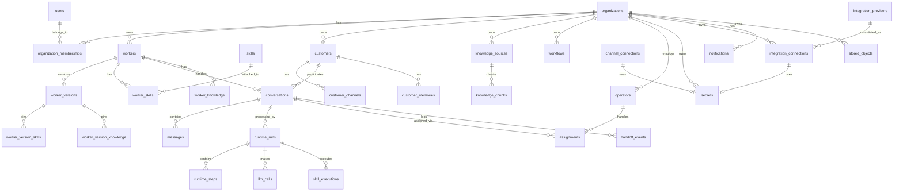

# Database Specification: Initial Data Model

## 1. Purpose

This document defines the initial PostgreSQL data model for AI Workforce OS. It is the starting point for Prisma schema generation and backend repository implementation.

The schema is designed for a modular monolith, multi-tenant SaaS, server-side skills, asynchronous worker runtime, RAG, memory, and channel-based conversations.

## 2. Design Principles

- PostgreSQL is the primary source of truth.
- Use UUID primary keys.
- Use `organization_id` on all tenant-owned records.
- Use explicit foreign keys for strong ownership relationships.
- Use soft deletes for business entities that users may expect to restore or audit.
- Use audit logs for sensitive operations.
- Use pgvector for knowledge embeddings.
- Avoid premature partitioning.
- Store credentials only in the Secrets domain (`secrets`); every other table holds a `secret_id` reference, never a plaintext value.
- Each table is owned by exactly one domain (see the Domain Ownership Map in §5.1).
- Worker Versions pin exact skill and knowledge versions so runtime executions are reproducible.
- Operator assignment and human handoff are owned by the Operators domain; Conversation holds only a status flag and an operator reference.
- Skills reach external systems only through Integrations connections; they never hold OAuth or credentials.
- Optimize for correctness and debuggability before raw scale.

## 3. Naming Conventions

- Tables use snake_case plural names.
- Columns use snake_case.
- Primary key column is `id`.
- Foreign keys use `<entity>_id`.
- Timestamps use `created_at`, `updated_at`, `deleted_at`.
- Status fields use text enums in Prisma or PostgreSQL enums if stable.
- JSON columns use `jsonb`.

## 4. Common Columns

Most persistent tables should include:

```text
id uuid primary key
created_at timestamptz not null default now()
updated_at timestamptz not null default now()
deleted_at timestamptz null
```

Tenant-owned tables should include:

```text
organization_id uuid not null references organizations(id)
```

## 5. Core Entity Relationship Overview



### 5.1 Domain Ownership Map

Every table is owned by exactly one domain from `docs/01-domain/DOMAIN_MAP.md`. A table's owning domain is the only one that writes it; other domains reference it by id. This map is authoritative for ownership regardless of the section a table is documented under.

| Domain | Tables |
| --- | --- |
| Organization | organizations, organization_memberships |
| Identity & Access | users, sessions, api_keys |
| Secrets | secrets |
| Worker | workers, worker_versions, worker_skills, worker_knowledge, worker_channels, worker_version_skills, worker_version_knowledge |
| Skill | skills, skill_executions |
| Channel | channel_connections, inbound_events |
| Customer | customers, customer_channels |
| Conversation | conversations, messages |
| Operators | operators, operator_presence, queues, assignments, handoff_events |
| Integrations | integration_providers, integration_connections |
| AI Runtime | runtime_runs, runtime_steps, llm_calls |
| Knowledge | knowledge_sources, knowledge_chunks |
| Memory | customer_memories |
| Workflow | workflows, workflow_runs |
| Notification | notifications, notification_preferences |
| Audit | audit_logs |
| Media & Storage | stored_objects |
| Analytics | (derive-on-read for MVP; no owned tables yet) |
| Billing | (deferred to V1) |

## 6. Identity and Tenancy Tables

### 6.1 organizations

Stores platform tenants.

Columns:

| Column | Type | Required | Notes |
| --- | --- | --- | --- |
| id | uuid | yes | Primary key |
| name | text | yes | Organization display name |
| slug | text | yes | Unique URL-safe slug |
| status | text | yes | active, suspended, deleted |
| plan | text | yes | starter, growth, enterprise |
| settings | jsonb | yes | Default `{}` |
| created_at | timestamptz | yes |  |
| updated_at | timestamptz | yes |  |
| deleted_at | timestamptz | no |  |

Indexes:

- unique `organizations_slug_key` on `slug`
- index on `status`

### 6.2 users

Stores dashboard users.

Columns:

| Column | Type | Required | Notes |
| --- | --- | --- | --- |
| id | uuid | yes | Primary key |
| email | citext | yes | Unique |
| password_hash | text | no | Nullable for future OAuth users |
| full_name | text | yes |  |
| avatar_url | text | no |  |
| status | text | yes | active, invited, disabled |
| email_verified_at | timestamptz | no |  |
| last_login_at | timestamptz | no |  |
| created_at | timestamptz | yes |  |
| updated_at | timestamptz | yes |  |
| deleted_at | timestamptz | no |  |

Indexes:

- unique on `email`
- index on `status`

### 6.3 organization_memberships

Connects users to organizations.

Columns:

| Column | Type | Required | Notes |
| --- | --- | --- | --- |
| id | uuid | yes | Primary key |
| organization_id | uuid | yes | FK organizations |
| user_id | uuid | yes | FK users |
| role | text | yes | owner, admin, manager, operator, viewer |
| status | text | yes | active, invited, disabled |
| invited_by_user_id | uuid | no | FK users |
| joined_at | timestamptz | no |  |
| created_at | timestamptz | yes |  |
| updated_at | timestamptz | yes |  |
| deleted_at | timestamptz | no |  |

Indexes:

- unique on `(organization_id, user_id)`
- index on `(organization_id, role)`
- index on `(user_id)`

### 6.4 sessions

Tracks refresh-token-backed sessions.

Columns:

| Column | Type | Required | Notes |
| --- | --- | --- | --- |
| id | uuid | yes | Primary key |
| user_id | uuid | yes | FK users |
| refresh_token_hash | text | yes | Store hash only |
| user_agent | text | no |  |
| ip_address | inet | no |  |
| expires_at | timestamptz | yes |  |
| revoked_at | timestamptz | no |  |
| created_at | timestamptz | yes |  |
| updated_at | timestamptz | yes |  |

Indexes:

- index on `(user_id)`
- index on `(expires_at)`
- index on `(revoked_at)`

### 6.5 api_keys

Organization-scoped keys for programmatic API access. The key value itself is never stored in plaintext — only a hash (or a Secrets reference) is kept for verification.

Columns:

| Column | Type | Required | Notes |
| --- | --- | --- | --- |
| id | uuid | yes | Primary key |
| organization_id | uuid | yes | FK organizations |
| name | text | yes | Human label |
| key_prefix | text | yes | Short visible prefix for identification |
| secret_id | uuid | yes | FK secrets — hashed/encrypted key material |
| scopes | text[] | yes | Granted API scopes |
| created_by_user_id | uuid | yes | FK users |
| last_used_at | timestamptz | no |  |
| status | text | yes | active, revoked |
| expires_at | timestamptz | no |  |
| created_at | timestamptz | yes |  |
| updated_at | timestamptz | yes |  |
| revoked_at | timestamptz | no |  |

Indexes:

- unique on `(key_prefix)`
- index on `(organization_id, status)`

## 7. Worker Tables

### 7.1 workers

Stores current worker identity and high-level status.

Columns:

| Column | Type | Required | Notes |
| --- | --- | --- | --- |
| id | uuid | yes | Primary key |
| organization_id | uuid | yes | FK organizations |
| name | text | yes | Customer-facing name |
| internal_name | text | no | Optional operator label |
| description | text | no |  |
| status | text | yes | draft, active, paused, archived |
| default_language | text | yes | e.g. en |
| created_by_user_id | uuid | yes | FK users |
| published_version_id | uuid | no | FK worker_versions |
| created_at | timestamptz | yes |  |
| updated_at | timestamptz | yes |  |
| deleted_at | timestamptz | no |  |

Indexes:

- index on `(organization_id, status)`
- index on `(organization_id, name)`

### 7.2 worker_versions

Immutable snapshots of worker configuration.

Columns:

| Column | Type | Required | Notes |
| --- | --- | --- | --- |
| id | uuid | yes | Primary key |
| organization_id | uuid | yes | FK organizations |
| worker_id | uuid | yes | FK workers |
| version_number | integer | yes | Incrementing per worker |
| status | text | yes | draft, published, archived |
| model_provider | text | yes | openai, anthropic, gemini, local, etc. |
| model_name | text | yes |  |
| temperature | numeric | yes |  |
| system_prompt | text | yes | Base system prompt |
| prompt_config | jsonb | yes | Structured Prompt Profile: format rules, reusable fragments, tone directives |
| behavior_config | jsonb | yes | tone, style, constraints |
| personality_config | jsonb | yes | Persona: name, voice, character |
| goals | jsonb | yes | Configured business objectives |
| capabilities | jsonb | yes | Declared high-level abilities (realized by pinned skills) |
| runtime_config | jsonb | yes | Tool-loop limits, retrieval breadth, latency/cost ceilings |
| policy_config | jsonb | yes | approvals, safety rules (Policies remain a Worker facet) |
| created_by_user_id | uuid | yes | FK users |
| published_at | timestamptz | no |  |
| created_at | timestamptz | yes |  |
| updated_at | timestamptz | yes |  |

Indexes:

- unique on `(worker_id, version_number)`
- index on `(organization_id, worker_id, status)`

A published Worker Version is an immutable, reproducible snapshot. On publish, the Worker's live skill and knowledge attachments are frozen into `worker_version_skills` and `worker_version_knowledge` (below), pinning the exact skill versions and knowledge sources that were active. The AI Runtime executes against a specific `worker_version_id`, so a run can always be reconstructed from the version's pinned configuration.

### 7.3 skills

Registry of server-side skills available in the platform.

Columns:

| Column | Type | Required | Notes |
| --- | --- | --- | --- |
| id | uuid | yes | Primary key |
| name | text | yes | Stable programmatic name |
| display_name | text | yes | UI name |
| description | text | yes |  |
| version | text | yes | Skill version |
| category | text | yes | crm, calendar, messaging, etc. |
| input_schema | jsonb | yes | JSON schema |
| output_schema | jsonb | yes | JSON schema |
| required_permissions | text[] | yes |  |
| status | text | yes | active, deprecated, disabled |
| created_at | timestamptz | yes |  |
| updated_at | timestamptz | yes |  |

Indexes:

- unique on `(name, version)`
- index on `(status)`
- index on `(category)`

### 7.4 worker_skills

Attaches skills to workers.

Columns:

| Column | Type | Required | Notes |
| --- | --- | --- | --- |
| id | uuid | yes | Primary key |
| organization_id | uuid | yes | FK organizations |
| worker_id | uuid | yes | FK workers |
| skill_id | uuid | yes | FK skills |
| enabled | boolean | yes | Default true |
| configuration | jsonb | yes | Skill-specific config |
| created_at | timestamptz | yes |  |
| updated_at | timestamptz | yes |  |
| deleted_at | timestamptz | no |  |

Indexes:

- unique on `(worker_id, skill_id)` where `deleted_at is null`
- index on `(organization_id, worker_id)`

### 7.5 worker_knowledge

Attaches knowledge sources to workers (the live, editable attachment; parallels `worker_skills`).

Columns:

| Column | Type | Required | Notes |
| --- | --- | --- | --- |
| id | uuid | yes | Primary key |
| organization_id | uuid | yes | FK organizations |
| worker_id | uuid | yes | FK workers |
| knowledge_source_id | uuid | yes | FK knowledge_sources |
| enabled | boolean | yes | Default true |
| configuration | jsonb | yes | Retrieval scope/config for this pairing |
| created_at | timestamptz | yes |  |
| updated_at | timestamptz | yes |  |
| deleted_at | timestamptz | no |  |

Indexes:

- unique on `(worker_id, knowledge_source_id)` where `deleted_at is null`
- index on `(organization_id, worker_id)`

### 7.6 worker_version_skills

Immutable snapshot of the skills pinned into a published Worker Version. Written at publish time from `worker_skills`; never mutated afterward.

Columns:

| Column | Type | Required | Notes |
| --- | --- | --- | --- |
| id | uuid | yes | Primary key |
| organization_id | uuid | yes | FK organizations |
| worker_version_id | uuid | yes | FK worker_versions |
| skill_id | uuid | yes | FK skills |
| skill_name | text | yes | Denormalized stable name |
| skill_version | text | yes | Pinned skill version at publish time |
| configuration | jsonb | yes | Frozen skill config for this version |
| created_at | timestamptz | yes |  |

Indexes:

- unique on `(worker_version_id, skill_id)`
- index on `(organization_id, worker_version_id)`

### 7.7 worker_version_knowledge

Immutable snapshot of the knowledge sources pinned into a published Worker Version. Written at publish time from `worker_knowledge`.

Columns:

| Column | Type | Required | Notes |
| --- | --- | --- | --- |
| id | uuid | yes | Primary key |
| organization_id | uuid | yes | FK organizations |
| worker_version_id | uuid | yes | FK worker_versions |
| knowledge_source_id | uuid | yes | FK knowledge_sources |
| configuration | jsonb | yes | Frozen retrieval config for this version |
| created_at | timestamptz | yes |  |

Indexes:

- unique on `(worker_version_id, knowledge_source_id)`
- index on `(organization_id, worker_version_id)`

## 8. Channel, Conversation, and Operator Tables

### 8.1 channel_connections

Stores connected communication channels.

Columns:

| Column | Type | Required | Notes |
| --- | --- | --- | --- |
| id | uuid | yes | Primary key |
| organization_id | uuid | yes | FK organizations |
| type | text | yes | whatsapp, instagram, facebook, web_chat |
| display_name | text | yes |  |
| external_account_id | text | no | Provider account/page/number ID |
| status | text | yes | active, disabled, error |
| secret_id | uuid | no | FK secrets — encrypted channel credentials (see 14.1); never plaintext here |
| settings | jsonb | yes | Default `{}` |
| created_at | timestamptz | yes |  |
| updated_at | timestamptz | yes |  |
| deleted_at | timestamptz | no |  |

Indexes:

- index on `(organization_id, type, status)`
- unique on `(type, external_account_id)` where external_account_id is not null

### 8.2 worker_channels

Maps workers to channels.

Columns:

| Column | Type | Required | Notes |
| --- | --- | --- | --- |
| id | uuid | yes | Primary key |
| organization_id | uuid | yes | FK organizations |
| worker_id | uuid | yes | FK workers |
| channel_connection_id | uuid | yes | FK channel_connections |
| routing_config | jsonb | yes | Rules for this worker/channel pair |
| enabled | boolean | yes | Default true |
| created_at | timestamptz | yes |  |
| updated_at | timestamptz | yes |  |
| deleted_at | timestamptz | no |  |

Indexes:

- unique on `(worker_id, channel_connection_id)` where `deleted_at is null`
- index on `(organization_id, channel_connection_id)`

### 8.3 customers

Stores external contacts.

Columns:

| Column | Type | Required | Notes |
| --- | --- | --- | --- |
| id | uuid | yes | Primary key |
| organization_id | uuid | yes | FK organizations |
| display_name | text | no |  |
| email | citext | no |  |
| phone | text | no |  |
| metadata | jsonb | yes | Default `{}` |
| created_at | timestamptz | yes |  |
| updated_at | timestamptz | yes |  |
| deleted_at | timestamptz | no |  |

Indexes:

- index on `(organization_id, email)`
- index on `(organization_id, phone)`

### 8.4 customer_channels

Maps customers to channel identities.

Columns:

| Column | Type | Required | Notes |
| --- | --- | --- | --- |
| id | uuid | yes | Primary key |
| organization_id | uuid | yes | FK organizations |
| customer_id | uuid | yes | FK customers |
| channel_connection_id | uuid | yes | FK channel_connections |
| external_user_id | text | yes | Provider user/contact ID |
| display_name | text | no | Provider display name |
| created_at | timestamptz | yes |  |
| updated_at | timestamptz | yes |  |
| deleted_at | timestamptz | no |  |

Indexes:

- unique on `(channel_connection_id, external_user_id)` where `deleted_at is null`
- index on `(organization_id, customer_id)`

### 8.5 conversations

Stores conversation threads.

Columns:

| Column | Type | Required | Notes |
| --- | --- | --- | --- |
| id | uuid | yes | Primary key |
| organization_id | uuid | yes | FK organizations |
| customer_id | uuid | yes | FK customers |
| worker_id | uuid | no | FK workers, nullable during routing |
| channel_connection_id | uuid | yes | FK channel_connections |
| status | text | yes | open, pending, resolved, closed |
| mode | text | yes | Handoff status flag: worker, human, paused |
| assigned_operator_id | uuid | no | Reference to the current Operator (owned by Operators; see 8.8) |
| last_message_at | timestamptz | no |  |
| created_at | timestamptz | yes |  |
| updated_at | timestamptz | yes |  |
| deleted_at | timestamptz | no |  |

`mode` and `assigned_operator_id` are the only handoff-related fields Conversation owns — a status flag and a pointer. The Operators domain (8.8–8.12) owns operator identity, presence, queues, the assignment records, and the handoff lifecycle; it keeps `assigned_operator_id`/`mode` in sync via its events.

Indexes:

- index on `(organization_id, status, last_message_at)`
- index on `(organization_id, assigned_operator_id, status)`
- index on `(organization_id, customer_id)`
- index on `(organization_id, worker_id)`

### 8.6 messages

Stores conversation messages.

Columns:

| Column | Type | Required | Notes |
| --- | --- | --- | --- |
| id | uuid | yes | Primary key |
| organization_id | uuid | yes | FK organizations |
| conversation_id | uuid | yes | FK conversations |
| sender_type | text | yes | customer, worker, user, system |
| sender_id | uuid | no | Worker/user/customer depending on sender_type |
| channel_message_id | text | no | External provider ID |
| direction | text | yes | inbound, outbound, internal |
| content_type | text | yes | text, image, audio, file, system |
| text | text | no |  |
| payload | jsonb | yes | Normalized extra content |
| status | text | yes | received, queued, sent, delivered, failed |
| sent_at | timestamptz | no |  |
| created_at | timestamptz | yes |  |
| updated_at | timestamptz | yes |  |
| deleted_at | timestamptz | no |  |

Indexes:

- index on `(organization_id, conversation_id, created_at)`
- index on `(organization_id, channel_message_id)`
- index on `(organization_id, status)`

### 8.7 inbound_events

Stores raw and normalized inbound webhook events for idempotency and debugging.

Columns:

| Column | Type | Required | Notes |
| --- | --- | --- | --- |
| id | uuid | yes | Primary key |
| organization_id | uuid | no | May be unknown before resolution |
| channel_connection_id | uuid | no | FK channel_connections |
| provider | text | yes | whatsapp, instagram, facebook |
| external_event_id | text | yes | Provider event ID or computed hash |
| raw_payload | jsonb | yes | Original webhook payload |
| normalized_payload | jsonb | no | Normalized event |
| processing_status | text | yes | received, queued, processed, failed, duplicate |
| received_at | timestamptz | yes |  |
| processed_at | timestamptz | no |  |
| created_at | timestamptz | yes |  |
| updated_at | timestamptz | yes |  |

Indexes:

- unique on `(provider, external_event_id)`
- index on `(organization_id, processing_status)`
- index on `(received_at)`

### 8.8 operators

An Operator is a platform User acting in a human-support capacity. Owned by the Operators domain.

Columns:

| Column | Type | Required | Notes |
| --- | --- | --- | --- |
| id | uuid | yes | Primary key |
| organization_id | uuid | yes | FK organizations |
| user_id | uuid | yes | FK users (an Operator is always a User) |
| status | text | yes | active, inactive |
| max_concurrent | integer | yes | Capacity: max concurrent assigned conversations |
| routing_tags | jsonb | yes | Skills/teams used for routing. Default `{}` |
| created_at | timestamptz | yes |  |
| updated_at | timestamptz | yes |  |
| deleted_at | timestamptz | no |  |

Indexes:

- unique on `(organization_id, user_id)` where `deleted_at is null`
- index on `(organization_id, status)`

### 8.9 operator_presence

Current availability of an operator. One row per operator, updated frequently.

Columns:

| Column | Type | Required | Notes |
| --- | --- | --- | --- |
| id | uuid | yes | Primary key |
| organization_id | uuid | yes | FK organizations |
| operator_id | uuid | yes | FK operators |
| availability | text | yes | online, away, busy, offline |
| active_conversation_count | integer | yes | Current load. Default 0 |
| last_seen_at | timestamptz | yes |  |
| updated_at | timestamptz | yes |  |

Indexes:

- unique on `(operator_id)`
- index on `(organization_id, availability)`

### 8.10 queues

A routable pool of conversations awaiting a human, e.g. by team, skill, or channel.

Columns:

| Column | Type | Required | Notes |
| --- | --- | --- | --- |
| id | uuid | yes | Primary key |
| organization_id | uuid | yes | FK organizations |
| name | text | yes |  |
| routing_config | jsonb | yes | Rules for matching conversations to operators. Default `{}` |
| status | text | yes | active, paused, archived |
| created_at | timestamptz | yes |  |
| updated_at | timestamptz | yes |  |
| deleted_at | timestamptz | no |  |

Indexes:

- index on `(organization_id, status)`

### 8.11 assignments

Binds a conversation to an operator. The source of truth for who is handling a thread; `conversations.assigned_operator_id` mirrors the active assignment.

Columns:

| Column | Type | Required | Notes |
| --- | --- | --- | --- |
| id | uuid | yes | Primary key |
| organization_id | uuid | yes | FK organizations |
| conversation_id | uuid | yes | FK conversations |
| operator_id | uuid | yes | FK operators |
| queue_id | uuid | no | FK queues (queue the thread came from) |
| status | text | yes | active, released, transferred |
| assigned_at | timestamptz | yes |  |
| released_at | timestamptz | no |  |
| created_at | timestamptz | yes |  |
| updated_at | timestamptz | yes |  |

Indexes:

- unique on `(conversation_id)` where `status = 'active'`
- index on `(organization_id, operator_id, status)`
- index on `(organization_id, queue_id, status)`

### 8.12 handoff_events

Immutable log of the human-handoff lifecycle for a conversation.

Columns:

| Column | Type | Required | Notes |
| --- | --- | --- | --- |
| id | uuid | yes | Primary key |
| organization_id | uuid | yes | FK organizations |
| conversation_id | uuid | yes | FK conversations |
| operator_id | uuid | no | FK operators (null for system/queue events) |
| queue_id | uuid | no | FK queues |
| event_type | text | yes | requested, queued, claimed, active, returned, reassigned |
| actor_type | text | yes | system, policy, operator |
| reason | text | no | e.g. policy_required_review, customer_request |
| created_at | timestamptz | yes |  |

Indexes:

- index on `(organization_id, conversation_id, created_at)`
- index on `(organization_id, event_type, created_at)`

## 9. Runtime Tables

### 9.1 runtime_runs

Stores one worker runtime execution.

Columns:

| Column | Type | Required | Notes |
| --- | --- | --- | --- |
| id | uuid | yes | Primary key |
| organization_id | uuid | yes | FK organizations |
| conversation_id | uuid | yes | FK conversations |
| worker_id | uuid | yes | FK workers |
| worker_version_id | uuid | no | FK worker_versions |
| trigger_message_id | uuid | no | FK messages |
| status | text | yes | running, completed, failed, cancelled |
| failure_code | text | no |  |
| failure_message | text | no | Safe message |
| started_at | timestamptz | yes |  |
| completed_at | timestamptz | no |  |
| created_at | timestamptz | yes |  |
| updated_at | timestamptz | yes |  |

Indexes:

- index on `(organization_id, conversation_id, created_at)`
- index on `(organization_id, worker_id, created_at)`
- index on `(organization_id, status)`

### 9.2 runtime_steps

Stores runtime execution timeline.

Columns:

| Column | Type | Required | Notes |
| --- | --- | --- | --- |
| id | uuid | yes | Primary key |
| organization_id | uuid | yes | FK organizations |
| runtime_run_id | uuid | yes | FK runtime_runs |
| step_name | text | yes | e.g. RETRIEVING_KNOWLEDGE |
| status | text | yes | started, completed, failed, skipped |
| input_summary | jsonb | no | Redacted |
| output_summary | jsonb | no | Redacted |
| error | jsonb | no | Safe error |
| started_at | timestamptz | yes |  |
| completed_at | timestamptz | no |  |
| created_at | timestamptz | yes |  |

Indexes:

- index on `(organization_id, runtime_run_id, created_at)`

### 9.3 llm_calls

Tracks LLM calls for debugging and cost.

Columns:

| Column | Type | Required | Notes |
| --- | --- | --- | --- |
| id | uuid | yes | Primary key |
| organization_id | uuid | yes | FK organizations |
| runtime_run_id | uuid | no | FK runtime_runs |
| provider | text | yes |  |
| model | text | yes |  |
| purpose | text | yes | runtime, memory_extraction, embedding, etc. |
| prompt_tokens | integer | no |  |
| completion_tokens | integer | no |  |
| total_tokens | integer | no |  |
| estimated_cost_usd | numeric | no |  |
| latency_ms | integer | no |  |
| status | text | yes | success, failed |
| error | jsonb | no | Safe error |
| created_at | timestamptz | yes |  |

Indexes:

- index on `(organization_id, created_at)`
- index on `(organization_id, provider, model)`
- index on `(runtime_run_id)`

### 9.4 skill_executions

Tracks server-side skill execution.

Columns:

| Column | Type | Required | Notes |
| --- | --- | --- | --- |
| id | uuid | yes | Primary key |
| organization_id | uuid | yes | FK organizations |
| runtime_run_id | uuid | no | FK runtime_runs |
| worker_id | uuid | no | FK workers |
| skill_id | uuid | yes | FK skills |
| skill_name | text | yes | Denormalized stable name |
| integration_connection_id | uuid | no | FK integration_connections, if the skill used an external system |
| input | jsonb | yes | Redacted if needed |
| output | jsonb | no | Redacted if needed |
| status | text | yes | success, failed, skipped |
| error | jsonb | no | Safe error |
| latency_ms | integer | no |  |
| idempotency_key | text | no |  |
| created_at | timestamptz | yes |  |
| updated_at | timestamptz | yes |  |

Indexes:

- index on `(organization_id, runtime_run_id)`
- index on `(organization_id, skill_name, created_at)`
- unique on `(organization_id, idempotency_key)` where `idempotency_key is not null`

## 10. Knowledge Tables

### 10.1 knowledge_sources

Stores uploaded or connected knowledge sources.

Columns:

| Column | Type | Required | Notes |
| --- | --- | --- | --- |
| id | uuid | yes | Primary key |
| organization_id | uuid | yes | FK organizations |
| name | text | yes |  |
| type | text | yes | file, website, faq, text |
| status | text | yes | pending, processing, indexed, failed |
| storage_key | text | no | Original file reference |
| metadata | jsonb | yes | Default `{}` |
| created_by_user_id | uuid | yes | FK users |
| created_at | timestamptz | yes |  |
| updated_at | timestamptz | yes |  |
| deleted_at | timestamptz | no |  |

Indexes:

- index on `(organization_id, status)`
- index on `(organization_id, type)`

### 10.2 knowledge_chunks

Stores searchable chunks and embeddings.

Columns:

| Column | Type | Required | Notes |
| --- | --- | --- | --- |
| id | uuid | yes | Primary key |
| organization_id | uuid | yes | FK organizations |
| knowledge_source_id | uuid | yes | FK knowledge_sources |
| chunk_index | integer | yes | Order within source |
| content | text | yes |  |
| content_hash | text | yes | Used to avoid duplicate embeddings |
| embedding | vector | yes | pgvector |
| metadata | jsonb | yes | Default `{}` |
| created_at | timestamptz | yes |  |
| updated_at | timestamptz | yes |  |
| deleted_at | timestamptz | no |  |

Indexes:

- unique on `(knowledge_source_id, chunk_index)`
- index on `(organization_id, knowledge_source_id)`
- vector index on `embedding`

## 11. Memory Tables

### 11.1 customer_memories

Stores structured facts about customers.

Columns:

| Column | Type | Required | Notes |
| --- | --- | --- | --- |
| id | uuid | yes | Primary key |
| organization_id | uuid | yes | FK organizations |
| customer_id | uuid | yes | FK customers |
| key | text | yes | Stable memory key |
| value | jsonb | yes | Structured value |
| confidence | numeric | yes | 0 to 1 |
| source_conversation_id | uuid | no | FK conversations |
| source_message_id | uuid | no | FK messages |
| status | text | yes | active, superseded, deleted |
| expires_at | timestamptz | no |  |
| created_at | timestamptz | yes |  |
| updated_at | timestamptz | yes |  |
| deleted_at | timestamptz | no |  |

Indexes:

- index on `(organization_id, customer_id, key)`
- index on `(organization_id, status)`

## 12. Workflow Tables

### 12.1 workflows

Stores deterministic automations.

Columns:

| Column | Type | Required | Notes |
| --- | --- | --- | --- |
| id | uuid | yes | Primary key |
| organization_id | uuid | yes | FK organizations |
| name | text | yes |  |
| description | text | no |  |
| status | text | yes | draft, active, paused, archived |
| trigger_type | text | yes | e.g. lead_created |
| definition | jsonb | yes | Nodes and edges |
| created_by_user_id | uuid | yes | FK users |
| created_at | timestamptz | yes |  |
| updated_at | timestamptz | yes |  |
| deleted_at | timestamptz | no |  |

Indexes:

- index on `(organization_id, status)`
- index on `(organization_id, trigger_type)`

### 12.2 workflow_runs

Tracks workflow executions.

Columns:

| Column | Type | Required | Notes |
| --- | --- | --- | --- |
| id | uuid | yes | Primary key |
| organization_id | uuid | yes | FK organizations |
| workflow_id | uuid | yes | FK workflows |
| trigger_payload | jsonb | yes |  |
| status | text | yes | running, completed, failed, cancelled |
| started_at | timestamptz | yes |  |
| completed_at | timestamptz | no |  |
| error | jsonb | no | Safe error |
| created_at | timestamptz | yes |  |
| updated_at | timestamptz | yes |  |

Indexes:

- index on `(organization_id, workflow_id, created_at)`
- index on `(organization_id, status)`

## 13. Audit and Operations Tables

### 13.1 audit_logs

Stores security and compliance-relevant events.

Columns:

| Column | Type | Required | Notes |
| --- | --- | --- | --- |
| id | uuid | yes | Primary key |
| organization_id | uuid | no | Nullable for platform-level events |
| actor_user_id | uuid | no | FK users |
| action | text | yes |  |
| resource_type | text | yes |  |
| resource_id | uuid | no |  |
| metadata | jsonb | yes | Redacted |
| ip_address | inet | no |  |
| user_agent | text | no |  |
| created_at | timestamptz | yes |  |

Indexes:

- index on `(organization_id, created_at)`
- index on `(organization_id, action)`
- index on `(resource_type, resource_id)`

## 14. Secrets Tables

The Secrets domain is the sole owner of credential material. Every other table (channel connections, integration connections, and any credentialed skill) holds only a reference (`secret_id`) to a row here — never a plaintext value.

### 14.1 secrets

Encrypted credential material with lifecycle metadata. The value is stored encrypted and only decrypted at point of use for an authorized caller.

Columns:

| Column | Type | Required | Notes |
| --- | --- | --- | --- |
| id | uuid | yes | Primary key |
| organization_id | uuid | yes | FK organizations |
| type | text | yes | oauth_token, api_key, channel_credential, encryption_key, other |
| name | text | no | Human-readable label |
| ciphertext | bytea | yes | Encrypted value; never stored or logged in plaintext |
| key_id | text | yes | Reference to the encryption key (external KMS or internal key) used |
| scope | jsonb | yes | What this secret is authorized for. Default `{}` |
| status | text | yes | active, rotated, revoked |
| rotated_at | timestamptz | no |  |
| expires_at | timestamptz | no |  |
| created_at | timestamptz | yes |  |
| updated_at | timestamptz | yes |  |
| deleted_at | timestamptz | no |  |

Indexes:

- index on `(organization_id, type, status)`
- index on `(organization_id, status)`

Notes:

- Encryption keys are held in or referenced from an external key-management service where possible; `key_id` identifies the wrapping key. Rotating or revoking a secret takes effect immediately for every referencing row.
- Access to a secret value is authorized, scoped, and audited (an `audit_logs` entry per access).

## 15. Integrations Tables

The Integrations domain owns connections to external systems that Skills consume. Skills never own OAuth or credentials — they obtain an authorized connection handle from here, and the underlying tokens live in the Secrets domain.

### 15.1 integration_providers

Platform-level catalog of supported external systems. Not tenant-scoped.

Columns:

| Column | Type | Required | Notes |
| --- | --- | --- | --- |
| id | uuid | yes | Primary key |
| key | text | yes | Stable provider key: hubspot, salesforce, gmail, google_calendar, slack, jira, shopify, stripe, notion |
| display_name | text | yes |  |
| category | text | yes | crm, email, calendar, messaging, commerce, payment, docs, project |
| auth_type | text | yes | oauth2, api_key |
| capabilities | jsonb | yes | Supported operations/metadata. Default `{}` |
| status | text | yes | active, deprecated |
| created_at | timestamptz | yes |  |
| updated_at | timestamptz | yes |  |

Indexes:

- unique on `(key)`
- index on `(category, status)`

### 15.2 integration_connections

One Organization's authorized connection to a provider. The credential/token is stored in Secrets and referenced by `secret_id`.

Columns:

| Column | Type | Required | Notes |
| --- | --- | --- | --- |
| id | uuid | yes | Primary key |
| organization_id | uuid | yes | FK organizations |
| provider_id | uuid | yes | FK integration_providers |
| provider_key | text | yes | Denormalized stable provider key |
| display_name | text | no |  |
| status | text | yes | connected, disconnected, error, reauth_required |
| scopes | text[] | yes | Granted authorization scopes |
| external_account_id | text | no | Provider account/workspace ID |
| secret_id | uuid | no | FK secrets — the OAuth token/credential; never plaintext here |
| health | jsonb | yes | Last health check result. Default `{}` |
| connected_by_user_id | uuid | no | FK users |
| connected_at | timestamptz | no |  |
| created_at | timestamptz | yes |  |
| updated_at | timestamptz | yes |  |
| deleted_at | timestamptz | no |  |

Indexes:

- index on `(organization_id, provider_id, status)`
- unique on `(organization_id, provider_id, external_account_id)` where `deleted_at is null`
- index on `(organization_id, status)`

## 16. Notification and Media Tables

### 16.1 notifications

Alerts delivered to platform Users about things needing attention.

Columns:

| Column | Type | Required | Notes |
| --- | --- | --- | --- |
| id | uuid | yes | Primary key |
| organization_id | uuid | yes | FK organizations |
| recipient_user_id | uuid | yes | FK users |
| type | text | yes | handoff_requested, ingestion_failed, run_failed, cost_threshold, etc. |
| title | text | yes |  |
| body | text | no |  |
| data | jsonb | yes | Context / deep-link payload. Default `{}` |
| status | text | yes | unread, read |
| delivered_channels | text[] | yes | in_app, email |
| read_at | timestamptz | no |  |
| created_at | timestamptz | yes |  |
| updated_at | timestamptz | yes |  |

Indexes:

- index on `(organization_id, recipient_user_id, status, created_at)`
- index on `(organization_id, type, created_at)`

### 16.2 notification_preferences

Per-user delivery preferences by notification type.

Columns:

| Column | Type | Required | Notes |
| --- | --- | --- | --- |
| id | uuid | yes | Primary key |
| organization_id | uuid | yes | FK organizations |
| user_id | uuid | yes | FK users |
| type | text | yes | Notification type |
| in_app | boolean | yes | Default true |
| email | boolean | yes | Default true |
| created_at | timestamptz | yes |  |
| updated_at | timestamptz | yes |  |

Indexes:

- unique on `(user_id, type)`

### 16.3 stored_objects

Registry of durable objects in S3-compatible storage. Conversations attachments and Knowledge source originals reference a row here rather than storing loose keys, so ownership, size, and lifecycle are tracked in one place.

Columns:

| Column | Type | Required | Notes |
| --- | --- | --- | --- |
| id | uuid | yes | Primary key |
| organization_id | uuid | yes | FK organizations |
| bucket | text | yes | Storage bucket |
| storage_key | text | yes | Object key within the bucket |
| content_type | text | yes |  |
| size_bytes | bigint | no |  |
| checksum | text | no |  |
| purpose | text | yes | message_attachment, knowledge_source, export |
| created_by_user_id | uuid | no | FK users |
| created_at | timestamptz | yes |  |
| updated_at | timestamptz | yes |  |
| deleted_at | timestamptz | no |  |

Indexes:

- unique on `(bucket, storage_key)`
- index on `(organization_id, purpose)`

Reconciliation: `knowledge_sources.storage_key` and message attachments (in `messages.payload`) should reference a `stored_objects` row (by id or key). Existing loose references remain valid but new writes point at `stored_objects`.

## 17. Initial Prisma Implementation Notes

Claude Code should generate Prisma models from this specification, but it must preserve these rules:

- Use `String @id @default(uuid()) @db.Uuid` for UUID IDs.
- Map Prisma model names to PascalCase singular names.
- Map table names with `@@map`.
- Use `DateTime @default(now())` for created fields.
- Use `DateTime @updatedAt` for updated fields.
- Use nullable `deletedAt` for soft deletes.
- Use `Json` for jsonb fields.
- Use pgvector according to the selected Prisma vector support strategy. If Prisma cannot model vector cleanly, use a documented raw migration for the vector column and keep repository access isolated.

## 18. Acceptance Criteria

The database implementation is acceptable when:

- Migrations create all MVP tables.
- Tenant-owned tables include `organization_id`.
- Common query indexes exist.
- Uniqueness constraints prevent duplicate memberships, duplicate channel identities, duplicate worker skills, and duplicate inbound events.
- Runtime, LLM, and skill execution traces are persisted.
- Knowledge chunks support vector search.
- Credentials are not stored in plaintext; all credential material lives in `secrets` and is referenced by `secret_id`.
- Operator presence, queues, assignments, and handoff lifecycle are persisted in the Operators tables; conversations reference the assigned operator only.
- Integration connections exist for external systems, with tokens referenced from Secrets, and skills consume connections rather than owning credentials.
- Worker Versions pin skill and knowledge versions, so a runtime run can be reconstructed from its `worker_version_id`.
- Every table maps to exactly one domain per the Domain Ownership Map.
- Repository tests prove organization-scoped access for critical entities.

## 19. Claude Code Implementation Prompt

Use this prompt after the backend project has been scaffolded:

```markdown
Read:

- `docs/00-foundation/MASTER_ARCHITECTURE.md`
- `docs/00-foundation/CLAUDE.md`
- `docs/03-database/01-data-model.md`

Implement the initial Prisma data model and migrations exactly as specified.

Requirements:

- Use UUID primary keys.
- Use PostgreSQL.
- Include pgvector support for `knowledge_chunks.embedding`.
- Preserve tenant scoping.
- Add indexes and unique constraints from the spec.
- Do not create backend services yet.
- Add a short database README explaining how to run migrations.
- Run Prisma formatting and validation.
```

