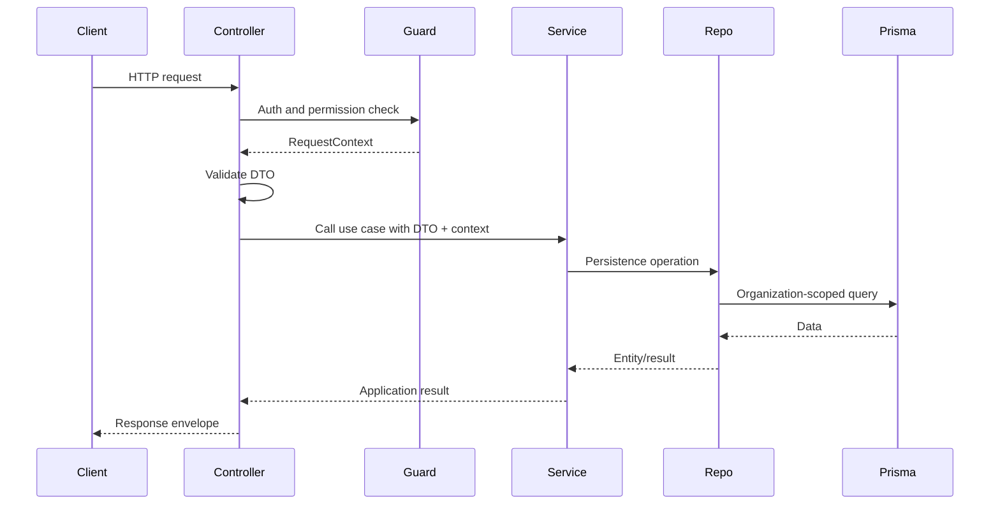

# Backend Specification: NestJS Modular Monolith Architecture

## 1. Purpose

This document defines the backend architecture for AI Workforce OS. It is the implementation contract for the NestJS application that Claude Code will eventually scaffold.

The backend must be simple enough for MVP development while still enforcing clean boundaries, tenant isolation, async processing, observability, and future extensibility.

## 2. Scope

This specification covers:

- NestJS application structure
- Module boundaries
- Dependency rules
- Request lifecycle
- Repository pattern
- DTO and validation standards
- Domain error model
- Queue and job conventions
- Events
- Logging and metrics
- Testing requirements
- Claude Code implementation expectations

This document does not define the complete implementation of individual modules. Those belong in later specs such as:

- `docs/04-backend/02-auth-and-organizations.md`
- `docs/04-backend/03-workers.md`
- `docs/04-backend/04-conversations.md`
- `docs/04-backend/05-channels.md`
- `docs/05-ai/01-worker-runtime.md`

## 3. Non-Goals

The backend MVP will not:

- Use microservices.
- Use Kafka.
- Use Kubernetes-specific code.
- Use GraphQL.
- Use dynamic untrusted plugin execution.
- Hide the AI Runtime inside LangChain, AutoGen, or similar frameworks.
- Allow controllers to contain business logic.
- Allow Prisma access outside repositories.

## 4. Architecture Style

Use a modular monolith with feature-first modules and repository-backed application services.

The architecture is not a pure academic clean architecture implementation. It should be pragmatic:

- Controllers handle transport.
- Services handle business workflows.
- Repositories handle persistence.
- Providers and adapters handle infrastructure.
- Shared utilities live in `common` only when genuinely cross-cutting.

Within large modules, use a light ports-and-adapters style where it improves testability.

## 5. Target Backend Tree

When implementation begins, the backend should be scaffolded roughly as:

```text
backend/
  src/
    main.ts
    app.module.ts
    config/
      configuration.ts
      env.validation.ts
    common/
      auth/
      constants/
      decorators/
      errors/
      filters/
      guards/
      interceptors/
      logging/
      pagination/
      request-context/
      responses/
      validation/
    database/
      prisma.module.ts
      prisma.service.ts
      transaction-manager.ts
    modules/
      auth/
      users/
      organizations/
      secrets/
      workers/
      channels/
      customers/
      conversations/
      operators/
      runtime/
      skills/
      integrations/
      knowledge/
      memory/
      workflows/
      notification/
      analytics/
      audit/
      queues/
    jobs/
      worker.ts
    test/
  prisma/
    schema.prisma
    migrations/
  package.json
  tsconfig.json
```

If a monorepo is later introduced, this backend can move to `apps/api/`. Do not introduce that structure until implementation needs justify it.

The modules under `modules/` map one-to-one to the domains in `docs/01-domain/DOMAIN_MAP.md` and the modules in `MASTER_ARCHITECTURE.md` §5. Two mappings differ by name: Identity & Access is implemented as `auth` + `users`, and Organization is `organizations`. `secrets` is listed early because `channels` and `integrations` reference it. Billing is deferred to V1; Media & Storage is a shared capability referenced by `conversations` and `knowledge` rather than a feature module.

## 6. Standard Module Structure

Each feature module should follow:

```text
src/modules/<feature>/
  <feature>.module.ts
  <feature>.controller.ts
  <feature>.service.ts
  <feature>.repository.ts
  dto/
    create-<entity>.dto.ts
    update-<entity>.dto.ts
    <entity>-response.dto.ts
  entities/
    <entity>.entity.ts
  errors/
    <feature>.errors.ts
  events/
    <feature>.events.ts
  jobs/
    <feature>.processor.ts
  interfaces/
    <feature>.interfaces.ts
  tests/
    <feature>.service.spec.ts
    <feature>.repository.spec.ts
```

Small modules may omit folders they do not need.

## 7. Dependency Rules

Allowed dependency direction:

```text
Controller -> Service -> Repository -> Prisma
Service -> Public service interface from another module
Service -> Event publisher
Service -> Queue producer
Queue processor -> Service
Runtime -> Public interfaces of workers, conversations, skills, knowledge, memory, channels, operators
Skills -> Integrations public interface
Integrations -> Secrets public interface
Channels -> Secrets public interface
```

Forbidden:

- Controller -> Repository
- Controller -> Prisma
- Service -> Prisma
- Module -> another module's repository
- Module -> another module's private database tables
- Runtime -> channel-specific webhook payloads
- Skills -> runtime internals
- Skills -> external systems directly (must go through Integrations)
- Any module -> plaintext credentials (only Secrets holds credential values)

## 8. Request Context

Every authenticated request should create a request context:

```typescript
export interface RequestContext {
  requestId: string;
  userId?: string;
  organizationId?: string;
  membershipId?: string;
  roles: string[];
  permissions: string[];
  ipAddress?: string;
  userAgent?: string;
}
```

The context should be available to controllers and services. Do not pass raw Express request objects deep into business logic.

## 9. HTTP Lifecycle



## 10. Standard Response Envelope

All successful API responses:

```typescript
export interface ApiResponse<T> {
  data: T;
  meta: {
    requestId: string;
  };
}
```

Paginated responses:

```typescript
export interface PaginatedResponse<T> {
  data: T[];
  meta: {
    requestId: string;
    pagination: {
      page: number;
      pageSize: number;
      totalItems: number;
      totalPages: number;
    };
  };
}
```

## 11. Standard Error Envelope

```typescript
export interface ApiErrorResponse {
  error: {
    code: string;
    message: string;
    details?: Record<string, unknown>;
    requestId: string;
  };
}
```

Error messages returned to clients must be safe. Internal details belong in logs.

## 12. Domain Error Model

Create a base domain error:

```typescript
export abstract class AppError extends Error {
  abstract readonly code: string;
  abstract readonly statusCode: number;

  constructor(
    message: string,
    public readonly details?: Record<string, unknown>,
  ) {
    super(message);
  }
}
```

Common errors:

- `ValidationAppError`
- `UnauthorizedAppError`
- `ForbiddenAppError`
- `NotFoundAppError`
- `ConflictAppError`
- `RateLimitAppError`
- `ExternalServiceAppError`
- `RuntimeAppError`
- `SkillExecutionAppError`

Each module may define specific errors, such as:

- `WorkerNotFoundError`
- `ConversationHumanControlledError`
- `SkillNotAttachedError`
- `KnowledgeSourceNotIndexedError`

## 13. Validation Strategy

Use DTO classes for HTTP input validation.

Rules:

- Validate all request bodies.
- Validate query parameters.
- Validate path parameters.
- Use explicit enums.
- Trim and normalize where appropriate.
- Do not rely on frontend validation.
- Validate skill inputs separately with JSON schema or Zod-like schemas inside the Skills module.

## 14. Authentication and Authorization

All non-public endpoints must use:

- JWT authentication guard.
- Organization membership guard when tenant-scoped.
- Permission guard for sensitive actions.

Authorization must happen before service execution.

Example permission names:

```text
organizations.read
organizations.update
users.invite
workers.create
workers.update
workers.publish
workers.delete
conversations.read
conversations.reply
conversations.takeover
channels.connect
integrations.connect
secrets.manage
operators.manage
knowledge.manage
skills.manage
workflows.manage
notifications.read
analytics.read
```

## 15. Repository Pattern

Repositories own persistence and tenant scoping.

Example repository interface:

```typescript
export interface WorkerRepository {
  findById(organizationId: string, workerId: string): Promise<Worker | null>;
  create(input: CreateWorkerRecordInput): Promise<Worker>;
  update(input: UpdateWorkerRecordInput): Promise<Worker>;
  softDelete(organizationId: string, workerId: string): Promise<void>;
}
```

Implementation:

```typescript
@Injectable()
export class PrismaWorkerRepository implements WorkerRepository {
  constructor(private readonly prisma: PrismaService) {}
}
```

Repository rules:

- Every tenant-owned method accepts `organizationId`.
- Never return records from another organization.
- Hide Prisma-specific query shape from services.
- Keep raw SQL rare, documented, and isolated.

## 16. Transactions

Use transactions for operations that must commit atomically.

Examples:

- Create organization + owner membership.
- Publish worker version + update worker published version.
- Create conversation + first message.
- Persist runtime run + steps + assistant message.

Do not hold transactions while calling external APIs or LLMs.

## 17. Events

Use internal domain events for cross-module reactions inside the monolith.

Initial events:

```text
OrganizationCreated
UserInvited
WorkerCreated
WorkerPublished
ChannelConnected
InboundMessageReceived
ConversationCreated
MessageCreated
HumanHandoffStarted
HumanHandoffEnded
RuntimeRunCompleted
RuntimeRunFailed
SkillExecuted
KnowledgeSourceIndexed
MemoryStored
WorkflowTriggered
```

Events should be typed objects. Do not pass large raw payloads unless necessary.

## 18. Queues

BullMQ queues:

- `inbound-message`
- `outbound-message`
- `knowledge-ingestion`
- `memory-extraction`
- `workflow-execution`
- `analytics-rollup`

Job payload standard:

```typescript
export interface BaseJobPayload {
  jobId: string;
  requestId?: string;
  organizationId?: string;
  idempotencyKey: string;
  createdAt: string;
}
```

Queue rules:

- Jobs must be idempotent.
- Jobs must have bounded retries.
- Jobs must log failures.
- Jobs must not depend on in-memory state.
- Jobs should load fresh database state when processing.

## 19. Webhook Handling

Webhook controllers must:

1. Verify provider signature.
2. Store raw inbound event.
3. Normalize enough to compute idempotency key.
4. Enqueue processing job.
5. Return success quickly.

Webhook controllers must not:

- Call LLMs.
- Execute skills.
- Run the full AI Runtime.
- Perform slow external calls.

## 20. Configuration

Use environment variables validated at startup.

Required groups:

- Application: port, environment, public URLs
- Database: PostgreSQL URL
- Redis: Redis URL
- Auth: JWT secrets, token TTLs
- Storage: S3 endpoint, bucket, region
- LLM: provider keys and gateway URL
- Channels: Meta app credentials, webhook secrets
- Observability: log level, telemetry flags

Invalid configuration should fail startup.

## 21. Logging

Use structured JSON logs in production.

Include:

- `requestId`
- `organizationId`
- `userId`
- `conversationId`
- `workerId`
- `jobId`
- `runtimeRunId`

Do not log:

- Passwords
- API keys
- Refresh tokens
- Channel access tokens
- Full unredacted prompts
- Sensitive customer data

## 22. Metrics

Track:

- HTTP request duration
- HTTP error count
- Queue wait time
- Queue processing time
- Queue failure count
- Runtime duration
- LLM latency
- LLM token usage
- LLM estimated cost
- Skill execution latency
- Skill failure count
- Webhook duplicate count
- Channel send failure count

## 23. Audit Logs

Emit audit logs for:

- Login failures above threshold
- Password changes
- Organization settings changes
- User invitations
- Role changes
- Worker publish events
- Secret creation, rotation, revocation, and access
- Integration connect/revoke and reauthorization
- Human handoff (start, end, reassignment)
- Skill configuration changes
- API key creation/deletion

## 24. Module Communication

Modules should communicate through public services and typed events.

Example:

- `RuntimeModule` calls `ConversationsService.getRuntimeConversationContext`.
- `RuntimeModule` calls `SkillsService.getAvailableToolsForWorker`.
- `RuntimeModule` calls `KnowledgeService.retrieveForRuntime`.
- `RuntimeModule` calls `MemoryService.getCustomerMemory`.
- `RuntimeModule` requests human handoff via `OperatorsService` (it does not assign operators itself).
- `SkillsService` obtains an authorized external connection via `IntegrationsService`, which reads tokens from `SecretsService`.
- `ChannelsService` resolves credentials via `SecretsService`.

The runtime should not query conversation tables, skill tables, knowledge tables, and memory tables directly. No module reads credential values except through `SecretsService`.

## 25. Testing Strategy

Required test categories:

- Unit tests for services.
- Repository tests for tenant scoping.
- API tests for DTO validation and authorization.
- Queue processor tests for idempotency.
- Runtime tests for tool loop behavior.
- Skill tests for input validation and permission checks.
- Webhook tests for signature verification and deduplication.

Critical test cases:

- User from org A cannot read org B conversations.
- Worker cannot use a skill not attached to it.
- Duplicate webhook does not create duplicate messages.
- Human handoff prevents automatic worker reply.
- Failed outbound message is recorded.

## 26. Security Requirements

- Use password hashing with a modern algorithm.
- Store refresh tokens hashed.
- Store all provider and integration credentials in the Secrets module (encrypted); other modules hold only `secret_id` references.
- Verify webhooks.
- Apply rate limits.
- Validate all input.
- Use tenant-scoped queries.
- Use permission guards.
- Redact logs.
- Do not trust LLM tool arguments without validation.

## 27. Performance Guidelines

- Paginate list endpoints.
- Avoid loading entire conversation history by default.
- Use recent messages plus summaries or memory for runtime context.
- Add indexes for inbox queries.
- Keep webhook response paths fast.
- Run document ingestion asynchronously.
- Batch embeddings when possible.
- Avoid N+1 queries in dashboard endpoints.

## 28. Implementation Order

When backend implementation begins:

1. Scaffold NestJS backend.
2. Add configuration validation.
3. Add Prisma and database connection.
4. Add common response/error/request context infrastructure.
5. Add auth and organizations.
6. Add users and memberships.
7. Add secrets (needed before channels and integrations).
8. Add workers.
9. Add customers.
10. Add conversations.
11. Add channels and webhook ingestion.
12. Add operators and human handoff.
13. Add queues.
14. Add skills registry.
15. Add integrations (external connections consumed by skills).
16. Add LLM provider abstraction.
17. Add runtime.
18. Add knowledge and memory.
19. Add workflows.
20. Add notification and analytics.

## 29. Things Claude Code Must Not Do

When implementing backend code, Claude Code must not:

- Create microservices.
- Introduce a different ORM.
- Use Prisma inside controllers or services.
- Add business logic to controllers.
- Use global mutable state for request data.
- Skip organization scoping.
- Add broad `any` types.
- Skip tests for authorization-sensitive logic.
- Add a plugin system for customer-uploaded code.
- Introduce GraphQL.
- Process webhooks synchronously.

## 30. Acceptance Criteria

The backend architecture is correctly implemented when:

- NestJS app follows feature-first module structure.
- Controllers are thin.
- Services own business workflows.
- Repositories own Prisma access.
- Tenant-owned data is organization-scoped.
- Standard response and error envelopes are used.
- Auth, permission, and request context infrastructure exist.
- Queue jobs use idempotency keys.
- Logs include correlation context.
- Tests prove critical authorization and tenant isolation behavior.

## 31. Claude Code Implementation Prompt

Use this prompt when scaffolding the backend:

```markdown
Read:

- `docs/00-foundation/MASTER_ARCHITECTURE.md`
- `docs/00-foundation/CLAUDE.md`
- `docs/03-database/01-data-model.md`
- `docs/04-backend/01-backend-architecture.md`

Scaffold the NestJS backend architecture exactly as specified.

Implement only the foundation:

- NestJS app structure
- Config validation
- Prisma module
- Request context
- Standard response envelope
- Standard error envelope
- Global exception filter
- Validation pipe
- Common auth guard placeholders
- Common permission decorator/guard placeholders
- Base repository conventions
- Queue module wiring placeholders

Do not implement business modules yet unless explicitly requested.
Do not introduce architecture not documented.
Add tests for common error/response behavior where practical.
Run formatting, linting, and type checks.
```

