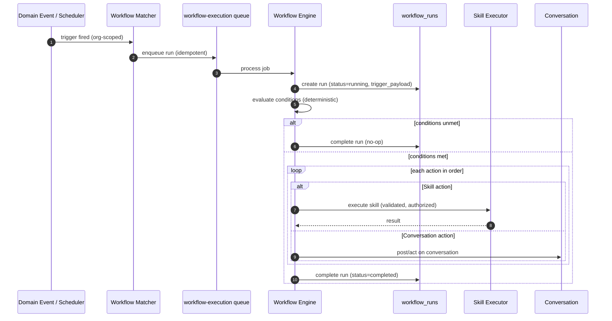
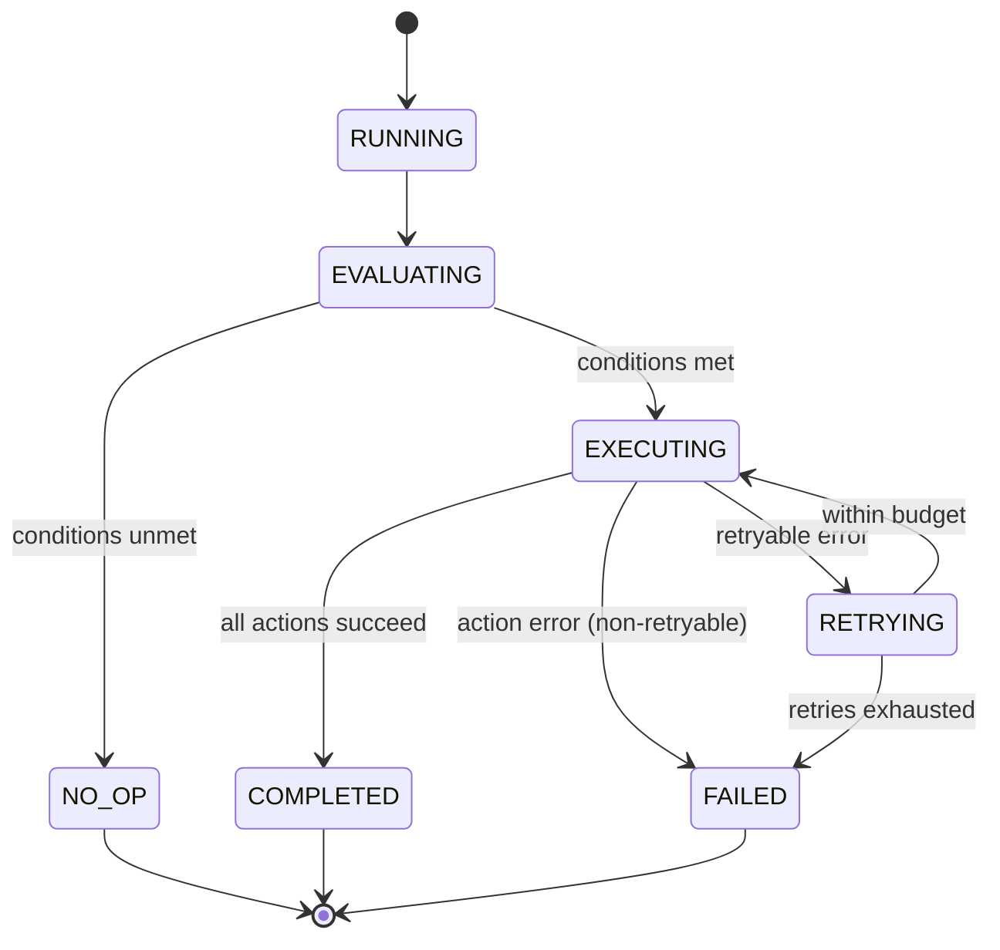

# Workflow Engine Specification

## Purpose

This document specifies the Workflow Engine — deterministic, non-AI automation made of triggers, conditions, and actions. It is the implementation contract for the Workflow domain in `docs/01-domain/DOMAIN_MAP.md` and the workflow architecture in `docs/00-foundation/MASTER_ARCHITECTURE.md` §17. Where the AI Runtime reasons, the Workflow Engine follows explicit rules.

## Scope

This spec covers workflow definitions (triggers, conditions, actions), the execution engine, run auditing, and how workflows invoke Skills and act on Conversations. It defines the strict separation between deterministic workflows and the nondeterministic AI Runtime.

It does not cover: the AI Runtime (`docs/05-ai/01-ai-runtime.md`), skill implementations (`docs/05-ai/02-skills-framework.md` — workflows consume skills through the same executor), or a visual workflow builder UI (Frontend spec). No application code.

## Goals

- Provide predictable, rule-based automation that runs the same way every time given the same inputs.
- Keep workflows completely separate from the AI Runtime's execution path.
- Make every workflow run auditable.
- Reuse the Skill executor for actions rather than duplicating capability logic.
- Treat any LLM usage inside a workflow as an explicit, discrete action — never emergent behavior.

## Non Goals

- No AI reasoning, planning, or tool loops (AI Runtime).
- No new capability definitions (actions invoke registered Skills).
- No sharing of the runtime's execution lifecycle or state machine.
- No workflow marketplace or templates in the MVP (see Future Work).

## Business Rules

1. Every Workflow and Workflow Run belongs to exactly one Organization.
2. Workflow execution is deterministic given the same inputs and definition version.
3. Workflows are separate from the AI Runtime and never share its execution path or tables.
4. Every workflow run is auditable (trigger payload, evaluated conditions, executed actions, outcome).
5. LLM calls inside a workflow are explicit action types, not hidden behavior.
6. Actions that invoke Skills go through the same Skill executor (validated, authorized, idempotent).
7. Runs are idempotent per triggering event where the trigger can fire more than once.

## Architecture

A workflow is a definition of a **trigger**, optional **conditions**, and an ordered set of **actions**. The engine listens for trigger events (domain events or schedules), evaluates conditions deterministically, and executes actions in order on the `workflow-execution` BullMQ queue. It reuses the Skill executor for capability actions and calls Conversation for messaging actions.

```text
trigger event / schedule
        │
        ▼
  match workflows (by trigger_type, org) ─► enqueue workflow-execution job
        │
        ▼
  evaluate conditions (deterministic) ─► execute actions in order ─► record workflow_run
                                              │
                              ┌───────────────┼────────────────┐
                              ▼               ▼                ▼
                        Skill action    Conversation action   Explicit LLM action
```

### Definition Model

A workflow definition (`workflows.definition` jsonb) declares:

- **Trigger** — `trigger_type` (e.g., `lead_created`, `conversation_unresolved`, `appointment_booked`) plus binding parameters; or a schedule.
- **Conditions** — deterministic predicates over the trigger payload and referenced data (all/any/none).
- **Actions** — an ordered list; each action has a type, inputs, and error behavior.

Action types (extensible): invoke a Skill, post/act on a Conversation, request human handoff (via Operators), send a Notification, wait/delay, and an explicit LLM action (a bounded, single-purpose model call — never an open-ended loop).

### Execution

1. A trigger event (domain event) or schedule matches workflows by `trigger_type` and organization.
2. A `workflow-execution` job is enqueued (idempotent per trigger where applicable).
3. The engine loads the workflow, records a `workflow_runs` row (status `running`), and stores the `trigger_payload`.
4. Conditions are evaluated deterministically; if unmet, the run completes as a no-op.
5. Actions execute in order; Skill actions go through the Skill executor, Conversation actions through `ConversationsService`, etc.
6. The run is marked `completed` or `failed` (with a safe error) and audited.

## Domain Model

Owned by the Workflow domain (see `docs/03-database/01-data-model.md`):

- `workflows` — the definition (name, status, `trigger_type`, `definition` jsonb).
- `workflow_runs` — one execution (trigger payload, status, timing, safe error).

Referenced (not owned): registered `skills` (via the Skill executor), `conversations` (Conversation), Operators (handoff), and Notification. Workflows consume the same event catalog other domains publish.

## Interfaces

- `WorkflowsService.create/update/enable/disable(...)` — definition CRUD and lifecycle (permission-gated).
- `WorkflowsService.listRuns(organizationId, workflowId)` — run history and status.
- `WorkflowsService.executeTriggered(job)` — the `workflow-execution` queue consumer.

Consumed: `SkillsService.execute(...)`, `ConversationsService` actions, `OperatorsService.requestHandoff(...)`, `NotificationService.notify(...)`.

Events published: `WorkflowTriggered`, `WorkflowRunStarted`, `WorkflowRunCompleted`, `WorkflowRunFailed`. Events consumed: any configured trigger event (e.g., `MessageReceived`, `CustomerCreated`, `SkillExecuted`).

## Sequence Diagram



## State Diagram

Workflow run lifecycle.



## Security

- Every workflow, run, and action is organization-scoped.
- Skill actions are authorized through the Skill executor's permission checks — a workflow cannot bypass skill permissions.
- Explicit LLM actions are bounded single calls; workflows cannot spawn open-ended AI loops.
- Trigger payloads and action inputs are treated as tenant data and redacted in logs.
- Workflow definitions changes are audited.

## Performance

- Execution is asynchronous on the `workflow-execution` queue and never blocks the triggering path.
- Condition evaluation is deterministic and bounded; no unbounded fan-out.
- Retries are bounded; long delays use scheduled re-enqueue rather than holding a worker.
- Runs load fresh state rather than relying on in-memory data.

## Logging

- Runs log `organizationId`, `workflowId`, `workflowRunId`, and per-action status.
- `workflow_runs` is the durable audit record; logs are the ephemeral stream.
- Never log raw trigger payloads containing sensitive data, or credentials.

## Testing

- The same definition and inputs produce the same actions (determinism).
- Unmet conditions complete as a no-op with no side effects.
- A Skill action without permission is rejected by the executor.
- A retryable action retries within budget; exhausted budget fails cleanly.
- Reprocessing the same trigger event does not double-execute (idempotent where applicable).
- Workflows never enter the AI Runtime's execution path or tables.
- Every run is recorded and organization-scoped.

## Future Work

- Visual workflow builder (Frontend).
- Workflow templates and a shared library (Templates domain).
- Richer control flow (branches, parallel actions, sub-workflows).
- Backtesting/simulation of workflows against historical events.

## Implementation Checklist

- [ ] Workflow definition model (trigger, conditions, ordered actions) and lifecycle.
- [ ] Trigger matching from domain events and schedules, organization-scoped.
- [ ] `workflow-execution` queue consumer, idempotent per trigger.
- [ ] Deterministic condition evaluation.
- [ ] Action execution: Skill (via executor), Conversation, Operators handoff, Notification, delay, explicit LLM action.
- [ ] `workflow_runs` recording with trigger payload, status, and safe errors.
- [ ] Workflow events published; failures surfaced to Notification.

## Acceptance Criteria

- [ ] Workflows are deterministic and fully separate from the AI Runtime.
- [ ] Every run is auditable via `workflow_runs` and organization-scoped.
- [ ] Skill actions reuse the Skill executor and respect permissions and idempotency.
- [ ] LLM usage inside workflows is limited to explicit, bounded actions.
- [ ] Reprocessing a trigger does not double-execute side effects.
- [ ] The engine matches the Workflow domain in `DOMAIN_MAP.md` and §17 of `MASTER_ARCHITECTURE.md`.
