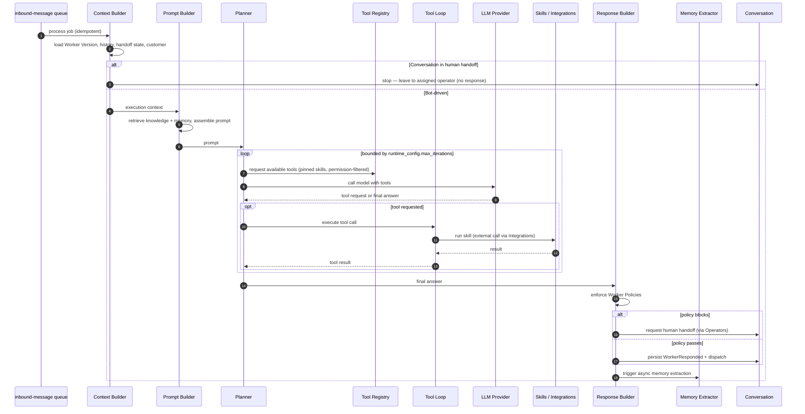
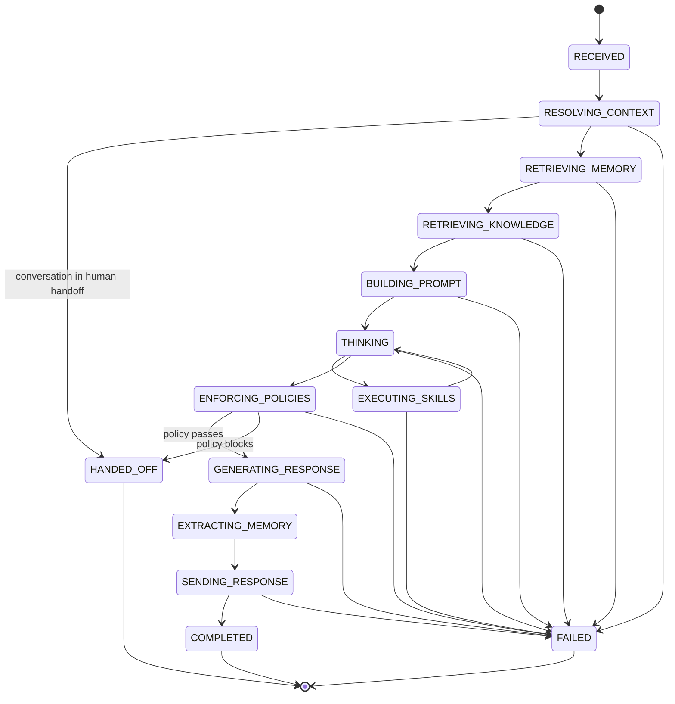

# AI Runtime Specification

## Purpose

This document specifies the AI Runtime — the engine that turns a single inbound, normalized event into a reasoned, policy-checked response. It is the implementation contract for the runtime described at the domain level in `docs/01-domain/DOMAIN_MAP.md` and at the system level in `docs/00-foundation/MASTER_ARCHITECTURE.md` (§7–§9). The AI Runtime is the platform's primary differentiator and is built in-house rather than on a heavy framework.

## Scope

This spec covers the AI Runtime bounded context only: its internal pipeline components (Context Builder, Prompt Builder, Planner, Tool Loop, Tool Registry, LLM Provider, Response Builder, Memory Extractor), the run/step/trace model, the tool-calling loop, policy enforcement, human-handoff gating, reproducibility, and observability.

It does not cover: skill definition or execution internals (`docs/05-ai` skills spec and the Skill domain), knowledge ingestion and embedding (Knowledge spec), memory extraction rules and storage (Memory spec — the runtime only triggers extraction), channel transport (Channel spec), or deterministic automation (Workflow spec). It defines interfaces to those domains, not their internals. It contains no application code.

## Goals

- Define the runtime as an explicit, observable pipeline where every stage is independently testable.
- Guarantee bounded, terminating execution with full cost and trace capture.
- Enforce reproducibility: every run executes against a pinned Worker Version.
- Enforce safety: only attached skills run, policies gate every response, and no response is sent during human handoff.
- Specify the interfaces the runtime consumes from other domains, so the runtime orchestrates without owning their data.

## Non Goals

- No prompt-template authoring (owned by Worker / Prompt Profile).
- No skill implementations or the skill registry's source of truth (Skill domain).
- No knowledge chunking/embedding or memory extraction algorithms (Knowledge / Memory domains).
- No channel-specific payload handling (Channel domain).
- No model/provider procurement decisions beyond the provider-abstraction boundary.
- No streaming/voice execution (see Future Work).

## Business Rules

1. A run is always tied to exactly one `worker_version_id`, one `conversation_id`, and one `organization_id`.
2. The tool loop is always bounded by a maximum iteration count from the Worker's Runtime Configuration.
3. Only skills pinned into the run's Worker Version (`worker_version_skills`) may be exposed as tools and executed.
4. Every skill execution is authorized against the acting context's permissions before it runs.
5. No response is generated or sent while the conversation is in human handoff (`conversations.mode = human`).
6. Every run persists enough detail (context inputs, steps, LLM calls, tool calls, outputs, tokens, cost) to be replayed and debugged.
7. The LLM may only request registered tools; it never executes arbitrary code.
8. Job processing is idempotent — reprocessing the same inbound event must not double-send or duplicate side effects.
9. Worker Policies are enforced on the draft response before dispatch; a blocking policy routes to human handoff instead of sending.
10. External skill calls go through Integrations; the runtime never handles credentials directly.

## Architecture

The AI Runtime is a single bounded context, invoked asynchronously off the `inbound-message` queue (a webhook enqueues; the runtime processes). Internally it is an ordered pipeline of conceptual components. Each component has one responsibility, reads from other domains through their public interfaces, and writes only the runtime's own trace tables (`runtime_runs`, `runtime_steps`, `llm_calls`; skill telemetry is written by the Skill domain as `skill_executions`).

```text
inbound-message job
        │
        ▼
  Context Builder ──► Prompt Builder ──► Planner ──► Tool Loop ──► Response Builder ──► Memory Extractor
                                             ▲            │
                                             └── Tool Registry + LLM Provider
```

The pipeline maps directly to the runtime stages in `MASTER_ARCHITECTURE.md` §8 and the state machine in §9. The Planner corresponds to the `THINKING` state; the Tool Loop cycles between `THINKING` and `EXECUTING_SKILLS`.

### Component Responsibilities

**Context Builder.** Resolves everything the run needs before any reasoning: the Worker Version and its pinned configuration (Brain, Prompt Profile, Policies, Runtime Configuration, pinned skills/knowledge), the conversation's recent message history and handoff state, the Customer, and organization context. Produces a single coherent execution context. It gathers; it does not reason. If the conversation is in human handoff, the pipeline stops here.

**Prompt Builder.** Assembles the prompt sent to the model from the Worker's Prompt Profile and Personality, the built context, retrieved Knowledge chunks, and retrieved Memory facts. It is the runtime consumer of the Worker's prompt material; it does not author prompts.

**Planner.** Decides, within the configured budget, what the model should attempt next — answer directly, retrieve more, or call a tool. Represents the reasoning/decision step and enforces the Runtime Configuration's limits (max iterations, latency/cost ceilings).

**Tool Registry.** Exposes the skills pinned into the run's Worker Version to the model as callable tools, filtered by the acting context's permissions. It is a runtime projection of the Skill domain's authoritative registry, scoped to this run — not a second source of truth.

**Tool Loop.** The bounded iteration that lets the model request tool calls, receives results, and continues until a final answer or the iteration limit. Guarantees termination and never executes anything outside the Tool Registry.

**LLM Provider.** The abstraction over the language-model provider (via LiteLLM / OpenAI-compatible tool calling). It isolates the rest of the runtime from provider specifics and records each call's tokens, cost, and latency into `llm_calls`. It calls the model; it makes no product decisions. Multiple providers (OpenAI, Anthropic, Gemini, etc.) sit behind this single boundary.

**Response Builder.** Turns the model's final output into the outbound response, enforces Worker Policies as a final gate, formats the reply, and hands it to the Conversation domain for dispatch. If a policy blocks the draft, it requests human handoff via the Operators domain instead of sending.

**Memory Extractor.** After the exchange, asynchronously triggers extraction of structured facts into the Memory domain. It initiates extraction; the Memory domain owns the facts and the extraction rules.

## Domain Model

The runtime owns the execution trace, defined in `docs/03-database/01-data-model.md`:

- `runtime_runs` — one execution against one inbound event (org, conversation, worker, `worker_version_id`, trigger message, status, timing).
- `runtime_steps` — the ordered timeline of stages within a run (step name, status, redacted input/output summaries, error, timing).
- `llm_calls` — each model call (provider, model, purpose, tokens, estimated cost, latency, status).

It reads (never writes) from other domains: `worker_versions` + `worker_version_skills`/`worker_version_knowledge` (Worker), `conversations`/`messages` (Conversation), `customer_memories` (Memory), `knowledge_chunks` (Knowledge). Skill telemetry is written by the Skill domain as `skill_executions`, which reference `runtime_run_id`.

## Interfaces

The runtime is primarily a queue-driven worker, not a public API. It exposes an internal entry point and a read interface, and consumes public services from other modules.

Entry point:

- `RuntimeService.processInboundMessage(job)` — consumes an `inbound-message` job idempotently and executes one run.

Consumed services (per `docs/04-backend/01-backend-architecture.md` §24):

- `WorkersService.getResolvedWorkerVersion(organizationId, workerId)` — the pinned configuration.
- `ConversationsService.getRuntimeConversationContext(organizationId, conversationId)` — history + handoff state.
- `MemoryService.getCustomerMemory(organizationId, customerId)` — relevant facts.
- `KnowledgeService.retrieveForRuntime(organizationId, query, workerVersionId)` — ranked chunks with citations.
- `SkillsService.getAvailableToolsForWorker(...)` and `SkillsService.execute(...)` — tool registry projection and execution.
- `OperatorsService.requestHandoff(...)` — when a policy blocks or the model escalates.
- Outbound dispatch is handed to `ConversationsService`, which persists `WorkerResponded` and dispatches to the Channel.

Read interface:

- `RuntimeService.getRunTrace(organizationId, runId)` — the full run/step/LLM-call trace for debugging and the dashboard's runtime timeline.

## Sequence Diagram

The internal flow of a single run, from job pickup to dispatch. Components are shown as participants; each writes a `runtime_steps` row as it executes.



## State Diagram

The run state machine. Aligns with `MASTER_ARCHITECTURE.md` §9, with an explicit terminal `HANDED_OFF` state.



## Security

- Every run and every consumed/produced record is scoped by `organization_id`; the runtime never crosses tenants.
- Tool arguments produced by the model are validated against the skill's input schema before execution; the model's output is never trusted as-is.
- Only skills pinned into the run's Worker Version and permitted for the acting context are executable.
- The LLM cannot execute code, access the filesystem, or reach the network except through registered skills and Integrations.
- Policies are enforced server-side on every draft response; a blocked response is never sent.
- The runtime handles no credentials; external access is brokered by Integrations with tokens from Secrets.
- Prompts, tool inputs/outputs, and step summaries are redacted of secrets and sensitive customer data before persistence or logging.

## Performance

- The tool loop is bounded by `runtime_config.max_iterations`; the run also respects latency and cost ceilings from the Worker's Runtime Configuration.
- Context is built from recent messages plus memory and retrieved knowledge, not the full conversation history, to control token cost.
- Knowledge retrieval breadth (top-k) is configurable per Worker; embeddings are precomputed (Knowledge domain), so retrieval is a bounded vector query.
- LLM calls are the dominant latency; the LLM Provider records latency and cost per call for tuning.
- Runs execute on BullMQ workers and never block webhook acknowledgement.
- Trace writes are batched where possible; step summaries are bounded in size.

## Logging

- Every run carries `requestId`, `organizationId`, `conversationId`, `workerId`, `workerVersionId`, and `runtimeRunId` in structured logs.
- `runtime_steps` is the durable, queryable timeline; logs are the ephemeral stream.
- Never log full unredacted prompts, tool payloads containing customer data, credentials, or tokens.
- Failures log a safe error plus enough context (step, ids) to debug from the trace.

## Testing

- Tool loop terminates at the iteration limit and never exceeds it.
- A conversation in human handoff produces no model call and no response.
- A skill not pinned into the Worker Version cannot be exposed or executed.
- A skill execution without the required permission is rejected.
- A blocking policy routes to handoff and does not send a response.
- Reprocessing the same inbound event (same idempotency key) produces no duplicate response or side effect.
- A run is fully reconstructable from `runtime_runs` + `runtime_steps` + `llm_calls` + `skill_executions`.
- Tenant isolation: a run for org A never reads org B's worker, memory, knowledge, or conversation.

## Future Work

- Streaming/token-by-token responses where channels support them.
- Voice execution as an additional inbound modality behind the same pipeline.
- Richer Planner strategies (multi-step planning, reflection) behind the same bounded-loop contract.
- Multi-worker collaboration (deferred; out of MVP scope).
- Response caching for repeated deterministic queries.

## Implementation Checklist

- [ ] Idempotent `inbound-message` consumer that creates a `runtime_runs` record.
- [ ] Context Builder resolving Worker Version, history, handoff state, customer, org.
- [ ] Handoff gate that terminates the run in `HANDED_OFF` without a model call.
- [ ] Prompt Builder integrating Prompt Profile, Personality, memory, and knowledge.
- [ ] Tool Registry projecting pinned, permission-filtered skills as tools.
- [ ] Bounded Tool Loop with Planner decisions and iteration cap.
- [ ] LLM Provider abstraction (LiteLLM/OpenAI-compatible) recording `llm_calls`.
- [ ] Skill execution via Skills domain with input/output validation.
- [ ] Response Builder enforcing Policies and routing to handoff on block.
- [ ] Dispatch handed to Conversation; async Memory extraction triggered.
- [ ] Full trace persistence (`runtime_steps`) with redaction.
- [ ] Run-trace read interface for the dashboard timeline.

## Acceptance Criteria

- [ ] Every run executes against a pinned `worker_version_id` and is reproducible from its trace.
- [ ] The tool loop is provably bounded and only ever calls registered, pinned, permitted skills.
- [ ] No response is produced during human handoff, and blocked policies route to handoff.
- [ ] The LLM cannot execute anything outside registered skills; tool args are schema-validated.
- [ ] Every run/step/LLM-call is persisted, organization-scoped, and redacted of secrets.
- [ ] The pipeline components and states match `DOMAIN_MAP.md` and `MASTER_ARCHITECTURE.md` §8–§9.
- [ ] All consumed data comes through documented service interfaces, not cross-domain table reads.

