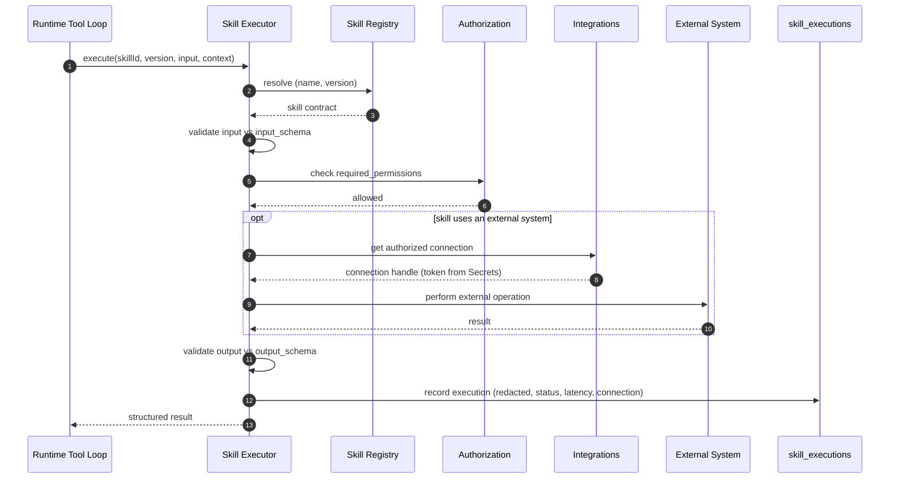
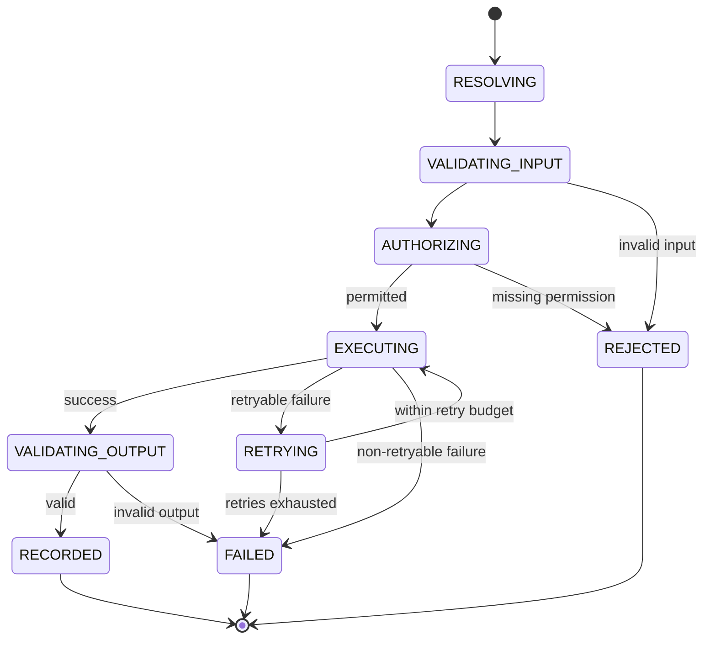

# Skills Framework Specification

## Purpose

This document specifies the Skills framework — the server-side capabilities a Worker can invoke through LLM tool calling (create a lead, check a calendar, send an email, search a CRM). It is the implementation contract for the Skill domain defined in `docs/01-domain/DOMAIN_MAP.md` and the skill architecture in `docs/00-foundation/MASTER_ARCHITECTURE.md` §13. Skills are how a Worker acts on the world.

## Scope

This spec covers the skill contract, the skill registry, the execution engine (resolve → validate → authorize → execute → validate → record), permissioning, idempotency and retries, and how skills consume Integrations for external systems. It defines how the AI Runtime's Tool Registry projects skills as tools, and how executions are recorded.

It does not cover: the runtime pipeline itself (`docs/05-ai/01-ai-runtime.md`), the definition of any specific business skill's logic beyond its contract, Integrations OAuth/credential internals (Integrations + Secrets domains), or a third-party skill marketplace (deferred; see Future Work). No application code.

## Goals

- Define a single, uniform contract every skill must satisfy.
- Make skill execution safe: validated, authorized, bounded, and idempotent where side-effecting.
- Keep skills server-side and registered — no dynamic or untrusted code execution.
- Cleanly separate a skill's *capability* from the *decision to call it* (the runtime's tool loop) and from *external connectivity* (Integrations).
- Make every execution observable and reproducible.

## Non Goals

- No dynamic customer-uploaded or third-party runtime code (MVP is server-side only).
- No prompt/tool-calling orchestration (owned by the AI Runtime's Tool Loop and Tool Registry).
- No OAuth flows or credential storage (Integrations owns connections; Secrets owns tokens).
- No skill marketplace, publishing, or billing (deferred to Future Work / Marketplace domain).
- No running skills in the customer's browser.

## Business Rules

1. Only registered, server-side skills may be executed — never dynamic or untrusted code.
2. A skill executes only if it is pinned into the run's Worker Version (`worker_version_skills`) and the acting context holds the skill's `required_permissions`.
3. Every execution validates input against the skill's input schema before running and output against its output schema after.
4. Skills declare idempotency behavior; side-effecting skills are safe to retry via an idempotency key.
5. Every skill carries a version; a Worker Version pins the exact skill versions it may use.
6. A skill reaches an external system only through an Integrations connection; it never holds OAuth or credentials.
7. Every execution is bounded by the skill's timeout and retry policy.
8. Every execution is recorded (inputs/outputs redacted as needed, status, latency, connection used) for audit and debugging.

## Architecture

A skill is a contract-bound, callable function with metadata. The framework has three parts: the **registry** (source of truth for available skills and their contracts), the **executor** (the safe execution pipeline), and the **runtime projection** (how the AI Runtime exposes pinned skills as tools). The Skill domain owns the registry and executor; the runtime's Tool Registry is a read-only projection scoped to a single run.

```text
Worker Version (pinned skills)
        │
        ▼
AI Runtime Tool Registry ──exposes──► LLM tool calling
        │ model requests a tool
        ▼
Skill Executor:  resolve ─► validate input ─► authorize ─► execute ─► validate output ─► record ─► return
                                                              │
                                                              ▼
                                                     Integrations connection (external systems)
```

### Skill Contract

Every skill declares (per `MASTER_ARCHITECTURE.md` §13 and the `skills` table):

- **Name** — stable programmatic identifier (unique per version).
- **Display name** and **description** — the description is what the model sees to decide when to call it.
- **Version** — stable; Worker Versions pin a specific skill version.
- **Category** — e.g. crm, calendar, messaging, commerce.
- **Input schema** and **output schema** — JSON Schema (or equivalent) used for validation on both sides.
- **Required permissions** — the permissions the acting context must hold.
- **Timeout** — maximum execution time.
- **Retry policy** — bounded retries and backoff.
- **Idempotency behavior** — whether and how repeated execution is safe.
- **Executor** — the server-side implementation reference.
- **Integration provider** (optional) — which Integrations provider the skill uses, if any.

### Registry

The registry (`skills` table) is the authoritative catalog. Skills are registered at deploy time (server-side classes), never uploaded at runtime. A skill is resolvable by `(name, version)`. Skills move through `active → deprecated → disabled`; deprecating a skill flags Worker configurations that pin it (`SkillDeprecated` event).

### Execution Flow

For each tool call requested by the model, the executor runs the fixed pipeline:

1. **Resolve** the skill by name and pinned version from the registry.
2. **Validate input** against the skill's input schema; reject on mismatch.
3. **Authorize** against the skill's `required_permissions` and the acting context; reject if missing.
4. **Execute** within the timeout; if the skill needs an external system, obtain an authorized connection handle from Integrations (tokens supplied by Secrets — never seen by the skill as raw values).
5. **Validate output** against the output schema.
6. **Record** a `skill_executions` row (inputs/outputs redacted as needed, status, latency, `integration_connection_id`, idempotency key).
7. **Return** a structured result to the Tool Loop.

## Domain Model

Owned by the Skill domain (see `docs/03-database/01-data-model.md`):

- `skills` — the registry: contract metadata, schemas, required permissions, version, status.
- `skill_executions` — one execution record (run, worker, skill, `integration_connection_id`, input/output, status, latency, idempotency key).

Referenced (not owned): `worker_skills` and `worker_version_skills` (Worker domain — which skills are attached/pinned), `integration_connections` (Integrations — the connection an execution used), and `runtime_runs` (AI Runtime — the run an execution belongs to).

## Interfaces

Consumed by the AI Runtime and by Workflow:

- `SkillsService.getAvailableToolsForWorker(organizationId, workerVersionId, context)` — the permission-filtered set of pinned skills projected as tool definitions (the Tool Registry projection).
- `SkillsService.execute(organizationId, { skillId, version, input, context, runtimeRunId?, idempotencyKey? })` — runs the execution pipeline and returns a structured result.

Administration:

- `SkillsService.listSkills(...)`, `registerSkill(...)`, `deprecateSkill(...)` — registry management (deploy-time / admin, permission-gated).

The framework calls `IntegrationsService.getAuthorizedConnection(...)` when a skill needs an external system; it never calls Secrets directly.

## Sequence Diagram



## State Diagram

The lifecycle of one skill execution.



## Security

- Only registered server-side skills execute; there is no path to run arbitrary code.
- Tool arguments from the model are validated against the input schema before execution and never trusted as-is.
- Every execution is authorized against `required_permissions` in the acting organization context.
- Skills obtain external access only through Integrations; they never read credentials or run OAuth.
- Execution inputs/outputs are redacted of secrets and sensitive customer data before persistence and logging.
- Side-effecting skills use idempotency keys so retries do not double-apply effects.

## Performance

- Each execution is bounded by the skill's timeout; the runtime's tool loop is separately bounded by iteration count.
- Retries are bounded with backoff; non-retryable failures fail fast.
- External calls run within timeouts and never hold database transactions open.
- Skill telemetry (latency, status) is recorded per execution for hotspot analysis.

## Logging

- Executions carry `organizationId`, `runtimeRunId`, `skillName`, and `integrationConnectionId` in structured logs.
- `skill_executions` is the durable record; logs are the ephemeral stream.
- Never log raw credentials, tokens, or unredacted external payloads.

## Testing

- A skill not pinned to the Worker Version cannot be resolved or executed.
- Execution without the required permission is rejected before any side effect.
- Invalid input is rejected against the schema; invalid output fails the execution.
- A retryable failure retries within budget; an exhausted budget fails cleanly.
- A side-effecting skill run twice with the same idempotency key applies its effect once.
- An external-system skill obtains its connection from Integrations and never sees raw credentials.
- Every execution writes a `skill_executions` row scoped to the organization.

## Future Work

- Third-party / marketplace skills with sandboxed execution (Marketplace domain; deliberately deferred).
- Per-skill rate limiting and quotas.
- Skill-level evaluation and regression testing (AI Evaluations domain).
- Composite skills that orchestrate multiple underlying operations.

## Implementation Checklist

- [ ] Skill contract type (name, version, schemas, permissions, timeout, retry, idempotency, executor).
- [ ] Registry with `(name, version)` resolution and `active/deprecated/disabled` lifecycle.
- [ ] Execution pipeline: resolve → validate input → authorize → execute → validate output → record → return.
- [ ] Permission checks against the acting context.
- [ ] Input/output schema validation.
- [ ] Idempotency-key handling for side-effecting skills.
- [ ] Integrations handoff for external calls (no direct credential access).
- [ ] `skill_executions` recording with redaction and `integration_connection_id`.
- [ ] Tool Registry projection for the AI Runtime (permission-filtered, pinned skills).
- [ ] Initial set of MVP skills registered.

## Acceptance Criteria

- [ ] Every skill satisfies the uniform contract, including schemas, permissions, and versioning.
- [ ] Only pinned, permitted, registered skills execute; no dynamic code paths exist.
- [ ] Input and output are schema-validated on every execution.
- [ ] Side-effecting skills are idempotent under retry.
- [ ] External access flows only through Integrations; skills never touch OAuth or credentials.
- [ ] Every execution is recorded, organization-scoped, and redacted of secrets.
- [ ] The framework matches the Skill domain in `DOMAIN_MAP.md` and §13 of `MASTER_ARCHITECTURE.md`.
