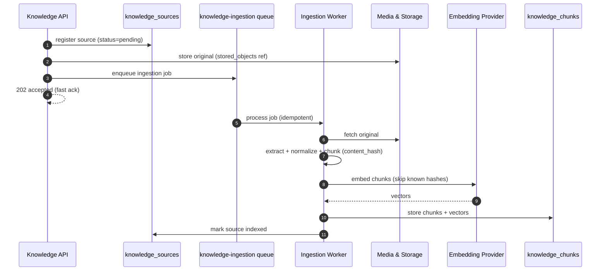
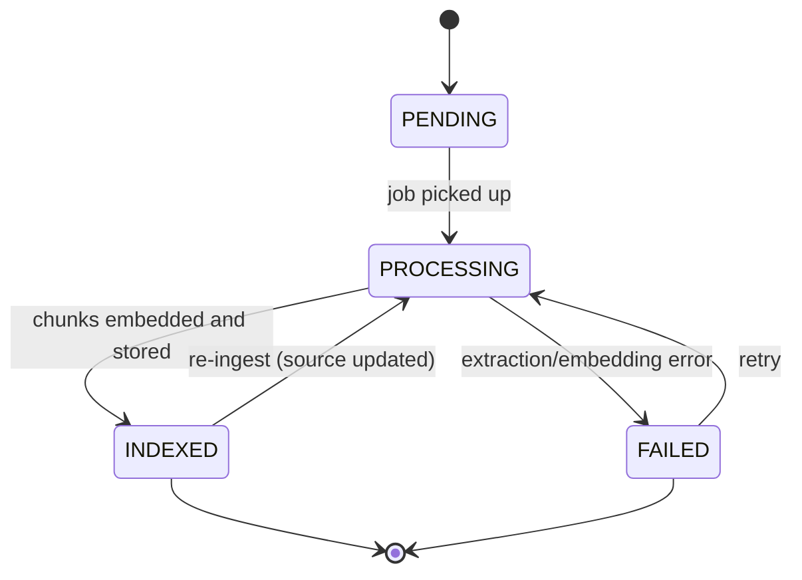

# Knowledge Engine Specification

## Purpose

This document specifies the Knowledge Engine — how agency-provided content is ingested, chunked, embedded, and retrieved so a Worker can answer questions from it (Retrieval-Augmented Generation). It is the implementation contract for the Knowledge domain in `docs/01-domain/DOMAIN_MAP.md` and the RAG architecture in `docs/00-foundation/MASTER_ARCHITECTURE.md` §15, using PostgreSQL + pgvector per `docs/adr/0006-pgvector.md`.

## Scope

This spec covers knowledge source ingestion (upload/connect → store → extract → chunk → embed → index), organization-scoped retrieval for the runtime, and the source/chunk/embedding model. It defines how the AI Runtime's Prompt Builder consumes retrieved chunks with citations.

It does not cover: the runtime pipeline (`docs/05-ai/01-ai-runtime.md`), customer-specific facts (Memory domain — Knowledge is authored reference content, not learned facts), object storage internals (Media & Storage domain), or embedding-model procurement beyond the provider boundary. No application code.

## Goals

- Turn heterogeneous sources (files, web pages, FAQs, text) into retrievable, citable chunks.
- Keep ingestion asynchronous so uploads acknowledge immediately.
- Make retrieval fast, organization-scoped, and Worker-scoped, with source provenance for citations.
- Keep embeddings inside PostgreSQL (pgvector) — no separate vector store for the MVP.
- Make chunking deterministic so re-ingestion is reproducible.

## Non Goals

- No customer-specific memory or personalization (Memory domain).
- No prompt assembly (AI Runtime Prompt Builder consumes retrieved chunks).
- No durable blob storage mechanics (Media & Storage owns `stored_objects`).
- No separate/managed vector database (deferred; see Future Work and ADR 0006).
- No real-time web crawling at scale in the MVP (basic page ingestion only).

## Business Rules

1. Every Knowledge Source and Chunk belongs to exactly one Organization; retrieval is always organization-scoped and can never return another tenant's content.
2. Original source files are stored durably via Media & Storage (`stored_objects`); the engine keeps a reference, not the bytes.
3. Chunking is deterministic for a given source and configuration.
4. Embeddings are generated asynchronously and never block ingestion acknowledgement.
5. Every Chunk traces back to its Source (and position) so responses can cite provenance.
6. Retrieval is additionally scoped to the Worker Version's pinned knowledge (`worker_version_knowledge`).
7. Ingestion is idempotent per source+version; re-ingesting does not duplicate chunks (guarded by `content_hash`).

## Architecture

The engine has two asynchronous-friendly halves: an **ingestion pipeline** (write path, queue-driven) and a **retrieval interface** (read path, called synchronously by the runtime). Sources and chunks live in PostgreSQL; vectors live in the same database via pgvector; originals live in object storage referenced by `stored_objects`.

```text
Ingestion (knowledge-ingestion queue):
  upload/connect ─► store original (stored_objects) ─► extract text ─► normalize
                 ─► chunk (deterministic) ─► embed (async) ─► store chunks+vectors ─► mark indexed

Retrieval (synchronous, called by AI Runtime):
  query ─► embed query ─► org+worker-scoped vector search (pgvector) ─► rank/top-k ─► chunks + citations
```

### Ingestion Pipeline

1. **Register** the source (`knowledge_sources`, status `pending`) — an upload or a connected source.
2. **Store original** in object storage; keep a `stored_objects` reference (`purpose = knowledge_source`).
3. **Extract text** from the source (file parsing, page fetch, FAQ/text passthrough).
4. **Normalize** the extracted text (whitespace, encoding, boilerplate removal).
5. **Chunk** deterministically (stable chunk boundaries and `chunk_index`), computing a `content_hash` per chunk.
6. **Embed** each chunk asynchronously via the embedding provider; skip chunks whose `content_hash` already has an embedding.
7. **Store** chunks and vectors in `knowledge_chunks` (with the pgvector `embedding` column).
8. **Mark** the source `indexed` (or `failed` with a safe error). Emit `KnowledgeIngestionCompleted` / `KnowledgeIngestionFailed`.

Each step updates the source status and is safe to retry; the whole pipeline runs on the `knowledge-ingestion` BullMQ queue with bounded retries.

### Retrieval

Called by the AI Runtime's Prompt Builder via `KnowledgeService.retrieveForRuntime`:

1. Build a retrieval query from the latest customer message and recent conversation context.
2. Embed the query with the same embedding model used at ingestion.
3. Run an organization-scoped similarity search over `knowledge_chunks`, further filtered to the Worker Version's pinned sources.
4. Rank and return the top-k chunks (k from the Worker's Runtime Configuration) with source references for citation.
5. The Prompt Builder adds the chunks to the prompt context; the runtime may surface citations in the response.

## Domain Model

Owned by the Knowledge domain (see `docs/03-database/01-data-model.md`):

- `knowledge_sources` — a registered source (type, status, `storage_key`/`stored_objects` reference, metadata).
- `knowledge_chunks` — a searchable fragment (content, `content_hash`, pgvector `embedding`, `chunk_index`, metadata) tracing back to its source.

Referenced (not owned): `stored_objects` (Media & Storage — original files), `worker_knowledge` / `worker_version_knowledge` (Worker — which sources a Worker may use), and the embedding provider (behind an abstraction shared with the LLM Provider concept).

## Interfaces

- `KnowledgeService.addSource(organizationId, input)` / `removeSource(...)` — register/remove sources; enqueues ingestion.
- `KnowledgeService.getIngestionStatus(organizationId, sourceId)` — progress/status.
- `KnowledgeService.retrieveForRuntime(organizationId, workerVersionId, query, topK)` — ranked chunks with citations (the runtime's read interface).

Events: `KnowledgeSourceAdded`, `KnowledgeIngestionStarted`, `KnowledgeIngestionCompleted`, `KnowledgeIngestionFailed`, `KnowledgeSourceRemoved`.

## Sequence Diagram

Ingestion (asynchronous):



## State Diagram

Knowledge source lifecycle.



## Security

- Every source, chunk, and retrieval is organization-scoped; a query can never cross tenants.
- Retrieval is additionally restricted to the Worker Version's pinned sources.
- Original files are stored via Media & Storage with scoped access; the engine holds references, not credentials.
- Extracted content and chunks are treated as tenant data and never leaked across organizations or into logs.
- Ingestion of remote sources (web pages) uses timeouts and size limits; untrusted content is treated as data, never instructions.

## Performance

- Ingestion is asynchronous and bounded; embeddings are batched where the provider supports it.
- `content_hash` dedup avoids re-embedding unchanged chunks on re-ingestion.
- Retrieval is a bounded top-k pgvector query with an appropriate vector index; k is configurable per Worker.
- Chunk size and overlap are tuned for retrieval quality vs. token cost.
- Retrieval joins chunk metadata for citations without N+1 queries.

## Logging

- Ingestion jobs log `organizationId`, `knowledgeSourceId`, and job/step status.
- Retrieval logs `organizationId`, `workerVersionId`, query length (not raw query if sensitive), and result counts.
- Never log full document contents, chunk text at volume, or any credentials.

## Testing

- Retrieval for org A never returns org B chunks.
- Retrieval respects Worker Version pinned sources.
- Chunking is deterministic for the same source and configuration.
- Re-ingesting an unchanged source does not create duplicate chunks/embeddings (`content_hash`).
- Ingestion failure marks the source `failed` with a safe error and is retryable.
- A retrieved chunk always resolves to a citable source.
- Embedding generation runs asynchronously and does not block the add-source response.

## Future Work

- Dedicated/managed vector store behind the same retrieval interface if scale outgrows pgvector (ADR 0006).
- Hybrid retrieval (keyword + vector) and re-ranking.
- Incremental/connected-source sync (e.g., live website or document-store connectors).
- Per-source access controls finer than Worker-level pinning.
- Retrieval-quality evaluation signals feeding the AI Evaluations domain.

## Implementation Checklist

- [ ] Source registration with status lifecycle (`pending → processing → indexed/failed`).
- [ ] Original storage via Media & Storage (`stored_objects`, `purpose = knowledge_source`).
- [ ] Text extraction + normalization for file/web/FAQ/text sources.
- [ ] Deterministic chunking with `content_hash`.
- [ ] Async embedding on the `knowledge-ingestion` queue, idempotent and dedup'd.
- [ ] `knowledge_chunks` storage with pgvector column and vector index.
- [ ] Organization- and Worker-scoped retrieval returning top-k with citations.
- [ ] Ingestion events emitted; failures surfaced to Notification.

## Acceptance Criteria

- [ ] Sources ingest asynchronously and reach `indexed`, with originals referenced in `stored_objects`.
- [ ] Chunks carry embeddings and trace back to a citable source.
- [ ] Retrieval is organization- and Worker-scoped and returns ranked chunks with citations.
- [ ] Chunking is deterministic and re-ingestion does not duplicate content.
- [ ] Embeddings live in PostgreSQL via pgvector; no separate vector store is required.
- [ ] No tenant's content is ever returned to or logged for another tenant.
- [ ] The engine matches the Knowledge domain in `DOMAIN_MAP.md` and §15 of `MASTER_ARCHITECTURE.md`.
