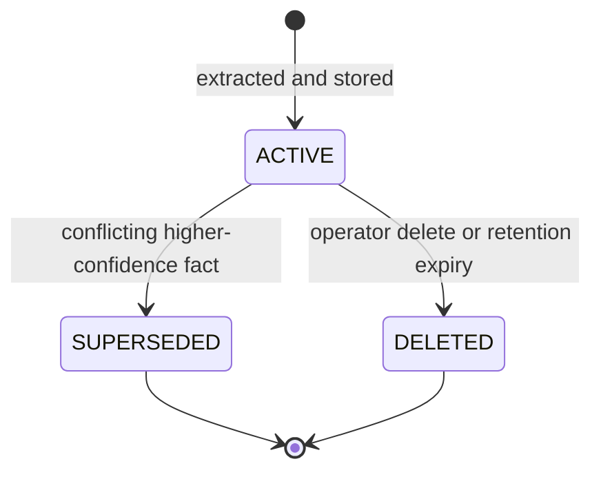

# Memory Engine Specification

## Purpose

This document specifies the Memory Engine — how the platform learns and stores structured, durable facts about a Customer from conversations (location, preferences, budget, prior purchases) so a Worker can be contextual across interactions without re-reading entire histories. It is the implementation contract for the Memory domain in `docs/01-domain/DOMAIN_MAP.md` and the memory architecture in `docs/00-foundation/MASTER_ARCHITECTURE.md` §16.

## Scope

This spec covers memory extraction (asynchronous, after an exchange), storage of structured facts with source and confidence, conflict resolution, retrieval for the runtime, and privacy constraints. It defines how the AI Runtime triggers extraction and consumes memory at prompt-construction time.

It does not cover: full conversation storage (Conversation domain), authored reference content (Knowledge domain — Memory is learned facts, not agency content), the runtime pipeline itself (`docs/05-ai/01-ai-runtime.md`), or the extraction model's procurement beyond the LLM Provider boundary. No application code.

## Goals

- Persist compact, structured facts rather than raw conversation dumps.
- Extract facts asynchronously so the response path stays fast.
- Resolve conflicting facts deliberately, keeping the current truth clear and the history auditable.
- Serve a Customer's relevant memory quickly and organization-scoped to the runtime.
- Respect privacy: store only what product requirements justify.

## Non Goals

- No storage of full message history or summaries of every message (Conversation owns messages).
- No agency-authored reference content or RAG (Knowledge domain).
- No prompt assembly (the AI Runtime Prompt Builder consumes memory).
- No Worker-level memory in the MVP (anticipated; see Future Work).
- No cross-organization or cross-Customer memory sharing.

## Business Rules

1. Every Memory record belongs to exactly one Organization and one Customer.
2. Memory stores structured facts (`key`, structured `value`), not raw conversation text.
3. Each fact carries a source (conversation/message), a confidence (0–1), and timestamps.
4. Conflicting facts for the same `key` are resolved deliberately — the prior fact is superseded, not silently duplicated.
5. Extraction is asynchronous and idempotent per triggering exchange.
6. Retrieval is organization- and customer-scoped.
7. Sensitive facts are not stored unless product requirements justify it; a redaction/allow policy governs what may be retained.

## Architecture

The engine has a **write path** (asynchronous extraction, queue-driven) and a **read path** (synchronous retrieval, called by the runtime before prompt construction). Facts live in `customer_memories`, keyed by Customer and a stable `key`, with a status that marks the current vs. superseded records.

```text
Write (memory-extraction queue):
  exchange completed ─► extract candidate facts (LLM) ─► apply privacy policy
                     ─► resolve conflicts (supersede) ─► upsert customer_memories

Read (synchronous, called by AI Runtime):
  customer + worker ─► load active facts (org+customer scoped) ─► relevant subset ─► Prompt Builder
```

### Extraction

Triggered after an exchange (e.g., on `WorkerResponded` / `MessageReceived`) via the `memory-extraction` BullMQ queue:

1. Load the recent exchange context for the Customer.
2. Extract candidate facts as structured `{ key, value, confidence }` using the LLM Provider (a distinct `purpose = memory_extraction` LLM call, recorded in `llm_calls`).
3. Apply the privacy policy — drop disallowed/sensitive categories.
4. For each candidate, resolve against existing active facts for the same `key` (see below).
5. Upsert `customer_memories`, recording `source_conversation_id` / `source_message_id`, confidence, and timestamps.

Extraction is idempotent per exchange: reprocessing the same exchange does not create duplicate facts.

### Conflict Resolution

When a new fact conflicts with an active fact for the same `(customer_id, key)`:

- If the new fact has clearly higher confidence or a newer, authoritative source, mark the prior record `superseded` and insert the new one as `active`.
- If confidence is comparable, prefer the more recent unless product rules say otherwise.
- Never silently overwrite: the superseded record is retained for audit, and a `MemoryConflictResolved` event is emitted.

### Retrieval

Called by the AI Runtime's Context/Prompt Builder via `MemoryService.getCustomerMemory`:

1. Load `active` facts for the Customer, organization-scoped.
2. Select the subset relevant to the current conversation (by key relevance and recency).
3. Return compact facts (with confidence) for inclusion in the prompt context.

## Domain Model

Owned by the Memory domain (see `docs/03-database/01-data-model.md`):

- `customer_memories` — a structured fact: `key`, `value` (jsonb), `confidence`, `source_conversation_id`/`source_message_id`, `status` (`active`/`superseded`/`deleted`), `expires_at`, timestamps.

Referenced (not owned): `customers` (Customer — the subject), `conversations`/`messages` (Conversation — the source material), and the LLM Provider (AI Runtime — extraction calls recorded in `llm_calls`).

## Interfaces

- `MemoryService.getCustomerMemory(organizationId, customerId, context?)` — active, relevant facts for the runtime.
- `MemoryService.extractFromExchange(job)` — the `memory-extraction` queue consumer.
- `MemoryService.listMemory(organizationId, customerId)` / `updateMemory(...)` / `deleteMemory(...)` — operator inspection and management (permission-gated).

Events: `MemoryExtracted`, `MemoryUpdated`, `MemoryConflictResolved`.

## Sequence Diagram

Extraction (asynchronous, after an exchange):

```mermaid
sequenceDiagram
    autonumber
    participant RT as AI Runtime
    participant Q as memory-extraction queue
    participant W as Extraction Worker
    participant LLM as LLM Provider
    participant PP as Privacy Policy
    participant DB as customer_memories

    RT->>Q: enqueue extraction (after exchange)
    Q->>W: process job (idempotent)
    W->>DB: load active facts for customer
    W->>LLM: extract candidate facts (purpose=memory_extraction)
    LLM-->>W: {key, value, confidence}[]
    W->>PP: apply retention/redaction policy
    PP-->>W: allowed facts
    loop each candidate
        W->>DB: resolve conflict; supersede prior if needed
        W->>DB: upsert active fact (+source, confidence)
    end
```

## State Diagram

Lifecycle of a single memory fact.



## Security

- Every fact is organization- and customer-scoped; retrieval never crosses tenants or customers.
- A privacy policy governs which categories may be stored; disallowed/sensitive facts are dropped at extraction.
- Facts and extraction inputs are treated as sensitive customer data and never logged in full.
- Operator access to memory is permission-gated and audited.
- Retention/expiry (`expires_at`) supports data-minimization and deletion requirements.

## Performance

- Extraction is asynchronous and off the response path; retrieval is a bounded, indexed read.
- Facts are compact (structured `value`), keeping retrieval and prompt cost low.
- Retrieval selects a relevant subset rather than all facts, bounding prompt size.
- Extraction batches an exchange rather than running per message.

## Logging

- Extraction jobs log `organizationId`, `customerId`, and counts; never raw fact values or message text.
- Retrieval logs `organizationId`, `customerId`, and result counts.
- Conflict resolutions are recorded via `MemoryConflictResolved` for auditability.

## Testing

- Retrieval for org A / customer X never returns another org's or customer's facts.
- A conflicting higher-confidence fact supersedes (does not duplicate) the prior fact; the prior is retained.
- Reprocessing the same exchange does not create duplicate facts (idempotent extraction).
- Disallowed/sensitive categories are not stored.
- Expired facts (`expires_at`) are excluded from retrieval.
- Memory stores structured facts, not raw conversation text.

## Future Work

- Worker-level memory (facts belonging to a Worker, not a Customer).
- Confidence decay over time and reinforcement on repetition.
- Richer conflict strategies (merging, multi-valued keys).
- Customer-facing memory transparency/export for data requests.

## Implementation Checklist

- [ ] `memory-extraction` queue consumer, idempotent per exchange.
- [ ] Structured fact extraction via LLM Provider (`purpose = memory_extraction`, recorded in `llm_calls`).
- [ ] Privacy/retention policy applied at extraction.
- [ ] Conflict resolution with supersede + audit and `MemoryConflictResolved` event.
- [ ] Upsert to `customer_memories` with source, confidence, timestamps, status.
- [ ] Organization- and customer-scoped retrieval returning a relevant subset.
- [ ] Operator inspection/management interfaces (permission-gated).
- [ ] Retention/expiry handling.

## Acceptance Criteria

- [ ] Facts are structured, org- and customer-scoped, and carry source + confidence + timestamps.
- [ ] Extraction is asynchronous, idempotent, and off the response path.
- [ ] Conflicts supersede deliberately and retain history for audit.
- [ ] Sensitive categories are excluded per the privacy policy; retention/expiry is enforced.
- [ ] Retrieval returns a compact, relevant, correctly-scoped subset for the runtime.
- [ ] The engine matches the Memory domain in `DOMAIN_MAP.md` and §16 of `MASTER_ARCHITECTURE.md`.
