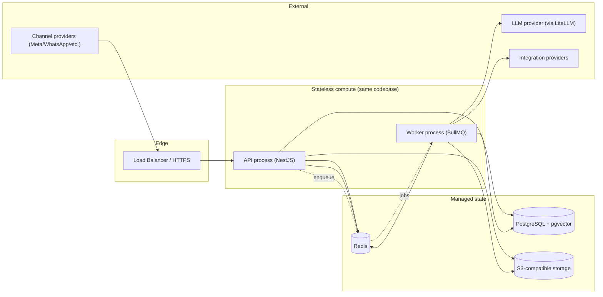
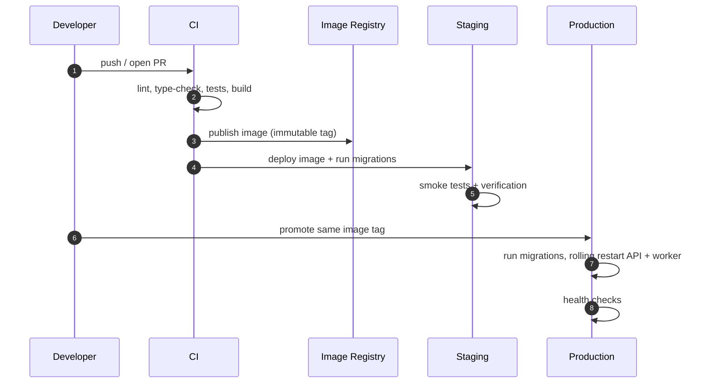

# Deployment Architecture Specification

## Purpose

This document specifies how AI Workforce OS is deployed and operated. It is the implementation contract for the deployment concerns in `docs/00-foundation/MASTER_ARCHITECTURE.md` §21, covering environments, configuration, infrastructure topology, secrets handling, observability, the release process, and recovery. It stays at the design level — no infrastructure code.

## Scope

This spec covers the MVP deployment shape and its operational rules: environments and configuration, the runtime topology (API, worker, PostgreSQL + pgvector, Redis, object storage), secrets and configuration management, the build/release/rollback process, observability, and backup/recovery.

It does not cover: application code, actual IaC/Docker/Kubernetes manifests (deliberately excluded from the architecture phase), CI pipeline scripts, or provider-specific account setup. No infrastructure code.

## Goals

- Keep the MVP deployable and operable by a small team.
- Run the API and the queue workers from the same NestJS codebase as separate processes.
- Make configuration explicit and validated at startup; fail fast on misconfiguration.
- Keep all credentials in the Secrets domain / a managed secret store — never in images or plaintext config.
- Provide safe, reversible releases and clear rollback triggers.
- Make the system observable enough to debug from traces and metrics.

## Non Goals

- No Kubernetes for the MVP (see ADR 0001's spirit — avoid premature operational complexity).
- No microservices or per-domain deployments (modular monolith, ADR 0001).
- No multi-region or active-active topology in the MVP.
- No autoscaling beyond simple horizontal worker/API scaling.
- No infrastructure code in this document.

## Business Rules (Operational Principles)

1. The API and the queue worker share one codebase but run as separate processes so slow work never blocks HTTP.
2. Invalid or incomplete configuration must fail startup, not degrade silently.
3. No secret is baked into an image, committed to the repo, or stored in plaintext config; secrets come from a managed secret store / the Secrets domain.
4. Every environment (local, staging, production) is provisioned from the same definitions with environment-specific configuration only.
5. Releases are reversible; a rollback path exists for both code and database migrations.
6. Redis and PostgreSQL are required infrastructure; the system does not run without them.
7. Webhooks must remain fast and available; deployments must not drop inbound events (queue durability + idempotency cover restarts).

## Architecture

The MVP runs a small, conventional topology on a simple platform (e.g., AWS ECS, Render, Fly.io, Railway) — not Kubernetes. Compute is stateless (API and worker processes); state lives in managed PostgreSQL (with pgvector), managed Redis, and S3-compatible object storage.

The API handles HTTP (dashboard + webhooks) and enqueues jobs; the worker consumes the BullMQ queues (`inbound-message`, `outbound-message`, `knowledge-ingestion`, `memory-extraction`, `workflow-execution`, `analytics-rollup`) and runs the AI Runtime, ingestion, extraction, and workflows.

## Environments

- **Local** — Docker Compose (introduced at implementation time) for PostgreSQL+pgvector, Redis, and a storage emulator; API and worker run against them. Used for development and integration tests.
- **Staging** — a production-like environment with its own managed data stores and secrets; used for release verification.
- **Production** — the live environment; identical shape to staging, differing only in configuration, scale, and secrets.

All three are provisioned from the same definitions; only configuration differs.

## Configuration

Configuration is provided by environment variables validated at startup (per backend §20). Required groups: Application (port, environment, public URLs), Database (PostgreSQL URL), Redis (URL), Auth (JWT secrets, token TTLs), Storage (S3 endpoint, bucket, region), LLM (provider keys and gateway URL), Channels (Meta app credentials, webhook secrets), Observability (log level, telemetry flags). Invalid configuration fails startup.

Secret-valued configuration (keys, tokens) is injected from a managed secret store at deploy/runtime, not stored in the repo or images.

## Secrets Handling

- Runtime credentials for external providers and channels live in the **Secrets** domain (`secrets` table, encrypted) and are referenced by `secret_id` (see the data model and ADR-adjacent Secrets design).
- Platform-level secrets (database URL, JWT signing keys, provider API keys) come from the platform's managed secret store / environment injection.
- Encryption keys are held in or referenced from a key-management service; rotation invalidates dependent secrets immediately.
- No secret is ever logged, echoed, or committed.

## Release Process

Rules: build once, promote the same immutable image from staging to production. Run database migrations as an explicit, ordered step (expand/contract for backward compatibility). Roll API and worker processes with health checks.

## Rollback

- **Code**: redeploy the previous immutable image tag.
- **Database**: migrations are written backward-compatible (expand/contract) so a code rollback does not require a schema rollback; destructive changes are staged across releases.
- **Triggers**: elevated error rates, failed health checks, queue backlog growth, or webhook failure spikes trigger rollback. Rollback triggers are defined before a release, not improvised.

## Observability

- Structured JSON logs with correlation context (`requestId`, `organizationId`, `userId`, `conversationId`, `workerId`, `jobId`, `runtimeRunId`).
- Metrics per backend §22: HTTP latency/errors, queue wait/processing/failure, runtime duration, LLM latency/token/cost, skill latency/failures, webhook duplicates, channel send failures.
- Health/readiness endpoints for API and worker; alerting on error rates, queue depth, and dependency health.
- Runtime traces (`runtime_runs`/`runtime_steps`) and audit logs are queryable for debugging and compliance.

## Backups and Recovery

- PostgreSQL: automated backups with point-in-time recovery; periodic restore drills.
- Redis: treated as reprocessable/ephemeral where possible; durable queues plus idempotent jobs mean a Redis loss reprocesses rather than corrupts. Persistence configured per platform capabilities.
- Object storage: durable by design; lifecycle policies for exports/originals.
- Recovery objectives (RPO/RTO) are defined per environment before go-live.

## Security

- HTTPS everywhere; webhooks verified before processing.
- Least-privilege credentials for each store and provider; separate credentials per environment.
- No secrets in images, logs, or the repo.
- Network access restricted to required dependencies.
- Rate limiting at the edge and per tenant where applicable.

## Performance & Scaling

- Scale API and worker processes horizontally and independently (workers scale with queue load).
- Managed PostgreSQL and Redis sized to load; add read replicas only when justified.
- Webhook paths stay fast (enqueue and return); heavy work is always asynchronous.
- Avoid premature partitioning and sharding (data-model principle).

## Testing (Deployment)

- Startup fails on invalid/missing configuration (config validation test).
- Staging smoke tests cover: auth, a webhook round-trip, an enqueue→worker run, and an outbound send.
- Migration up/down (or expand/contract) verified in staging before production.
- Rollback rehearsed: previous image tag redeploys cleanly.
- Backup restore drill succeeds within the recovery objective.

## Future Work

- Move to a monorepo `apps/api` layout and, if scale requires, container orchestration (Kubernetes).
- Blue/green or canary deploys.
- Multi-region and read replicas.
- Autoscaling policies driven by queue depth and latency.
- Dedicated infrastructure tiers for larger customers.

## Implementation Checklist

- [ ] Docker Compose for local PostgreSQL+pgvector, Redis, storage emulator.
- [ ] Config validation that fails startup on missing/invalid values.
- [ ] Separate API and worker process definitions from one codebase.
- [ ] Managed secret injection; no secrets in images or repo.
- [ ] CI: lint, type-check, test, build immutable image.
- [ ] Migration step (expand/contract) in the release flow.
- [ ] Health/readiness endpoints and alerting.
- [ ] Backups with restore drill; defined RPO/RTO.
- [ ] Rollback runbook with predefined triggers.

## Acceptance Criteria

- [ ] API and worker run as separate processes from one codebase against managed Postgres, Redis, and S3.
- [ ] Configuration is validated at startup; the app fails fast on misconfiguration.
- [ ] No secret exists in images, logs, or the repository; runtime credentials live in Secrets / a managed store.
- [ ] Releases promote a single immutable image with an explicit migration step and a rehearsed rollback.
- [ ] The system is observable (logs, metrics, traces) and recoverable (backups, restore drills).
- [ ] The deployment matches §21 of `MASTER_ARCHITECTURE.md` and avoids Kubernetes/microservices for the MVP.
